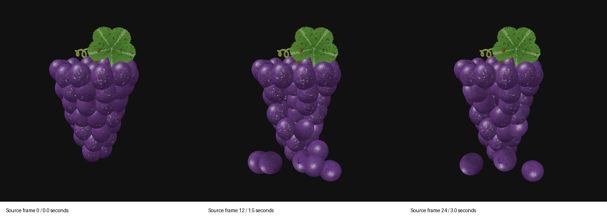

# Can a Splashery toy move inside a PDF?

Codex built this report and eight sample PDFs on October 4, 2026, from `main` at
`19f8d720b77df087f1aba2e807fc3a490725a936`, on `codex/pdf-motion`.

Before delivery, the branch was synchronized with `main` at
`023d6b2ef791f52278e6cd3fa161533b6b4bdf78`. That update changed operating/handoff documentation; the
captures remain pinned to the earlier source baseline above.

**Yes. A PDF can contain motion and working controls.** In this run, the color grapes flip book
played inside Firefox, and a monochrome grapes animation played inside Chrome, Edge and Firefox.
Those are actual PDF document actions, not a video superimposed on a PDF screenshot. Preview kept
the flip book still. The results depend on the viewer and the kind of animation.

**The existing WebGL toy cannot simply be pasted into an ordinary PDF and run unchanged.** We can
export its pictures, video, or simplified 3D geometry, or write a new program against the viewer's
limited PDF API. LaTeX can emit those PDF objects; it does not supply the recipient's missing
browser APIs. There is no need to exploit LaTeX to get the working examples below.

Start with [the color flip book](pdf-motion-2026-10/01-animate-widget.pdf) in desktop Firefox. For
Chrome or Edge, open [the form animation](pdf-motion-2026-10/02-pdfium-fields.pdf), click the empty
box below the instructions, and type `n`, then `p`. For a normal document that travels well, open
[the still, link and QR](pdf-motion-2026-10/05-still-link-qr.pdf).

## What the samples contain

All samples use the real, procedural [grapes toy](../../src/packs/food.js) and its existing drop and
return effect. Playwright captured the local site through WebGL2, with a fixed camera and simulation
clock: 40 JPEG frames, 420 × 420, at a target eight frames per second, with the tap at frame 4. The
source has 200,012 splats. The 3D export samples every 84th center, excluding near-transparent
points, leaving 2,382. No outside model, photograph, game assets or game code was copied.

This is a source filmstrip. It shows what was captured, not a viewer playback test.

| ID  | Download                                                            | What is inside                                                                                   | Size, rounded | Evidence here                                                          |
| --- | ------------------------------------------------------------------- | ------------------------------------------------------------------------------------------------ | ------------- | ---------------------------------------------------------------------- |
| W   | [01-animate-widget.pdf](pdf-motion-2026-10/01-animate-widget.pdf)   | 40 color frames, `animate` widget method, PDF JavaScript, play/step/speed controls               | 534 KB        | Moves and responds in Firefox                                          |
| O   | [01-animate-ocg.pdf](pdf-motion-2026-10/01-animate-ocg.pdf)         | Same frames, optional-content groups (layers), PDF JavaScript                                    | 544 KB        | Still only in Firefox; desktop Acrobat/Okular path needs owner testing |
| F   | [02-pdfium-fields.pdf](pdf-motion-2026-10/02-pdfium-fields.pdf)     | 64 text-row fields, 96 characters per row, 10 grayscale glyph levels, plus command/status fields | 510 KB        | Moves and responds in Chrome, Edge and Firefox                         |
| D   | [03-point-cloud.pdf](pdf-motion-2026-10/03-point-cloud.pdf)         | Embedded PRC in a 3D annotation, with a static poster and camera                                 | 2.43 MB       | Payload built and checked; native orbit/zoom untested                  |
| V   | [04-embedded-video.pdf](pdf-motion-2026-10/04-embedded-video.pdf)   | Embedded five-second H.264 MP4 through a Screen/Rendition annotation; MP4 attachment fallback    | 153 KB        | Payload and codec checked; native PDF playback untested                |
| L   | [05-still-link-qr.pdf](pdf-motion-2026-10/05-still-link-qr.pdf)     | Color still, ordinary URL link, vector QR with quiet zone                                        | 42 KB         | Chrome link opened the actual live toy; QR decoded from rendered PDF   |
| H   | [06-html-attachment.pdf](pdf-motion-2026-10/06-html-attachment.pdf) | An attached HTML launcher and still                                                              | 18 KB         | Attachment extraction checked; viewer extraction UI untested           |
| P   | [07-page-flip.pdf](pdf-motion-2026-10/07-page-flip.pdf)             | Ten pages, one frame every half second, `/Dur` and dissolve transitions                          | 180 KB        | Pages and timing objects checked; presentation playback untested       |

Sizes use decimal KB/MB. Every PDF is below the task's 15 MB limit. Exact bytes, page counts and
SHA-256 hashes are in [build.json](pdf-motion-2026-10/build.json). Sources include both `.tex`
files, [field-animation.js](pdf-motion-2026-10/field-animation.js), frame JPEGs, field data, sampled
point JSON, [grapes.asy](pdf-motion-2026-10/grapes.asy), the PRC,
[grapes.mp4](pdf-motion-2026-10/grapes.mp4), the QR modules/SVG, and
[open-grapes.html](pdf-motion-2026-10/open-grapes.html).

## Why the browser toy needs a different runtime

Splashery's [stage](../../src/stage.js), [player](../../src/player.js) and imported modules run in
the surrounding HTML page. The viewer creates a graphics context, loads modules and toy data,
updates thousands of positions, sorts and blends splats, and draws each frame. Drag/tap/zoom and the
toy's effect state belong to that program. The capture metadata records this particular renderer's
source and settings.

A PDF document script receives a different set of objects. PDFium implements selected Acrobat-style
`app` and field operations, including timers and field values; it does not expose the host page's
DOM, HTML canvas, WebGL context or ES-module loader through that document API. Setting a form
field's text is an output channel; it is not `canvas.getContext("webgl2")`. This distinction comes
from the inspected
[PDFium app implementation](https://raw.githubusercontent.com/chromium/pdfium/main/fxjs/cjs_app.cpp)
and
[field implementation](https://raw.githubusercontent.com/chromium/pdfium/main/fxjs/cjs_field.cpp).

Firefox's viewer is itself an HTML/JavaScript application, but document scripting runs through a
separate sandbox and PDF API. The viewer's rendering canvas is not handed to the PDF's script. Its
timer and field APIs can drive these recordings. Embedding HTML as a file does not turn that
attachment into a document-script DOM. See Mozilla's
[sandbox implementation](https://raw.githubusercontent.com/mozilla/pdf.js/master/src/pdf.sandbox.js)
and
[scripting app API](https://raw.githubusercontent.com/mozilla/pdf.js/master/src/scripting_api/app.js).

Desktop Acrobat has a larger PDF-specific API and its own 3D renderer, but document scripts still
run under restrictions. Privileged operations and trusted contexts have separate rules; granting
trust does not add a browser graphics API. Adobe documents those boundaries in its
[JavaScript security guide](https://www.adobe.com/devnet-docs/acrobatetk/tools/AppSec/javascript.html).

The conclusion is about **running the existing Splashery program unchanged**, not a claim that a PDF
cannot perform computation. A new CPU renderer, simplified game or simulated toy could calculate its
own frames and write fields, as the public projects below demonstrate. Porting the full splat
renderer to that interface would be a substantial separate project, with visual and performance
limits; this run did not implement or benchmark such a port. Packing JavaScript source into a stream
or enabling scripting cannot supply missing host functions.

One other option is a custom web PDF viewer that renders a normal PDF page and puts the real WebGL
toy in an HTML overlay. That is a proposed host application, not a feature that travels inside a
downloaded PDF. Mozilla's
[PDF.js library API](https://mozilla.github.io/pdf.js/api/draft/module-pdfjsLib.html) is a suitable
rendering component for that host. The overlay would need its own URLs, permissions, offline
packaging and maintenance.

## Ways to make a PDF move or respond

### Color frames, JavaScript and layers

`animate` embeds successive pictures and document controls. Its current manual lists desktop Acrobat
Reader, Okular, PDF-XChange, Foxit and sufficiently recent PDF.js as animation targets; Firefox
support starts at version 130 / PDF.js 4.4.168. That last item means PDF.js, including an optional
Chrome extension, not Chrome's built-in PDFium viewer. The widget method worked in this run's
Firefox. The OCG method toggles layers and is documented for Acrobat Reader and Okular; it still
needs script support. A layer is not a video decoder or a script-free animation clock.
[animate manual, viewer list and method options](https://ctan.math.illinois.edu/macros/latex/contrib/animate/animate.pdf).

W preserves the original render's color and appearance at one camera angle. It can replay, pause and
step the effect, but it cannot choose a new camera or respond with a new physical outcome. More
directions and states could be pre-rendered as a larger lookup table; that would still have a finite
set of pictures. This is an export design inference, not a capability tested here.

### A form field “canvas,” Doom and Tetris

[DoomPDF](https://github.com/ading2210/doompdf) compiles a C program through an older Emscripten
asm.js target and renders through text fields, one field per image row. Its author reports 320 ×
200, six monochrome shades and about 80 ms per frame: roughly 12.5 fps if that timing holds. That is
the author's result, not a measurement on this Mac. It is CPU output through a restricted API, not
Doom acquiring WebGL inside the PDF. The repository is GPL v2; its program and assets were not
reused.

[PDF Tetris](https://github.com/ThomasRinsma/pdftris) uses a grid of fields and text input for
controls. Its author explains the limited drawing options and input handling in the
[implementation article](https://th0mas.nl/2025/01/12/tetris-in-a-pdf/). These projects establish
that limited I/O can support a real interactive program. They do not establish that an arbitrary web
page runs in the viewer or that all browser PDF engines behave alike.

F uses original, newly written PDF JavaScript. It stores 40 monochrome recordings as row strings,
updates 64 readonly fields per frame and asks for a 125 ms interval. `n` steps; `p` toggles play;
`r` resets. The status field changes alongside the image. Chrome, Edge and Firefox visibly ran those
commands. Eight fps is the requested cadence: no stopwatch, frame-drop or sustained timing
measurement was made. The coarse grayscale and glyph texture are visible limits. Chrome and Edge
leave typed command letters in the control field; the commands still work.

Firefox supports enough document scripting for both F and W in this test. Browser extensions,
organization policy, viewer version and disabled scripting can change the result. A PDF.js embedding
can also be configured differently from Firefox. The tested built-in viewer is the specific
evidence, not an assurance about every PDF.js installation.

### Real 3D geometry: PRC and U3D

A 3D annotation carries a scene for the viewer's 3D engine. D contains sampled centers and colors as
small colored spherical markers exported to PRC by Asymptote. It drops Gaussian covariance, opacity,
depth blending, view-dependent shading and all toy effects. Rotating this scene would be real
geometry interaction, unlike turning through a fixed recording, but its appearance is an
approximation.
[Asymptote's three-dimensional output documentation](https://asymptote.sourceforge.io/doc/three.html)
describes the PRC route.

`media9` can wrap PRC/U3D in PDF RichMedia and supersedes `movie15`. This sample instead writes a
standard 3D annotation directly through pypdf; the generated `.asy` and PRC are included. There is
no Flash player in D. [media9 package description](https://ctan.org/pkg/media9).

Adobe describes desktop 3D activation as disabled by default, with document trust choices. The owner
should trust this generated file once, click the image and try orbit, zoom and Fit Model. Neither
Acrobat nor Reader was installed for this run, so the annotation's native activation, camera fit and
interaction are **unverified**. A parsed PRC signature and a rendered poster do not prove that
Acrobat displays the 3D model.
[Adobe's 3D activation instructions](https://helpx.adobe.com/acrobat/using/enable-3d-content-pdf.html).

Do not promise every 3D-capable viewer will open this PRC: PDF-XChange's opened V10 multimedia page
says U3D only. Foxit's Windows add-on page describes 3D viewing, but this precise PRC has not been
tried there. The payload format matters as well as the viewer name.
[PDF-XChange Multimedia 3D](https://help.pdf-xchange.com/pdfxt10/multimedia-3d_ed.html),
[Foxit add-ons](https://www.foxit.com/pdf-editor/addons/).

### Embedded video and sound

V embeds the captured five-second H.264 video and a poster. Its Screen annotation launches a
Rendition action pointing at the embedded MP4. A second attachment lets a person extract the clip
when the annotation cannot play. The source MP4 is independently available beside the PDF. Adobe
lists H.264 and MP3 among supported desktop multimedia formats, with security/trust and player
dependencies. The Screen/legacy multimedia path can differ from Acrobat's newer native authoring
path. The sample's codec and bytes are verified; its playback in Acrobat is not.
[Adobe multimedia playback guide](https://helpx.adobe.com/acrobat/using/playing-video-audio-multimedia-formats.html),
[current multimedia authoring guide](https://helpx.adobe.com/acrobat/using/adding-multimedia-pdfs.html).

RichMedia is an annotation mechanism, not a guarantee of a working decoder. Old LaTeX recipes using
`media9`'s Flash video players are a poor present-day target: the package still describes that
route, while Adobe ended Flash support. PRC/U3D use of the package is a different route.
[media9](https://ctan.org/pkg/media9),
[Adobe Flash end-of-life notice](https://www.adobe.com/products/flashplayer/end-of-life.html).

An MP3 audio clip can use the same general desktop multimedia family, but audio has no separate
compatibility proof here. The grapes toy's existing synthesized cues were not captured; V is silent.
There is no external sound asset or dummy soundtrack. A future export should include actual toy
sound only after recording and native playback tests, and keep an extractable audio fallback.

### Attachments, links, QR and page changes

H's attachment is deliberately an HTML **launcher** that links to the live toy. It is not an offline
copy of the WebGL engine. Its bytes were extracted and compared to the source. A complete offline
HTML package could be attached instead, but it would still require extraction and a browser, and
ES-module/assets loading would need to be packaged correctly. PDF.js exposes an attachment API; that
is not the same thing as executing the attachment inside the PDF.
[PDF.js document API](https://mozilla.github.io/pdf.js/api/draft/module-pdfjsLib-PDFDocumentProxy.html).

L makes the boundary obvious: a printable still remains in the document; the link or QR opens the
actual [live grapes toy](https://ryanjosephkamp.github.io/splashery/embed/?toy=grapes) in a browser.
Chrome's native PDF link was clicked and the correct toy rendered. The vector QR was decoded from a
rasterization of the PDF, not just from the source QR matrix. Physical camera scanning on a phone
remains untested. This version needs the live site and a network connection for interaction.

P advances through ten ordinary pages. Manual Next Page can show successive states even where
document scripts do not run; automatic timing and transitions depend on presentation support. Okular
documents timed advancement, looping and transition settings. This is a separate sequence of pages,
not an embedded WebGL surface or a practical one-page-per-toy catalog design.
[Okular presentation settings](https://docs.kde.org/stable_kf6/en/okular/okular/configpresentation.html),
[presentation controls](https://docs.kde.org/trunk_kf6/en/okular/okular/presentationMode.html).

## Samples × viewers: actual observations

Every result other than **untested** below was observed in native UI on this Mac. **Moves** means an
image/frame changed through playback; the successful W/F cases also had working controls.
**Responds** means an action worked, with no claim of motion inside the PDF (L opens a browser).
**Still only** means this sample's play control was tried but the poster stayed still. It does not
mean the viewer supports no other PDF actions. **Untested** is unknown, not “still only,” and leaves
the cell for owner testing. Literature expectations follow the table rather than masquerading as
sample results.

| Viewer / device                         | W          | O          | F        | D        | V        | L        | H        | P        |
| --------------------------------------- | ---------- | ---------- | -------- | -------- | -------- | -------- | -------- | -------- |
| Acrobat desktop / macOS                 | untested   | untested   | untested | untested | untested | untested | untested | untested |
| Acrobat Reader desktop / macOS          | untested   | untested   | untested | untested | untested | untested | untested | untested |
| Acrobat desktop / Windows               | untested   | untested   | untested | untested | untested | untested | untested | untested |
| Acrobat Reader desktop / Windows        | untested   | untested   | untested | untested | untested | untested | untested | untested |
| Acrobat mobile / iPhone or iPad         | untested   | untested   | untested | untested | untested | untested | untested | untested |
| Acrobat mobile / Android                | untested   | untested   | untested | untested | untested | untested | untested | untested |
| Preview 11.0 / macOS                    | still only | untested   | untested | untested | untested | untested | untested | untested |
| Files Quick Look / iPhone or iPad       | untested   | untested   | untested | untested | untested | untested | untested | untested |
| Chrome 154.0.8037.95 built-in / macOS   | still only | untested   | moves    | untested | untested | responds | untested | untested |
| Edge 154.0.4258.53 built-in / macOS     | untested   | untested   | moves    | untested | untested | untested | untested | untested |
| Firefox 156.0.1 built-in PDF.js / macOS | moves      | still only | moves    | untested | untested | untested | untested | untested |
| Foxit PDF Reader / Windows              | untested   | untested   | untested | untested | untested | untested | untested | untested |
| Foxit PDF Reader / macOS                | untested   | untested   | untested | untested | untested | untested | untested | untested |
| PDF-XChange Editor / Windows            | untested   | untested   | untested | untested | untested | untested | untested | untested |
| Okular / Linux desktop                  | untested   | untested   | untested | untested | untested | untested | untested | untested |
| SumatraPDF / Windows                    | untested   | untested   | untested | untested | untested | untested | untested | untested |

The host was Apple Silicon, macOS 26.3.1 (a), build 25D771280a. See the eight observations in
[viewer-checks.json](pdf-motion-2026-10/viewer-checks.json). Native screenshots appeared during the
chat, but are not archived in this sample folder. Chrome's normal profile initially returned a blank
`about:srcdoc` surface; Incognito exposed its built-in viewer. The cause was not established and no
extension/security settings were changed. Native results are limited to that configuration.

### What the opened sources suggest for untested cells

- Desktop Acrobat/Reader are the strongest literature targets for W/O and 3D; Adobe also documents
  desktop multimedia. The exact D/V files still need native tests, including camera fit and player
  behavior. The
  [animate manual](https://ctan.math.illinois.edu/macros/latex/contrib/animate/animate.pdf)
  explicitly excludes mobile Reader animation. Do not transfer desktop capabilities to the mobile
  apps or infer that mobile forms can never run any script.
- Apple documents ordinary PDF viewing and form work in Preview. The local W observation is the
  evidence for this experiment; the absence of an advertised feature is not proof of universal
  non-support. iOS Files has no local evidence here.
  [Apple Preview guide](https://support.apple.com/guide/preview/welcome/mac).
- Chrome/PDFium and Firefox/PDF.js have demonstrably different image-animation support here. Windows
  browser builds and mobile versions were not tested. Edge must be identified separately: Microsoft
  documents an
  [Adobe-powered PDF engine policy](https://learn.microsoft.com/en-us/deployedge/microsoft-edge-policies/NewPDFReaderEnabled).
  Its [PDF feature page](https://learn.microsoft.com/en-us/deployedge/microsoft-edge-pdf) says
  JavaScript forms are unsupported, yet F's script ran in the installed Mac build. Treat that as a
  documentation/result mismatch, not permission to promise all Edge configurations work. This run
  did not independently identify Edge's engine variant or change its policy.
- Foxit and PDF-XChange are listed by `animate` as animation targets. Foxit's opened Windows page
  describes 3D support (a plugin for older Reader versions); Mac Reader's precise PRC/video support
  was not confirmed. PDF-XChange exposes
  [JavaScript preferences](https://help.pdf-xchange.com/pdfxe10/javascript_ed.html?zoom_highlightsub=editor+script)
  but its opened [3D page](https://help.pdf-xchange.com/pdfxt10/multimedia-3d_ed.html) limits the
  payload to U3D. F, D and V cannot be called working there without trying them.
- Okular is an `animate` target, including OCG, and documents presentation timing. Its current
  [Poppler integration source](https://github.com/KDE/okular/blob/master/generators/poppler/generator_pdf.cpp)
  handles multimedia annotations, but the actual codec/backend and our V remain untested. No PRC
  interaction claim is established here.
- Do not repeat the old blanket claim “SumatraPDF has no JavaScript.” Current upstream
  [EngineMupdf.cpp](https://raw.githubusercontent.com/sumatrapdfreader/sumatrapdf/master/src/EngineMupdf.cpp)
  enables sandboxed form JavaScript; its
  [command-line JavaScript API](https://www.sumatrapdfreader.org/docs/Tool-run-javascript-reference)
  is a separate host tool. Neither fact proves that these timers/animations run in the installed
  Windows GUI. All Sumatra sample cells stay untested.

## Exact owner test procedure

Download each PDF from its link above; do not test a GitHub thumbnail or a mail attachment preview
and call that Acrobat. Record app version, OS/device, sample ID, result, prompt and whether you used
a local file or HTTP URL. Try the same eight actions in each named app:

1. **W and O:** click the forward play triangle under the picture, watch for a falling grape, pause,
   then step forward. If only the starting picture remains after play/step, record “still only.”
2. **F:** click the empty left box below the instructions. Type `n`: look for `Frame 1 / paused`.
   Type `p`: watch the frame counter and grapes change; type `p` again to pause, then `r` to reset.
   If input appears but the counter stays at zero, record “still only”; do not count plain text
   entry as a successful animation. Desktop keyboard input is required by this prototype; a mobile
   readonly/hidden keyboard limitation is itself a result to record.
3. **D:** in desktop Acrobat/Reader, choose trust **for this document once** if prompted, then click
   the picture and drag. Try zoom and Fit Model in the 3D toolbar if the initial view is empty.
   Record whether a colored 3D model replaced the poster and whether changing the camera reveals a
   new side. If activation/camera fails, preserve the error text; do not call the poster a 3D pass.
4. **V:** click the picture, choose the per-document playback/trust option if offered, and look for
   moving grapes. Note whether the native player or an external player was used. It should be
   silent. Separately save `grapes.mp4` through the attachments panel and open it: external playback
   checks the fallback, not in-page multimedia. Record these two outcomes separately.
5. **L:** click/tap the green link and confirm the browser opens grapes. Tap the bunch there. Scan
   the QR with a second device and check that it opens the same toy. Record link and scan results
   separately; the toy's movement is outside the PDF.
6. **H:** open the attachments panel, save `open-grapes.html`, open it in a browser and follow its
   link. Record extraction support. The launcher needs the Internet; there is no automatic launch.
7. **P:** manually advance through all ten pages. Then try the viewer's presentation/full-screen
   mode and its timed advance/play control if present. Record manual response separately from
   automatic movement and whether dissolve transitions show.

Use these device/app entry points for **every untested cell** in the table:

| Device               | Open with / action                                                                                                                                                                        | Cells to fill                                                                      |
| -------------------- | ----------------------------------------------------------------------------------------------------------------------------------------------------------------------------------------- | ---------------------------------------------------------------------------------- |
| Mac                  | Download, then File → Open in **Acrobat** and separately **Acrobat Reader**, not Preview. Use the attachment panel for H/V.                                                               | All eight in each Adobe app                                                        |
| Mac                  | File → Open in **Preview**; drag local PDFs into **Chrome**, **Edge** and **Firefox**. Confirm each browser uses its built-in PDF viewer.                                                 | All untested Mac cells; repeat successful ones if your version/settings differ     |
| Windows PC           | File → Open separately in **Acrobat**, **Acrobat Reader**, **Foxit PDF Reader**, **PDF-XChange Editor**, and **SumatraPDF**.                                                              | All eight in each app; note PRC versus U3D for D                                   |
| Windows PC           | Drag PDFs into built-in **Chrome**, **Edge**, **Firefox** viewers; record Edge's displayed engine/configuration if identifiable.                                                          | Additional Windows-browser results; Mac results do not fill them                   |
| iPhone/iPad          | Save to Files; tap the PDF for **Files/Quick Look**. Separately Share/Open in **Acrobat mobile** and use its own view. Test F only if it presents an editable command field and keyboard. | All eight in Files and Acrobat mobile; note attachment/3D/playback controls absent |
| Android phone/tablet | Download locally, explicitly Open with **Acrobat mobile**. Do not conflate Android's system preview or Chrome's download handler with that app.                                           | All eight in Acrobat mobile                                                        |
| Linux desktop        | File → Open in **Okular**; try View → Presentation and play/timed advancement for P. Note multimedia backend/codecs and attachment extraction.                                            | All eight in Okular                                                                |

The samples do not require a global reduction in security. If managed policy forbids an action,
record the blocked result and use L or the extracted MP4. This procedure leaves approval and
device-specific settings with the owner, rather than reporting hypothetical activation as evidence.

## Recommendations for a Splashery export feature

**For desktop Acrobat readers:** offer a color W-style recording with a useful still and live link
on the same page. It gives the clearest recognizable effect and uses the frame method already proved
in a second viewer. Treat an MP4 attachment as an optional compact fallback. Add a separate “3D
points” option only after D passes real Reader/Acrobat tests on Mac and Windows. PRC geometry can
give true camera interaction, but it is a reduced point scene and does not preserve splat appearance
or tap effects. Native video is a promising size-efficient alternative pending V's test.

**For browser readers:** specify desktop Firefox for the color flip book. F is a working Chrome/
Edge/Firefox experiment, suitable for a deliberately coarse interactive PDF or playful proof of
concept, but a poor visual default for Splashery's color/materials. Offer L as the reliable path to
the full toy. If keeping the toy visually “on the PDF page” matters, build a separate web document
viewer with a WebGL overlay and explain that the downloaded PDF has a still/link fallback.

**For everyone:** make L the default: still, descriptive name/instructions, a visible clickable URL
and QR. Promise that the document contains a still and an opening route to the live toy; do not
promise that every app follows links, scans codes or plays active content. The source image survives
printing and static previews. An optional downloadable video beside the PDF helps readers who cannot
or do not want to run the full site. Full interaction needs a browser and, for this export, the
network.

The proposed **Export as PDF** control should choose “Still + live toy” by default, with an explicit
“Moving recording (desktop Firefox/Acrobat)” option, a frame/duration/quality choice and a size
estimate. Capture the selected toy's actual current camera and settings, then one complete effect
cycle with a clear starting still. Include text explaining playback and a live-link fallback on
every page. Let an optional video be saved separately or attached. Do not promise “interactive toy”
when the option only records an effect. These are feature recommendations, not site changes in this
task.

The **catalog of every toy, one per page** should reuse that template: name, pack, useful still,
short action description, stable live link, QR and any required asset credit/license. Build a
deterministic ordered manifest with source commit, selected settings and failures. Generate a
portable still catalog first; offer a separately labeled animated desktop edition. Load/capture toys
sequentially, activate animation only for the visible page, stop its timer on leaving, and budget
the whole catalog's size instead of multiplying this five-second recording by every toy. Use a
contact sheet and native viewer review before acceptance. Keep P out of that edition because its
ten-page sequence violates the one-page-per-toy format. A Claude implementation lane can build this
after the owner decides which optional active format passed his devices.

## Build, verification and limits

[Build instructions](../../tools/pdf-motion/README.md) and scripts are included. This run used the
repository's existing Playwright 1.56.1, QR generator, jsQR and pngjs; Codex's bundled Python with
ReportLab 4.4.9, pypdf 6.10.0 and Pillow 12.3.0; existing TeX Live 2026 / pdfTeX 1.40.29 with
`animate` dated October 14, 2024; existing FFmpeg 9.0.2 with libx264; and bundled Poppler 26.05.0
for static PDF rasterization. Tool license/source entries are in [LICENSES.md](../../LICENSES.md).

The MacTeX Asymptote 3.09 binary crashed with an illegal-instruction signal. The task-authorized
replacement was `brew install asymptote`, yielding Homebrew Asymptote 3.15, which exported the PRC.
Homebrew also installed/upgraded its dependencies, including font/rendering libraries and
Ghostscript. No Acrobat or other PDF reader was installed, no browser extensions or security
settings were changed, and no package was added to the site's runtime. This is a build-machine
change beyond the repository diff, disclosed here for reproducibility.

[validation.json](pdf-motion-2026-10/validation.json) records strict PDF parsing, text on every
page, size limits, 66 fields and distinct animation states, PRC signature/payload equality, MP4
payload/attachment equality, 40 H.264 frames at 420 × 420 and five-second duration, HTML attachment
equality, the URL, and ten page timing objects. [qr-check.json](pdf-motion-2026-10/qr-check.json)
records decoding the rasterized PDF QR. [posters.png](pdf-motion-2026-10/posters.png) contains
static first-page renders, inspected for legibility/layout. Poppler emitted a fontconfig warning but
completed the renders. These checks establish file contents and readable fallbacks, not native
active-content acceptance.

The local capture reported no page errors. Native tests establish motion/controls only in the
specific rows above. No physical phone, Windows host, Linux host, Adobe activation, 3D camera,
embedded audio/video player, physical QR camera scan, catalog-scale load, accessibility audit or
measured viewer fps is claimed. The PDFs are prototypes, not PDF/A archives or tagged accessible
production exports. Text sources are included; active content may not survive flattening,
print-to-PDF, sanitization or conversion, which were not tested.

Repository verification: `npx prettier --check .` and `node tools/us-english.mjs --diff` were run
before push. No `src/`, site dependency or production test file changes are part of this task. The
site Playwright suite was not run; the task's capture, artifact checks and native viewer
observations are the relevant verification, and do not imply the site's entire suite passes.

What was cut: a full splat-engine port, custom web PDF host, offline HTML toy bundle, U3D
alternative, audio recording, native RichMedia authoring through Acrobat, additional toys and the
catalog/export implementation. Those are separate work or require viewer evidence unavailable in
this run.
