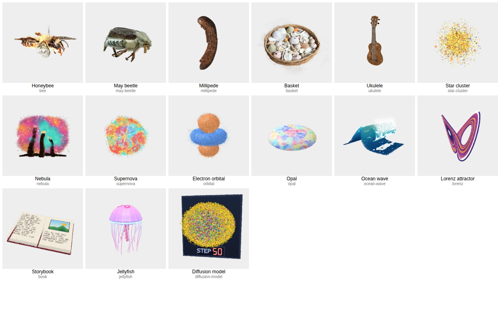
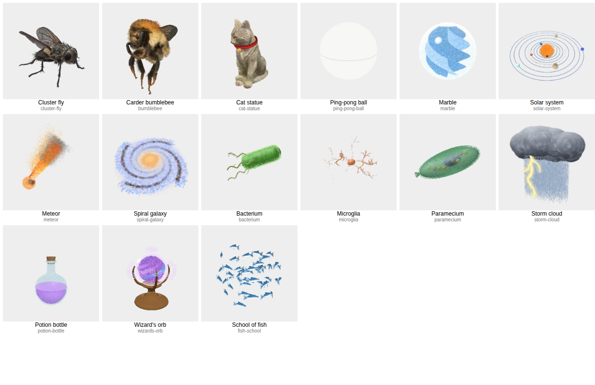

# Quality sweep of the public toys (September 30, 2026)

Built by Sonnet 5.5 (default effort), a worker session for the Operator. No toy, test or tool was
changed. This file and the contact sheets beside it (`docs/audits/quality-sweep-2026-09-30/`) are
the whole change.

## How this was done

- **Scope:** all 318 public toys (every toy in `src/toys.js` that is not `labs: true`; the shelf has
  334 toys, 16 are in labs).
- **Stills:** every toy's 256 px shelf thumbnail, viewed on contact sheets made with
  `tools/contact-sheet.mjs` (14 sheets of 24). Thumbnails were last rendered on September 27, 2026
  and after the Fidelity passes of September 29, 2026, so a toy fixed since then may look better
  live.
- **Measures:** `tools/shp-measure.mjs` at the phone setting (`base`: 390×844 at a device ratio of
  2, software renderer), home view, for **318 of 318** toys. It gives `speck` (mean difference from
  a 3×3 median over the flat half of the toy; lower is cleaner) and `edge` (median 10–90 percent
  rise across the strongest edges, in CSS pixels; lower is sharper). The grain score is at least the
  speck band (under 0.8 is 0, under 1.5 is 1, under 2.5 is 2, above that 3) and the softness score
  is at least the edge band (under 0.85 is 0, under 1.15 is 1, under 1.5 is 2, above that 3).
  `tools/world-grain.mjs` was not used (it is for worlds).
- **Tap clips:** 28 toys were rendered with `tools/effect-clip.mjs` (one at a time, 280 px, 8 fps,
  8-frame strips) and judged on the strips. The toys without a clip show "–" in the move column and
  count 0 in the total, so a toy with a bad tap can rank lower than it should. Clipped toys: bee,
  ocean-wave, may-beetle, jellyfish, book, ukulele, cat-statue, fish-school, origami-crane, lamp,
  croissant-real, marble-bust, newtons-cradle, horse-statue, boombox, steam-train, tomatoes,
  lantern, donut, yo-yo, alarm-clock, chess-set, garden-gnome, octopus, frog, wooden-elephant,
  pool-ball, penguin.
- **Calibration:** the owner's reviews in `docs/reviews/` (2026-09-23, E1, E1b, sounds, new toys)
  and the Sharpness lane's "what is left" list. Where the owner already named a problem it is in the
  note.

### The scale

Each column is 0 (fine) to 3 (bad). The total is the sum of the five (move counted 0 when there is
no clip).

| Column | 0                     | 3                                                         |
| ------ | --------------------- | --------------------------------------------------------- |
| Grain  | clean                 | speckle you see at phone size                             |
| Soft   | crisp edges           | blurry, hard to recognize                                 |
| See    | opaque                | see-through where it should be solid                      |
| Move   | rigid, physical parts | a warped or smeared picture, parts that do not move apart |
| Read   | reads at a glance     | unreadable at phone size                                  |

Scores are my judgment from stills and strips, with the measures as a floor for grain and softness.
Treat one point either way as noise. A glow, cloud or dust toy (nebula, star cluster, supernova) is
soft or grainy by design; those are listed but the fix is a different kind of change.

## The 30 weakest

### 1. Honeybee (`bee`, Photoreal) — total 7

Grain 3, soft 1, see-through 0, move 3, read 0. Measured speck 9.84, edge 0.82. Fur and wings
speckle; wing flap and abdomen smear into ghost copies in the tap.

- **Likely cause:** A scan with soft rig regions (0.35) on the wings and thorax, so the flap bends
  the picture and leaves ghost copies; the fur is fine-grained scan noise at phone size.
- **Fix PACKS.md suggests:** 7b, Real motion: cut the wings out with hard edges (`soft: 0.02`,
  color-keyed regions) and keep the flap small, or hide the scan's wings (`visible: 0`) and show
  kit-built wings from an `addon` that flap.

### 2. Ocean wave (`ocean-wave`, Weather & fire) — total 7

Grain 2, soft 1, see-through 1, move 1, read 2. Measured speck 0.94, edge 0.73. Real curling wave;
spray speckle, thin sheet.

- **Likely cause:** The curl is a thin sheet of splats, and the spray is many tiny faint splats that
  read as speckle.
- **Fix PACKS.md suggests:** 7b, Fading by size makes speckle and Thin ribbons need bigger splats:
  fewer, bigger spray drops with real paths; raise the sheet's size and use `even: true` (7c).

### 3. May beetle (`may-beetle`, Photoreal) — total 6

Grain 3, soft 1, see-through 0, move 2, read 0. Measured speck 9.66, edge 0.88. Wing case lifts but
leaves a ghost smear (soft region 0.4).

- **Likely cause:** Soft regions (0.4) on the wing cases: the lift drags a smear of neighboring
  picture with it.
- **Fix PACKS.md suggests:** 7b, Real motion: hard-edged wing-case cut-out (`soft: 0.02`) or a
  kit-built stand-in wing case; keep the move small enough that no gap shows.

### 4. Opal (`opal`, Gems) — total 6

Grain 2, soft 2, see-through 0, move –, read 2. Measured speck 1.91, edge 0.75. Flat pastel cloud
with speckle (1.9).

- **Likely cause:** A flat cloud of faint pastel splats over a dome; no sharp surface to read.
- **Fix PACKS.md suggests:** 7c, Faint clouds and Highlights: bigger, fainter glow splats over a
  solid, evenly placed body; `even: true` on the surface.

### 5. Jellyfish (`jellyfish`, Animals) — total 6

Grain 1, soft 1, see-through 1, move 1, read 2. Measured speck 1.45, edge 0.72. Bell pulses,
tendrils follow; faint and thin.

- **Likely cause:** Tendrils are thin ribbons of faint small splats; the bell is see-through.
- **Fix PACKS.md suggests:** 7b, Thin ribbons need bigger splats (weight 2 to 2.5, size 1.5); 7c,
  translucent bodies read as jelly with fewer, larger, fainter splats (`size` 1.8 to 2.4, `opacity`
  about 0.3).

### 6. Diffusion model (`diffusion-model`, AI and computing) — total 6

Grain 2, soft 2, see-through 0, move –, read 2. Measured speck 0.28, edge 1.39. Noise field by
design; soft edge 1.4; small label.

- **Likely cause:** Noise field by design; tiny step label.
- **Fix PACKS.md suggests:** 7b, Text and small details: ink-only text splats; keep the noise as
  bigger, fewer splats so it reads as a cloud.

### 7. Storybook (`book`, Open me) — total 6

Grain 2, soft 2, see-through 0, move 2, read 0. Measured speck 0.19, edge 1.12. Pages blur while
flipping (soft, smeared); cover edge fray.

- **Likely cause:** The page flip is drawn with large soft page splats that smear in flight, and the
  cover edge frays.
- **Fix PACKS.md suggests:** 7c, Text and flat faces: smaller splats along page edges
  (`crisp()`/`rect()` in `src/packs/music.js`), ink-only text splats (7b), and kernel `sharp`
  (Sharpness lane measured small gains).

### 8. Basket (`basket`, Photoreal) — total 5

Grain 3, soft 1, see-through 0, move –, read 1. Measured speck 3.29, edge 0.87. Shells blur into a
fuzzy cloud at the rim (measured 3.3); owner: not intricate.

- **Likely cause:** Hundreds of small scanned shells blur together, and the rim is a fuzzy cloud
  (speck 3.3).
- **Fix PACKS.md suggests:** 7b, Separate things move separately and Real motion: rebuild the shells
  as kit-built pieces (one part each) or cut them out with hard edges; raising scan density is the
  Photoreal lane's call.

### 9. Ukulele (`ukulele`, Photoreal) — total 5

Grain 3, soft 0, see-through 0, move 2, read 0. Measured speck 2.62, edge 0.48. Strings too fine to
see vibrate at phone size; measured speck 2.6.

- **Likely cause:** Strings are thinner than a pixel at phone size, so the strum is unreadable.
- **Fix PACKS.md suggests:** 7b, Instruments are played: a bigger, brighter string ribbon or a
  visible pick (Thin ribbons need bigger splats).

### 10. Nebula (`nebula`, Space) — total 5

Grain 1, soft 3, see-through 0, move –, read 1. Measured speck 0.29, edge 1.66. Very blurry by
design (edge 1.7).

- **Likely cause:** A very large cloud of faint big splats (by design).
- **Fix PACKS.md suggests:** 7b, Fading by size makes speckle: denser, even splats with less size
  jitter; keep glow overlays bigger and fainter than the layer under them. Consider a sharper core.

### 11. Lorenz attractor (`lorenz`, Maths) — total 5

Grain 2, soft 1, see-through 0, move –, read 2. Measured speck 1.97, edge 0.88. Thin curve speckle
(measured 2.0).

- **Likely cause:** One long thin ribbon of high-weight small splats (speck 2 of 3).
- **Fix PACKS.md suggests:** 7b, Thin ribbons need bigger splats: weight 2 to 2.5, size 1.5 (lane
  Math's plotters).

### 12. Star cluster (`star-cluster`, Space) — total 5

Grain 2, soft 2, see-through 0, move –, read 1. Measured speck 1.46, edge 1.22. Grainy dust by
design (edge 1.2).

- **Likely cause:** Thousands of tiny bright points (by design) that are either dropped by the
  2-pixel cull or shimmer.
- **Fix PACKS.md suggests:** 7c, The two-pixel cull: fewer, larger points with `even: true`; check a
  256 px render as well as the phone view.

### 13. Supernova (`supernova`, Space) — total 5

Grain 2, soft 2, see-through 0, move –, read 1. Measured speck 1.3, edge 1.3. Speckled shell (edge
1.3).

- **Likely cause:** A shell of speckled splats (measured edge 1.3).
- **Fix PACKS.md suggests:** 7b, Fading by size: make the shell from even, larger splats and clear
  it as a moving front (`out.grow`), not by shrinking.

### 14. Electron orbital (`orbital`, Atoms) — total 5

Grain 1, soft 2, see-through 1, move –, read 1. Measured speck 0.5, edge 0.93. Fuzzy cloud lobes.

- **Likely cause:** Lobes are faint clouds; the edge is blurry (edge rise 2 of 3).
- **Fix PACKS.md suggests:** 7c, Faint clouds: `even: true` and larger, fainter splats with a solid
  isosurface skin.

### 15. Millipede (`millipede`, Photoreal) — total 4

Grain 3, soft 1, see-through 0, move –, read 0. Measured speck 3.66, edge 0.9. Leg speckle (measured
3.7, fourth highest scan).

- **Likely cause:** Scan: hundreds of tiny legs at phone size (speck 3.7).
- **Fix PACKS.md suggests:** No PACKS.md rule for scan grain. Re-bake at bigger splats along the
  legs (lane Photoreal), or rebuild as a kit toy with evenly placed segments (7c) if a move is
  wanted.

### 16. Cluster fly (`cluster-fly`, Photoreal) — total 4

Grain 3, soft 1, see-through 0, move –, read 0. Measured speck 3.49, edge 0.94. Thin leg and wing
speckle (measured 3.5).

- **Likely cause:** Scan: thin legs and wings (speck 3.5).
- **Fix PACKS.md suggests:** 7b, Real motion: if the legs are to move, hide the scan legs
  (`visible: 0`) and show kit-built legs from an `addon` (even tubes, 7c).

### 17. Carder bumblebee (`bumblebee`, Photoreal) — total 4

Grain 3, soft 1, see-through 0, move –, read 0. Measured speck 3, edge 0.77. Fur speckle (measured
3.0); wings have soft regions (0.3), not clipped.

- **Likely cause:** Fur speckle (3.0) and wing soft regions (0.3), not clipped.
- **Fix PACKS.md suggests:** 7b, Real motion: hard-edged wing cut-outs (`soft: 0.02`) or kit-built
  wings.

### 18. Bacterium (`bacterium`, Tiny world) — total 4

Grain 3, soft 1, see-through 0, move –, read 0. Measured speck 2.86, edge 0.69. Fuzzy rim and
flagella speckle (measured 2.9).

- **Likely cause:** A furry halo of tiny flagella and cilia splats (speck 2.9, third highest).
- **Fix PACKS.md suggests:** 7c, See-through and thin parts: solid even body; draw flagella as tubes
  of bigger splats (`evenTube`, 7b Thin ribbons).

### 19. Cat statue (`cat-statue`, Photoreal) — total 4

Grain 3, soft 0, see-through 0, move 1, read 0. Measured speck 2.6, edge 0.68. Head turns as a
block; stone speckle measured 2.6.

- **Likely cause:** Stone speckle (2.6); the head turns as one block, which is better than the E1
  bend the owner rejected.
- **Fix PACKS.md suggests:** 7b, Real motion: keep the hard-edged head cut-out; the grain is scan
  texture (Photoreal lane).

### 20. Paramecium (`paramecium`, Tiny world) — total 4

Grain 3, soft 0, see-through 1, move –, read 0. Measured speck 2.55, edge 0.64. Speckled cilia edge
(2.6).

- **Likely cause:** Hair-thin cilia as speckle around a translucent body (speck 2.6).
- **Fix PACKS.md suggests:** 7c, Translucent bodies: fewer, larger, fainter splats; cilia as a few
  solid tubes (`evenTube`).

### 21. Spiral galaxy (`spiral-galaxy`, Space) — total 4

Grain 1, soft 3, see-through 0, move –, read 0. Measured speck 0.31, edge 2.14. Softest edge of all
(2.1).

- **Likely cause:** Very soft by design: the widest edge rise measured (2.1 px).
- **Fix PACKS.md suggests:** 7c, Faint clouds: `even: true` spiral; add a sharper bright core;
  kernel `sharp` suits big smooth splats.

### 22. Storm cloud (`storm-cloud`, Weather & fire) — total 4

Grain 1, soft 3, see-through 0, move –, read 0. Measured speck 0.31, edge 2.82. Softest edge
measured (2.8 px), by design.

- **Likely cause:** Cloud made of soft big splats (by design).
- **Fix PACKS.md suggests:** 7c, Faint clouds; give the cloud a firmer, evenly placed core and keep
  rain as bigger splats.

### 23. Ping-pong ball (`ping-pong-ball`, Balls) — total 4

Grain 0, soft 0, see-through 1, move –, read 3. Measured speck 0.22, edge null. Almost invisible:
white on a pale background.

- **Likely cause:** White ball on a light background with almost no shading: it does not read at a
  glance.
- **Fix PACKS.md suggests:** 7b, Real materials: gloss and a little warm shading; 7c even placement
  so the ball gets a visible outline.

### 24. Solar system (`solar-system`, Space) — total 4

Grain 2, soft 0, see-through 0, move –, read 2. Measured speck 2.31, edge 0.7. Thin orbit lines and
tiny planets speckle (2.3).

- **Likely cause:** Orbit rings are thin ribbons and the planets are a few splats each (speck 2.3).
- **Fix PACKS.md suggests:** 7b, Thin ribbons need bigger splats; 7b, Text and small details: raise
  `density` of the busy diagram.

### 25. Microglia (`microglia`, Tiny world) — total 4

Grain 2, soft 0, see-through 0, move –, read 2. Measured speck 1.81, edge 0.63. Thin processes; hard
to read at phone size.

- **Likely cause:** Thin processes of few small splats (only 3 percent of the frame is filled).
- **Fix PACKS.md suggests:** 7b, Thin ribbons need bigger splats; scale the cell up in its frame
  (7b, long thin models come out small).

### 26. Potion bottle (`potion-bottle`, Open me) — total 4

Grain 2, soft 0, see-through 2, move –, read 0. Measured speck 1.62, edge 0.43. Glass shows speckle;
see-through by design.

- **Likely cause:** Glass: layered see-through splats speckle.
- **Fix PACKS.md suggests:** 7c, See-through surfaces: `nudgedEven()` for each glass layer, or a
  solid even shell with fewer, larger, fainter splats.

### 27. School of fish (`fish-school`, Animals) — total 4

Grain 1, soft 0, see-through 0, move 1, read 2. Measured speck 1.36, edge 0.82. Separate fish, good;
tiny at phone size, dust speckle.

- **Likely cause:** Fish are small (about 15 px each) and dust speckle surrounds them.
- **Fix PACKS.md suggests:** 7b, Long thin models come out small: tighter school, bigger fish;
  remove or enlarge the dust.

### 28. Meteor (`meteor`, Space) — total 4

Grain 2, soft 2, see-through 0, move –, read 0. Measured speck 0.91, edge 1.24. Smoke is speckle;
blurry edge (1.24).

- **Likely cause:** The fireball trail is smoke: many faint splats that shrink by size (edge 1.24).
- **Fix PACKS.md suggests:** 7b, Fading by size makes speckle: clear the trail as a moving front;
  bigger, fainter splats for glow over the rock.

### 29. Wizard's orb (`wizards-orb`, Medieval) — total 4

Grain 2, soft 0, see-through 1, move –, read 1. Measured speck 0.91, edge 0.64. Speckle cloud in
glass.

- **Likely cause:** A speckled particle cloud inside a glass ball.
- **Fix PACKS.md suggests:** 7c, See-through surfaces and Highlights: fewer, larger, fainter splats;
  solid even glass shell.

### 30. Marble (`marble`, Balls) — total 4

Grain 0, soft 0, see-through 2, move –, read 2. Measured speck 0.7, edge 0.83. Glass shell barely
visible (owner mark: fix).

- **Likely cause:** Glass shell barely visible (owner mark on Sharpness: 'I can barely see the
  marble's glass shape').
- **Fix PACKS.md suggests:** 7b, Real materials and 7c: see-through shell as solid, evenly placed
  layers with `nudgedEven()`; `glossSpin()` for the spin.

## Contact sheets of the 30 weakest

Rank order left to right, top to bottom within each sheet is the order of the toy list in
`src/toys.js` (the tool draws them in shelf order), so use the ids below each picture.

- `quality-sweep-2026-09-30/weakest-1.png`: ranks 1 bee, 2 ocean-wave, 3 may-beetle, 4 opal, 5
  jellyfish, 6 diffusion-model, 7 book, 8 basket, 9 ukulele, 10 nebula, 11 lorenz, 12 star-cluster,
  13 supernova, 14 orbital, 15 millipede.
- `quality-sweep-2026-09-30/weakest-2.png`: ranks 16 cluster-fly, 17 bumblebee, 18 bacterium, 19
  cat-statue, 20 paramecium, 21 spiral-galaxy, 22 storm-cloud, 23 ping-pong-ball, 24 solar-system,
  25 microglia, 26 potion-bottle, 27 fish-school, 28 meteor, 29 wizards-orb, 30 marble.

## Patterns across shelves

Mean total per shelf (the higher, the more work), with the count of toys scoring 3 or more:

| Shelf            | Toys | Mean total | Toys with total 3+ |
| ---------------- | ---- | ---------- | ------------------ |
| AI and computing | 16   | 2.50       | 10                 |
| Photoreal        | 32   | 2.47       | 15                 |
| Gems             | 9    | 2.44       | 3                  |
| Weather & fire   | 13   | 2.38       | 6                  |
| Space            | 23   | 2.30       | 11                 |
| Clothing         | 4    | 1.75       | 1                  |
| Atoms            | 6    | 1.67       | 1                  |
| Toys             | 16   | 1.56       | 4                  |
| Tiny world       | 18   | 1.56       | 5                  |
| Animals          | 13   | 1.54       | 3                  |
| Open me          | 12   | 1.50       | 3                  |
| Maths            | 16   | 1.50       | 5                  |
| Medieval         | 9    | 1.44       | 3                  |
| Nature           | 23   | 1.22       | 3                  |
| Landmarks        | 16   | 1.13       | 0                  |
| Holidays         | 8    | 1.00       | 1                  |
| Music            | 8    | 1.00       | 0                  |
| Shapes           | 4    | 1.00       | 0                  |
| Balls            | 25   | 0.96       | 3                  |
| Vehicles         | 14   | 0.93       | 2                  |
| Food             | 27   | 0.59       | 0                  |
| Body             | 6    | 0.17       | 0                  |

Across the 318 toys: 94 score 0 on everything, 79 score 3 or more, 51 have grain 2 or worse, 20 have
soft edges 2 or worse, 23 read poorly at phone size (2 or worse), 4 are see-through where they
should be solid, and 9 of the 34 clipped toys have a move score of 2 or more.

1. **Scan insects are the grainiest toys on the shelf.** The honeybee, May beetle, millipede,
   cluster fly and bumblebee take the top five places in the measured speck, all between 3.0 and
   9.8, against under 1 for almost every kit toy. The honeybee and May beetle are also the two worst
   motion clips: their soft rig regions (0.3 to 0.4) smear the wing flap into ghost copies, the
   exact "bent picture" PACKS.md 7b forbids. The photoreal shelf's mean is high mostly for this
   reason. The fix is one per toy (hard-edged cut-outs or kit-built wings), not a shelf-wide one.
2. **Glow, cloud and dust toys are soft or grainy by design.** Space and Weather & fire (nebula,
   star cluster, supernova, spiral galaxy, storm cloud, meteor, comet, sun, tornado, rainbow) hold 6
   of the top 30 and most of the soft-edge scores (edge 1.2 to 2.8 px against about 0.7 for a solid
   toy). PACKS.md 7b ("Fading by size makes speckle") and 7c ("Faint clouds") name the cause: faint
   big splats drop under 1/255 alpha and small ones fall under the 2 pixel cull. Whether these
   should be "fixed" or left as a look is the owner's call; the planets themselves (Mercury to
   Neptune, Moon, Mars) are clean.
3. **See-through things read as noise or not at all.** Glass and translucent bodies (marble,
   sunglasses, potion bottle, wizard's orb, crystal ball, diamond, pearl, ice swan, snow globe, soap
   bubbles, animal cell) score 1 to 2 on see-through, and the Fidelity B list left several as "grain
   by design". 7c's `nudgedEven()` and fewer-larger-fainter splats are the tested fix (Klein bottle,
   amoeba).
4. **Thin parts vanish at phone size.** The Lorenz attractor, hypercube, Newton's cradle strings,
   crossbow, fountain pen, paper plane, origami crane, fish school, microglia, solar system rings,
   ukulele and guitar strings and the bicycle's spokes score 2 on "read". 7b ("Thin ribbons need
   bigger splats") and "Long, thin models come out small" cover it.
5. **Small text on dark panels (AI and computing).** The RNN, transformer, looped transformer, word
   vectors, half adder, diffusion model and the machine toys (Enigma, bombe, difference engine) read
   as speckle or not at all at 390 px wide. The shelf's mean is the highest of any kit shelf. 7b
   ("Text and small details") says to put text splats only on the ink, stand them clearly in front
   of the plate and raise `density`.
6. **Motion: the physical ones are good, the glow-only ones are weak.** Clear wins at phone size:
   the frog (tongue, fly, throat), Newton's cradle, yo-yo, penguin's flipper, the donut's hard-edged
   break (with confetti speckle), the wooden elephant's trunk and the rolling pool ball. Weak: toys
   whose "effect" is a glow or a tilt of the whole scan (lantern, boombox, alarm clock, croissant,
   garden gnome), scans that still smear (honeybee, May beetle), instruments whose strings are too
   thin to see (ukulele) and the marble bust, whose mouth does not open.
7. **Food, Body, Vehicles, Balls and Landmarks are the strongest shelves.** They were the Fidelity A
   and B targets, and most score 0. What is left there is small: ground-shadow speckle under the
   bus, tractor and sports car, the ping-pong, lacrosse and golf balls that do not read against a
   pale background, and leather noise on the rugby ball.
8. **Older owner calls still stand.** The owner's "speckled" laptop, "blurry" storybook and "barely
   see the marble's glass" (Sharpness) are still visible in the book, marble and, to a lesser
   degree, laptop. The book's page flip blurs while it moves.

## What to plan from this

- **Motion, one toy at a time** (bee, may beetle, bumblebee, marble bust, boombox, horse, tomatoes,
  ukulele): PACKS.md 7b option 1 or 2 (hard-edged cut-out or kit-built stand-in). These matter most
  under the owner's "real motion" rule.
- **A see-through pass** (marble, sunglasses, potion bottle, wizard's orb, uranus, diamond, pearl):
  `nudgedEven()`, solid shells.
- **A thin-parts pass** (Lorenz, solar system, microglia, fish school, origami crane, strings):
  bigger splats, bigger framing.
- **A text pass** on the AI and computing toys.
- **Decide on the glow toys** (nebula, star cluster, supernova, spiral galaxy, storm cloud, meteor,
  comet): fix them, or accept them as a look.
- **Re-render** the thumbnails before planning: the stills here are from September 27 to 29.

## Caveats

- The math shelf is written in American English here; its id in the app is unchanged.

- Speckle is measured over the flat half of the toy, so thin or spiky toys (sea urchin 9.75,
  fireworks 5.9, bow and target 3.85) score high for their shape as much as for a build problem.
  They are listed in the table but only the sea urchin and fireworks are noted "by design"; the sea
  urchin would rank in the top 30 only if spines were counted as a defect.
- The scan toys' speck reflects their texture as well as their splats.
- One reviewer, one pass: scores are my reading, not the owner's marks. Nothing here has been shown
  to the owner.
- The measure used the software renderer at ratio 2; the tier step-down on a slow phone may differ.

## All public toys

| Toy (id)                                        | Shelf            | Grain | Soft | See | Move | Read | Total | Speck | Edge | Note                                                                            |
| ----------------------------------------------- | ---------------- | ----- | ---- | --- | ---- | ---- | ----- | ----- | ---- | ------------------------------------------------------------------------------- |
| Honeybee (`bee`)                                | Photoreal        | 3     | 1    | 0   | 3    | 0    | 7     | 9.84  | 0.82 | Fur and wings speckle; wing flap and abdomen smear into ghost copies in the tap |
| May beetle (`may-beetle`)                       | Photoreal        | 3     | 1    | 0   | 2    | 0    | 6     | 9.66  | 0.88 | Wing case lifts but leaves a ghost smear (soft region 0.4)                      |
| Basket (`basket`)                               | Photoreal        | 3     | 1    | 0   | –    | 1    | 5     | 3.29  | 0.87 | Shells blur into a fuzzy cloud at the rim (measured 3.3); owner: not intricate  |
| Ukulele (`ukulele`)                             | Photoreal        | 3     | 0    | 0   | 2    | 0    | 5     | 2.62  | 0.48 | Strings too fine to see vibrate at phone size; measured speck 2.6               |
| Millipede (`millipede`)                         | Photoreal        | 3     | 1    | 0   | –    | 0    | 4     | 3.66  | 0.9  | Leg speckle (measured 3.7, fourth highest scan)                                 |
| Cluster fly (`cluster-fly`)                     | Photoreal        | 3     | 1    | 0   | –    | 0    | 4     | 3.49  | 0.94 | Thin leg and wing speckle (measured 3.5)                                        |
| Carder bumblebee (`bumblebee`)                  | Photoreal        | 3     | 1    | 0   | –    | 0    | 4     | 3     | 0.77 | Fur speckle (measured 3.0); wings have soft regions (0.3), not clipped          |
| Cat statue (`cat-statue`)                       | Photoreal        | 3     | 0    | 0   | 1    | 0    | 4     | 2.6   | 0.68 | Head turns as a block; stone speckle measured 2.6                               |
| Cactus (`cactus`)                               | Photoreal        | 3     | 0    | 0   | –    | 0    | 3     | 3.71  | 0.63 | Spines speckle (measured 3.7, the highest scan)                                 |
| Real croissant (`croissant-real`)               | Photoreal        | 2     | 0    | 0   | 1    | 0    | 3     | 2.02  | 0.46 | Whole scan tilts and steams; allowed (effect 4), but little idea                |
| Mandeltorus (`mandeltorus`)                     | Photoreal        | 2     | 1    | 0   | –    | 0    | 3     | 1.88  | 1    |                                                                                 |
| Blackberry (`blackberry`)                       | Photoreal        | 2     | 1    | 0   | –    | 0    | 3     | 1.6   | 0.94 |                                                                                 |
| Marble bust (`marble-bust`)                     | Photoreal        | 1     | 0    | 0   | 2    | 0    | 3     | 1.26  | 0.65 | Speech bubble, but the mouth does not open                                      |
| Horse statue (`horse-statue`)                   | Photoreal        | 1     | 0    | 0   | 2    | 0    | 3     | 0.89  | 0.76 | Body leans like a bent picture; hooves stay                                     |
| Boombox (`boombox`)                             | Photoreal        | 1     | 0    | 0   | 2    | 0    | 3     | 0.75  | 0.8  | Speakers only glow; no cone visibly pumps                                       |
| Strawberry (`strawberry`)                       | Photoreal        | 2     | 0    | 0   | –    | 0    | 2     | 2.4   | 0.84 | Seed speckle (measured 2.4)                                                     |
| Raspberry (`raspberry`)                         | Photoreal        | 2     | 0    | 0   | –    | 0    | 2     | 1.84  | 0.84 |                                                                                 |
| Heart cookie (`cookie`)                         | Photoreal        | 2     | 0    | 0   | –    | 0    | 2     | 1.78  | 0.79 |                                                                                 |
| Tomatoes (`tomatoes`)                           | Photoreal        | 0     | 0    | 0   | 2    | 0    | 2     | 0.59  | 0.84 | Tomatoes shift only a little; owner wanted them to move apart                   |
| Blueberry (`blueberry`)                         | Photoreal        | 1     | 1    | 0   | –    | 0    | 2     | 1.17  | 0.87 |                                                                                 |
| Lantern (`lantern`)                             | Photoreal        | 1     | 0    | 0   | 1    | 0    | 2     | 0.87  | 0.71 | Glow only; thin frame                                                           |
| Alarm clock (`alarm-clock`)                     | Photoreal        | 0     | 1    | 0   | 1    | 0    | 2     | 0.52  | 0.93 | Tap barely rings; hands and bells move little                                   |
| Cinnamon star cookie (`star-cookie`)            | Photoreal        | 1     | 0    | 0   | –    | 0    | 1     | 1.28  | 0.81 |                                                                                 |
| Pomegranate (`pomegranate`)                     | Photoreal        | 1     | 0    | 0   | –    | 0    | 1     | 1.13  | 0.71 |                                                                                 |
| Carrot cake (`carrot-cake`)                     | Photoreal        | 1     | 0    | 0   | –    | 0    | 1     | 0.93  | 0.75 |                                                                                 |
| Garden gnome (`garden-gnome`)                   | Photoreal        | 0     | 0    | 0   | 1    | 0    | 1     | 0.72  | 0.7  | Lantern glow and lean; soft region 0.3 is fine at this size                     |
| Wooden elephant (`wooden-elephant`)             | Photoreal        | 0     | 0    | 0   | 1    | 0    | 1     | 0.33  | 0.75 | Trunk lifts cleanly (E1b fix holds)                                             |
| Grape (`grape`)                                 | Photoreal        | 0     | 0    | 0   | –    | 0    | 0     | 0.69  | 0.83 |                                                                                 |
| Vintage camera (`vintage-camera`)               | Photoreal        | 0     | 0    | 0   | –    | 0    | 0     | 0.53  | 0.5  |                                                                                 |
| Real tin can (`tin-can-real`)                   | Photoreal        | 0     | 0    | 0   | –    | 0    | 0     | 0.49  | 0.76 |                                                                                 |
| Real pencil (`pencil-real`)                     | Photoreal        | 0     | 0    | 0   | –    | 0    | 0     | 0.47  | 0.73 |                                                                                 |
| Real rubber duck (`rubber-duck-real`)           | Photoreal        | 0     | 0    | 0   | –    | 0    | 0     | 0.09  | 0.76 |                                                                                 |
| Donut (`donut`)                                 | Shapes           | 1     | 0    | 0   | 1    | 0    | 2     | 0.61  | 0.78 | Break-up tap scatters confetti-speckle sprinkles (motion clip)                  |
| Jelly blob (`blob`)                             | Shapes           | 0     | 1    | 0   | –    | 0    | 1     | 0.55  | 0.85 | Soft jelly edges; by design but blurry blobs                                    |
| Tiny planet (`planet`)                          | Shapes           | 0     | 1    | 0   | –    | 0    | 1     | 0.54  | 0.6  | Fuzzy halo on the rim                                                           |
| Neon knot (`knot`)                              | Shapes           | 0     | 0    | 0   | –    | 0    | 0     | 0.77  | 0.77 |                                                                                 |
| Ping-pong ball (`ping-pong-ball`)               | Balls            | 0     | 0    | 1   | –    | 3    | 4     | 0.22  | –    | Almost invisible: white on a pale background                                    |
| Marble (`marble`)                               | Balls            | 0     | 0    | 2   | –    | 2    | 4     | 0.7   | 0.83 | Glass shell barely visible (owner mark: fix)                                    |
| Lacrosse ball (`lacrosse-ball`)                 | Balls            | 2     | 0    | 0   | –    | 2    | 4     | 0.38  | –    | Washed-out white, speckled; barely reads                                        |
| Rugby ball (`rugby-ball`)                       | Balls            | 2     | 0    | 0   | –    | 0    | 2     | 2.35  | 0.47 | Leather grain (measured 2.35); Fidelity B left it as is                         |
| Basketball (`basketball`)                       | Balls            | 1     | 0    | 0   | –    | 0    | 1     | 1.41  | 0.43 |                                                                                 |
| American football (`american-football`)         | Balls            | 1     | 0    | 0   | –    | 0    | 1     | 0.92  | 0.74 |                                                                                 |
| Medicine ball (`medicine-ball`)                 | Balls            | 0     | 1    | 0   | –    | 0    | 1     | 0.71  | 1    |                                                                                 |
| Squash ball (`squash-ball`)                     | Balls            | 0     | 1    | 0   | –    | 0    | 1     | 0.65  | 0.95 |                                                                                 |
| Baseball (`baseball`)                           | Balls            | 0     | 1    | 0   | –    | 0    | 1     | 0.6   | 0.87 |                                                                                 |
| Tennis ball (`tennis-ball`)                     | Balls            | 0     | 1    | 0   | –    | 0    | 1     | 0.54  | 0.95 |                                                                                 |
| Softball (`softball`)                           | Balls            | 0     | 1    | 0   | –    | 0    | 1     | 0.54  | 0.88 |                                                                                 |
| Dodgeball (`dodgeball`)                         | Balls            | 1     | 0    | 0   | –    | 0    | 1     | 0.5   | 0.78 | Flat color with a little grain                                                  |
| Golf ball (`golf-ball`)                         | Balls            | 0     | 0    | 0   | –    | 1    | 1     | 0.47  | –    | Low contrast dimples                                                            |
| Pool ball (`pool-ball`)                         | Balls            | 0     | 0    | 1   | 0    | 0    | 1     | 0.29  | 0.78 | Faint glass rim outline while rolling                                           |
| Water polo ball (`water-polo-ball`)             | Balls            | 0     | 0    | 0   | –    | 0    | 0     | 0.66  | 0.75 |                                                                                 |
| Bouncy ball (`bouncy-ball`)                     | Balls            | 0     | 0    | 0   | –    | 0    | 0     | 0.61  | 0.5  |                                                                                 |
| Soccer ball (`soccer-ball`)                     | Balls            | 0     | 0    | 0   | –    | 0    | 0     | 0.6   | 0.45 |                                                                                 |
| Bowling ball (`bowling-ball`)                   | Balls            | 0     | 0    | 0   | –    | 0    | 0     | 0.57  | 0.48 |                                                                                 |
| Volleyball (`volleyball`)                       | Balls            | 0     | 0    | 0   | –    | 0    | 0     | 0.55  | 0.66 |                                                                                 |
| Pickleball (`pickleball`)                       | Balls            | 0     | 0    | 0   | –    | 0    | 0     | 0.41  | 0.77 |                                                                                 |
| Beach ball (`beach-ball`)                       | Balls            | 0     | 0    | 0   | –    | 0    | 0     | 0.38  | 0.58 |                                                                                 |
| Flying disc (`flying-disc`)                     | Balls            | 0     | 0    | 0   | –    | 0    | 0     | 0.38  | 0.68 |                                                                                 |
| Shuttlecock (`shuttlecock`)                     | Balls            | 0     | 0    | 0   | –    | 0    | 0     | 0.3   | 0.82 |                                                                                 |
| Hockey puck (`hockey-puck`)                     | Balls            | 0     | 0    | 0   | –    | 0    | 0     | 0.27  | 0.41 |                                                                                 |
| Cricket ball (`cricket-ball`)                   | Balls            | 0     | 0    | 0   | –    | 0    | 0     | 0.24  | 0.73 |                                                                                 |
| Nebula (`nebula`)                               | Space            | 1     | 3    | 0   | –    | 1    | 5     | 0.29  | 1.66 | Very blurry by design (edge 1.7)                                                |
| Star cluster (`star-cluster`)                   | Space            | 2     | 2    | 0   | –    | 1    | 5     | 1.46  | 1.22 | Grainy dust by design (edge 1.2)                                                |
| Supernova (`supernova`)                         | Space            | 2     | 2    | 0   | –    | 1    | 5     | 1.3   | 1.3  | Speckled shell (edge 1.3)                                                       |
| Spiral galaxy (`spiral-galaxy`)                 | Space            | 1     | 3    | 0   | –    | 0    | 4     | 0.31  | 2.14 | Softest edge of all (2.1)                                                       |
| Solar system (`solar-system`)                   | Space            | 2     | 0    | 0   | –    | 2    | 4     | 2.31  | 0.7  | Thin orbit lines and tiny planets speckle (2.3)                                 |
| Meteor (`meteor`)                               | Space            | 2     | 2    | 0   | –    | 0    | 4     | 0.91  | 1.24 | Smoke is speckle; blurry edge (1.24)                                            |
| Uranus (`uranus`)                               | Space            | 2     | 0    | 1   | –    | 1    | 4     | 0.62  | 0.55 | Sparkly see-through rings                                                       |
| Comet (`comet`)                                 | Space            | 1     | 2    | 0   | –    | 1    | 4     | 0.49  | –    | Blurry tail; owner called it underwhelming                                      |
| Sun (`sun`)                                     | Space            | 0     | 3    | 0   | –    | 0    | 3     | 0.58  | 1.81 | Soft flame edge (edge 1.8)                                                      |
| Pulsar (`pulsar`)                               | Space            | 0     | 2    | 0   | –    | 1    | 3     | 0.75  | 1.18 | Beam is blurry (edge 1.2)                                                       |
| Ring nebula (`planetary-nebula`)                | Space            | 0     | 2    | 0   | –    | 1    | 3     | 0.48  | 1.4  | Blurry rings (edge 1.4)                                                         |
| Asteroid (`asteroid`)                           | Space            | 2     | 0    | 0   | –    | 0    | 2     | 1.81  | 0.57 | Rocky speckle (1.8)                                                             |
| Earth (`earth`)                                 | Space            | 0     | 2    | 0   | –    | 0    | 2     | 0.43  | 1.24 | Blue glow edge blur (measured 1.24)                                             |
| Saturn (`saturn`)                               | Space            | 1     | 0    | 0   | –    | 0    | 1     | 1.49  | 0.8  | Ring speckle (1.5)                                                              |
| Black hole (`black-hole`)                       | Space            | 1     | 0    | 0   | –    | 0    | 1     | 0.93  | 0.84 |                                                                                 |
| Star (`star`)                                   | Space            | 0     | 1    | 0   | –    | 0    | 1     | 0.53  | 0.79 | Soft glow                                                                       |
| Aurora world (`aurora-planet`)                  | Space            | 0     | 1    | 0   | –    | 0    | 1     | 0.48  | 0.89 | Glow halo on the rim                                                            |
| Neptune (`neptune`)                             | Space            | 0     | 1    | 0   | –    | 0    | 1     | 0.43  | 0.81 | Glow halo on the rim                                                            |
| Mars (`mars`)                                   | Space            | 0     | 0    | 0   | –    | 0    | 0     | 0.63  | 0.78 |                                                                                 |
| Moon (`moon`)                                   | Space            | 0     | 0    | 0   | –    | 0    | 0     | 0.59  | 0.74 |                                                                                 |
| Jupiter (`jupiter`)                             | Space            | 0     | 0    | 0   | –    | 0    | 0     | 0.58  | 0.67 |                                                                                 |
| Mercury (`mercury`)                             | Space            | 0     | 0    | 0   | –    | 0    | 0     | 0.56  | 0.81 |                                                                                 |
| Venus (`venus`)                                 | Space            | 0     | 0    | 0   | –    | 0    | 0     | 0.53  | 0.76 |                                                                                 |
| Bacterium (`bacterium`)                         | Tiny world       | 3     | 1    | 0   | –    | 0    | 4     | 2.86  | 0.69 | Fuzzy rim and flagella speckle (measured 2.9)                                   |
| Paramecium (`paramecium`)                       | Tiny world       | 3     | 0    | 1   | –    | 0    | 4     | 2.55  | 0.64 | Speckled cilia edge (2.6)                                                       |
| Microglia (`microglia`)                         | Tiny world       | 2     | 0    | 0   | –    | 2    | 4     | 1.81  | 0.63 | Thin processes; hard to read at phone size                                      |
| Amoeba (`amoeba`)                               | Tiny world       | 2     | 0    | 1   | –    | 0    | 3     | 2.14  | 0.74 | Translucent jelly speckle (2.1)                                                 |
| Snowflake (`snowflake`)                         | Tiny world       | 1     | 1    | 0   | –    | 1    | 3     | 1.26  | 0.95 | Dotted fine arms (edge 0.95)                                                    |
| Animal cell (`animal-cell`)                     | Tiny world       | 0     | 0    | 1   | –    | 1    | 2     | 0.72  | 0.79 | Translucent shell hides organelles                                              |
| Bacteriophage (`bacteriophage`)                 | Tiny world       | 1     | 0    | 0   | –    | 0    | 1     | 1.23  | 0.55 |                                                                                 |
| White blood cell (`white-blood-cell`)           | Tiny world       | 1     | 0    | 0   | –    | 0    | 1     | 1.22  | 0.77 | Membrane noise (Sharpness note)                                                 |
| Astrocyte (`astrocyte`)                         | Tiny world       | 1     | 0    | 0   | –    | 0    | 1     | 1.03  | 0.57 |                                                                                 |
| Chromosome (`chromosome`)                       | Tiny world       | 1     | 0    | 0   | –    | 0    | 1     | 1.02  | 0.66 |                                                                                 |
| DNA (`dna`)                                     | Tiny world       | 1     | 0    | 0   | –    | 0    | 1     | 0.97  | 0.74 |                                                                                 |
| Neuron (`neuron`)                               | Tiny world       | 1     | 0    | 0   | –    | 0    | 1     | 0.95  | 0.66 |                                                                                 |
| Tardigrade (`tardigrade`)                       | Tiny world       | 1     | 0    | 0   | –    | 0    | 1     | 0.89  | 0.71 |                                                                                 |
| Diatom (`diatom`)                               | Tiny world       | 0     | 1    | 0   | –    | 0    | 1     | 0.79  | 1.11 |                                                                                 |
| Pollen grain (`pollen`)                         | Tiny world       | 0     | 0    | 0   | –    | 0    | 0     | 0.68  | 0.67 |                                                                                 |
| Red blood cell (`red-blood-cell`)               | Tiny world       | 0     | 0    | 0   | –    | 0    | 0     | 0.65  | 0.77 |                                                                                 |
| Virus (`virus`)                                 | Tiny world       | 0     | 0    | 0   | –    | 0    | 0     | 0.53  | 0.74 |                                                                                 |
| Mitochondrion (`mitochondrion`)                 | Tiny world       | 0     | 0    | 0   | –    | 0    | 0     | 0.48  | 0.65 |                                                                                 |
| Electron orbital (`orbital`)                    | Atoms            | 1     | 2    | 1   | –    | 1    | 5     | 0.5   | 0.93 | Fuzzy cloud lobes                                                               |
| Atom (`atom`)                                   | Atoms            | 1     | 0    | 0   | –    | 1    | 2     | 1.25  | 0.46 | Thin orbits, tiny nucleus                                                       |
| Periodic table (`periodic-table`)               | Atoms            | 1     | 0    | 0   | –    | 1    | 2     | 0.59  | 0.76 | Tiny cells of text                                                              |
| Molecule (`molecule`)                           | Atoms            | 1     | 0    | 0   | –    | 0    | 1     | 0.84  | 0.68 |                                                                                 |
| Protein (`protein`)                             | Atoms            | 0     | 0    | 0   | –    | 0    | 0     | 0.73  | 0.7  |                                                                                 |
| Crystal lattice (`crystal-lattice`)             | Atoms            | 0     | 0    | 0   | –    | 0    | 0     | 0.42  | 0.79 |                                                                                 |
| Opal (`opal`)                                   | Gems             | 2     | 2    | 0   | –    | 2    | 6     | 1.91  | 0.75 | Flat pastel cloud with speckle (1.9)                                            |
| Diamond (`diamond`)                             | Gems             | 1     | 1    | 1   | –    | 1    | 4     | 1.18  | 0.86 | Washed-out facets with speckle glints                                           |
| Crystal ball (`crystal-ball`)                   | Gems             | 1     | 0    | 1   | –    | 1    | 3     | 0.85  | 0.76 | Busy glass with glints                                                          |
| Ruby (`ruby`)                                   | Gems             | 2     | 0    | 0   | –    | 0    | 2     | 1.88  | 0.74 | Facet speckle after Fidelity pass (1.9)                                         |
| Amethyst geode (`amethyst-geode`)               | Gems             | 2     | 0    | 0   | –    | 0    | 2     | 1.72  | 0.61 | Crystal interior speckle (1.7)                                                  |
| Pearl (`pearl`)                                 | Gems             | 1     | 0    | 1   | –    | 0    | 2     | 0.74  | 0.75 | Translucent shell                                                               |
| Sapphire (`sapphire`)                           | Gems             | 1     | 1    | 0   | –    | 0    | 2     | 0.61  | 0.89 | Glints                                                                          |
| Quartz cluster (`quartz-cluster`)               | Gems             | 1     | 0    | 0   | –    | 0    | 1     | 0.86  | 0.7  |                                                                                 |
| Emerald (`emerald`)                             | Gems             | 0     | 0    | 0   | –    | 0    | 0     | 0.73  | 0.54 |                                                                                 |
| Eye (`eye`)                                     | Body             | 0     | 1    | 0   | –    | 0    | 1     | 0.36  | 0.93 |                                                                                 |
| Beating heart (`heart`)                         | Body             | 0     | 0    | 0   | –    | 0    | 0     | 0.6   | 0.69 |                                                                                 |
| Kidney (`kidney`)                               | Body             | 0     | 0    | 0   | –    | 0    | 0     | 0.6   | 0.56 |                                                                                 |
| Tooth (`tooth`)                                 | Body             | 0     | 0    | 0   | –    | 0    | 0     | 0.48  | 0.75 |                                                                                 |
| Lungs (`lungs`)                                 | Body             | 0     | 0    | 0   | –    | 0    | 0     | 0.46  | 0.78 |                                                                                 |
| Brain (`brain`)                                 | Body             | 0     | 0    | 0   | –    | 0    | 0     | 0.43  | 0.7  |                                                                                 |
| Cherry blossom (`cherry-blossom`)               | Nature           | 2     | 1    | 0   | –    | 0    | 3     | 2.12  | 0.96 | Blossom speckle and soft edge (2.1, 0.96)                                       |
| Kelp (`kelp`)                                   | Nature           | 2     | 0    | 0   | –    | 1    | 3     | 1.67  | 0.8  | Left as grain by design (Fidelity B)                                            |
| Coral reef (`coral`)                            | Nature           | 2     | 0    | 0   | –    | 1    | 3     | 0.65  | 0.57 | Fan speckle                                                                     |
| Maple tree (`maple`)                            | Nature           | 1     | 1    | 0   | –    | 0    | 2     | 1.33  | 1.06 | Falling-leaf speckle                                                            |
| Daisies (`daisy`)                               | Nature           | 1     | 1    | 0   | –    | 0    | 2     | 1.23  | 0.89 |                                                                                 |
| Lotus (`lotus`)                                 | Nature           | 1     | 1    | 0   | –    | 0    | 2     | 0.89  | 0.88 |                                                                                 |
| Pebbles (`rocks`)                               | Nature           | 1     | 0    | 0   | –    | 0    | 1     | 1.49  | 0.56 |                                                                                 |
| Rose (`rose`)                                   | Nature           | 1     | 0    | 0   | –    | 0    | 1     | 1.38  | 0.46 |                                                                                 |
| Saguaro cactus (`saguaro`)                      | Nature           | 1     | 0    | 0   | –    | 0    | 1     | 1.29  | 0.72 | Spines speckle                                                                  |
| Sunflower (`sunflower`)                         | Nature           | 1     | 0    | 0   | –    | 0    | 1     | 1.14  | 0.8  |                                                                                 |
| Tulips (`tulip`)                                | Nature           | 1     | 0    | 0   | –    | 0    | 1     | 1.08  | 0.64 |                                                                                 |
| Toadstool (`mushroom`)                          | Nature           | 1     | 0    | 0   | –    | 0    | 1     | 1.02  | 0.69 |                                                                                 |
| Dandelion (`dandelion`)                         | Nature           | 1     | 0    | 0   | –    | 0    | 1     | 0.98  | 0.82 | Seed puff speckle                                                               |
| Fern (`fern`)                                   | Nature           | 1     | 0    | 0   | –    | 0    | 1     | 0.98  | 0.78 |                                                                                 |
| Bamboo (`bamboo`)                               | Nature           | 1     | 0    | 0   | –    | 0    | 1     | 0.97  | 0.79 |                                                                                 |
| Bonsai (`bonsai`)                               | Nature           | 1     | 0    | 0   | –    | 0    | 1     | 0.87  | 0.8  |                                                                                 |
| Acorns (`acorn`)                                | Nature           | 1     | 0    | 0   | –    | 0    | 1     | 0.84  | 0.45 |                                                                                 |
| Palm tree (`palm`)                              | Nature           | 1     | 0    | 0   | –    | 0    | 1     | 0.78  | 0.77 | Frond edges                                                                     |
| Weeping willow (`willow`)                       | Nature           | 0     | 1    | 0   | –    | 0    | 1     | 0.49  | 0.93 |                                                                                 |
| Oak tree (`oak`)                                | Nature           | 0     | 0    | 0   | –    | 0    | 0     | 0.75  | 0.83 |                                                                                 |
| Pinecone (`pinecone`)                           | Nature           | 0     | 0    | 0   | –    | 0    | 0     | 0.74  | 0.69 |                                                                                 |
| Pine tree (`pine`)                              | Nature           | 0     | 0    | 0   | –    | 0    | 0     | 0.53  | 0.83 |                                                                                 |
| Succulent (`succulent`)                         | Nature           | 0     | 0    | 0   | –    | 0    | 0     | 0.41  | 0.78 |                                                                                 |
| Ocean wave (`ocean-wave`)                       | Weather & fire   | 2     | 1    | 1   | 1    | 2    | 7     | 0.94  | 0.73 | Real curling wave; spray speckle, thin sheet                                    |
| Storm cloud (`storm-cloud`)                     | Weather & fire   | 1     | 3    | 0   | –    | 0    | 4     | 0.31  | 2.82 | Softest edge measured (2.8 px), by design                                       |
| Rainbow (`rainbow`)                             | Weather & fire   | 2     | 1    | 0   | –    | 0    | 3     | 0.6   | 0.69 | Speckle halo                                                                    |
| Waterfall (`waterfall`)                         | Weather & fire   | 0     | 2    | 1   | –    | 0    | 3     | 0.36  | 0.74 | Soft white blob of water                                                        |
| Tornado (`tornado`)                             | Weather & fire   | 1     | 2    | 0   | –    | 0    | 3     | 0.23  | 1.35 | Debris speckle and soft funnel (edge 1.35)                                      |
| Ice swan (`ice-statue`)                         | Weather & fire   | 1     | 1    | 1   | –    | 0    | 3     | 0.51  | 0.92 | Glints in translucent ice                                                       |
| Volcano (`volcano`)                             | Weather & fire   | 1     | 1    | 0   | –    | 0    | 2     | 1.2   | 0.7  | Smoke speckle                                                                   |
| Campfire (`campfire`)                           | Weather & fire   | 1     | 1    | 0   | –    | 0    | 2     | 0.61  | 0.65 | Smoke and flame speckle                                                         |
| Snow globe (`snow-globe`)                       | Weather & fire   | 0     | 0    | 1   | –    | 1    | 2     | 0.36  | 0.77 | Glass hides the scene                                                           |
| Iceberg (`iceberg`)                             | Weather & fire   | 1     | 0    | 0   | –    | 0    | 1     | 0.96  | 0.54 | Glints                                                                          |
| Geyser (`geyser`)                               | Weather & fire   | 0     | 1    | 0   | –    | 0    | 1     | 0.39  | 0.57 | Soft plume                                                                      |
| Lava lamp (`lava-lamp`)                         | Weather & fire   | 0     | 0    | 0   | –    | 0    | 0     | 0.59  | 0.65 |                                                                                 |
| Candle (`candle`)                               | Weather & fire   | 0     | 0    | 0   | –    | 0    | 0     | 0.35  | 0.6  |                                                                                 |
| Pineapple (`pineapple`)                         | Food             | 2     | 0    | 0   | –    | 0    | 2     | 2     | 0.71 | Scale speckle (measured 2.0)                                                    |
| Jelly (`jelly`)                                 | Food             | 2     | 0    | 0   | –    | 0    | 2     | 0.63  | 0.78 | Speckled red surface                                                            |
| Pretzel (`pretzel`)                             | Food             | 1     | 0    | 0   | –    | 0    | 1     | 1.23  | 0.75 |                                                                                 |
| Lollipop (`lollipop`)                           | Food             | 1     | 0    | 0   | –    | 0    | 1     | 1.17  | 0.59 |                                                                                 |
| Kiwi (`kiwi`)                                   | Food             | 1     | 0    | 0   | –    | 0    | 1     | 0.99  | 0.75 |                                                                                 |
| Macarons (`macarons`)                           | Food             | 1     | 0    | 0   | –    | 0    | 1     | 0.97  | 0.57 |                                                                                 |
| Cupcake (`cupcake`)                             | Food             | 1     | 0    | 0   | –    | 0    | 1     | 0.88  | 0.45 |                                                                                 |
| Candy cane (`candy-cane`)                       | Food             | 1     | 0    | 0   | –    | 0    | 1     | 0.8   | 0.65 |                                                                                 |
| Popcorn (`popcorn`)                             | Food             | 0     | 1    | 0   | –    | 0    | 1     | 0.68  | 1    |                                                                                 |
| Pizza (`pizza`)                                 | Food             | 0     | 1    | 0   | –    | 0    | 1     | 0.66  | 0.91 |                                                                                 |
| Burger (`burger`)                               | Food             | 0     | 1    | 0   | –    | 0    | 1     | 0.62  | 1.09 |                                                                                 |
| Croissant (`croissant`)                         | Food             | 0     | 1    | 0   | –    | 0    | 1     | 0.61  | 0.91 |                                                                                 |
| Orange (`orange`)                               | Food             | 1     | 0    | 0   | –    | 0    | 1     | 0.49  | 0.7  | Cut-slice edge speckle                                                          |
| Birthday cake (`birthday-cake`)                 | Food             | 0     | 1    | 0   | –    | 0    | 1     | 0.38  | 0.9  |                                                                                 |
| Ice cream (`ice-cream`)                         | Food             | 0     | 0    | 0   | –    | 0    | 0     | 0.79  | 0.46 |                                                                                 |
| Avocado (`avocado`)                             | Food             | 0     | 0    | 0   | –    | 0    | 0     | 0.77  | 0.66 |                                                                                 |
| Sushi (`sushi`)                                 | Food             | 0     | 0    | 0   | –    | 0    | 0     | 0.69  | 0.77 |                                                                                 |
| Cherries (`cherries`)                           | Food             | 0     | 0    | 0   | –    | 0    | 0     | 0.69  | 0.63 |                                                                                 |
| Bananas (`banana`)                              | Food             | 0     | 0    | 0   | –    | 0    | 0     | 0.49  | 0.78 |                                                                                 |
| Apple (`apple`)                                 | Food             | 0     | 0    | 0   | –    | 0    | 0     | 0.48  | 0.77 |                                                                                 |
| Grapes (`grapes`)                               | Food             | 0     | 0    | 0   | –    | 0    | 0     | 0.45  | 0.76 |                                                                                 |
| Watermelon (`watermelon`)                       | Food             | 0     | 0    | 0   | –    | 0    | 0     | 0.41  | 0.56 |                                                                                 |
| Pancakes (`pancakes`)                           | Food             | 0     | 0    | 0   | –    | 0    | 0     | 0.39  | 0.81 |                                                                                 |
| Gummy bear (`gummy-bear`)                       | Food             | 0     | 0    | 0   | –    | 0    | 0     | 0.34  | 0.79 |                                                                                 |
| Coffee (`coffee`)                               | Food             | 0     | 0    | 0   | –    | 0    | 0     | 0.34  | 0.79 |                                                                                 |
| Taco (`taco`)                                   | Food             | 0     | 0    | 0   | –    | 0    | 0     | 0.33  | 0.65 |                                                                                 |
| Boiled egg (`egg`)                              | Food             | 0     | 0    | 0   | –    | 0    | 0     | 0.32  | 0.78 |                                                                                 |
| Origami crane (`origami-crane`)                 | Toys             | 0     | 0    | 0   | 2    | 2    | 4     | 0.56  | 0.74 | Wings barely move; thin flat folds read weakly                                  |
| Newton's cradle (`newtons-cradle`)              | Toys             | 1     | 0    | 0   | 0    | 2    | 3     | 0.91  | 0.72 | Balls swing as real rigid pieces; thin strings read weakly                      |
| Paper plane (`paper-plane`)                     | Toys             | 1     | 0    | 0   | –    | 2    | 3     | 0.83  | 0.78 | Faint thin sheet                                                                |
| Soap bubbles (`soap-bubbles`)                   | Toys             | 0     | 0    | 2   | –    | 1    | 3     | 0.75  | 0.69 | See-through by design                                                           |
| Teddy bear (`teddy-bear`)                       | Toys             | 1     | 1    | 0   | –    | 0    | 2     | 1.19  | 0.86 |                                                                                 |
| Yo-yo (`yo-yo`)                                 | Toys             | 1     | 1    | 0   | 0    | 0    | 2     | 0.55  | 0.71 | Real drop and rewind; fuzzy rim                                                 |
| Chess set (`chess-set`)                         | Toys             | 0     | 0    | 0   | 1    | 1    | 2     | 0.2   | 0.8  | Pieces are tiny at phone size; one move reads weakly                            |
| Building bricks (`bricks`)                      | Toys             | 1     | 0    | 0   | –    | 0    | 1     | 1.05  | 0.78 |                                                                                 |
| Spring toy (`spring-toy`)                       | Toys             | 1     | 0    | 0   | –    | 0    | 1     | 1.02  | 0.64 |                                                                                 |
| Kite (`kite`)                                   | Toys             | 0     | 0    | 0   | –    | 1    | 1     | 0.72  | 0.8  | Thin string and tail                                                            |
| Wind-up robot (`robot`)                         | Toys             | 1     | 0    | 0   | –    | 0    | 1     | 0.61  | 0.63 | Lattice left by Fidelity A                                                      |
| Spinning top (`spinning-top`)                   | Toys             | 0     | 1    | 0   | –    | 0    | 1     | 0.45  | 0.53 | Blurred tip shadow                                                              |
| Dice (`dice`)                                   | Toys             | 1     | 0    | 0   | –    | 0    | 1     | 0.37  | 0.63 | Lattice left by Fidelity A                                                      |
| Balloon dog (`balloon-dog`)                     | Toys             | 0     | 0    | 0   | –    | 0    | 0     | 0.78  | 0.75 |                                                                                 |
| Rubber duck (`rubber-duck`)                     | Toys             | 0     | 0    | 0   | –    | 0    | 0     | 0.52  | 0.46 |                                                                                 |
| Puzzle cube (`puzzle-cube`)                     | Toys             | 0     | 0    | 0   | –    | 0    | 0     | 0.44  | 0.75 |                                                                                 |
| Storybook (`book`)                              | Open me          | 2     | 2    | 0   | 2    | 0    | 6     | 0.19  | 1.12 | Pages blur while flipping (soft, smeared); cover edge fray                      |
| Potion bottle (`potion-bottle`)                 | Open me          | 2     | 0    | 2   | –    | 0    | 4     | 1.62  | 0.43 | Glass shows speckle; see-through by design                                      |
| Desk lamp (`lamp`)                              | Open me          | 2     | 1    | 0   | 1    | 0    | 4     | 0.42  | 0.75 | Light cone fades to speckle; lamp itself is still                               |
| Fountain pen (`fountain-pen`)                   | Open me          | 0     | 0    | 0   | –    | 2    | 2     | 0.03  | 0.74 | Tiny pen on a faint card                                                        |
| Laptop (`laptop`)                               | Open me          | 1     | 0    | 0   | –    | 0    | 1     | 0.49  | 0.82 | Keys small; owner earlier: speckled                                             |
| Treasure chest (`chest`)                        | Open me          | 1     | 0    | 0   | –    | 0    | 1     | 0.44  | 0.66 | Grainy wood                                                                     |
| Gift box (`gift-box`)                           | Open me          | 0     | 0    | 0   | –    | 0    | 0     | 0.79  | 0.77 |                                                                                 |
| Alarm clock (`clock`)                           | Open me          | 0     | 0    | 0   | –    | 0    | 0     | 0.74  | 0.68 |                                                                                 |
| Telescope (`telescope`)                         | Open me          | 0     | 0    | 0   | –    | 0    | 0     | 0.66  | 0.6  |                                                                                 |
| Umbrella (`umbrella`)                           | Open me          | 0     | 0    | 0   | –    | 0    | 0     | 0.48  | 0.46 |                                                                                 |
| Desk fan (`desk-fan`)                           | Open me          | 0     | 0    | 0   | –    | 0    | 0     | 0.45  | 0.77 |                                                                                 |
| Music box (`music-box`)                         | Open me          | 0     | 0    | 0   | –    | 0    | 0     | 0.35  | 0.77 |                                                                                 |
| Sunglasses (`sunglasses`)                       | Clothing         | 0     | 0    | 2   | –    | 2    | 4     | 0.51  | 0.76 | See-through lenses, thin frame                                                  |
| Baseball cap (`baseball-cap`)                   | Clothing         | 1     | 0    | 0   | –    | 1    | 2     | 0.44  | 0.76 | Gray, low contrast                                                              |
| Running shoe (`running-shoe`)                   | Clothing         | 1     | 0    | 0   | –    | 0    | 1     | 0.19  | 0.8  | Scan noise                                                                      |
| Hoodie (`hoodie`)                               | Clothing         | 0     | 0    | 0   | –    | 0    | 0     | 0.05  | 0.78 |                                                                                 |
| Wizard's orb (`wizards-orb`)                    | Medieval         | 2     | 0    | 1   | –    | 1    | 4     | 0.91  | 0.64 | Speckle cloud in glass                                                          |
| Bow and target (`bow-and-target`)               | Medieval         | 3     | 0    | 0   | –    | 0    | 3     | 3.85  | 0.48 | Thin bow string and grass speckle (measured 3.85)                               |
| Crossbow (`crossbow`)                           | Medieval         | 1     | 0    | 0   | –    | 2    | 3     | 0.95  | 0.69 | Thin string and limbs                                                           |
| Sword in the stone (`sword-in-stone`)           | Medieval         | 1     | 0    | 0   | –    | 1    | 2     | 1.35  | 0.54 | Thin blade                                                                      |
| Dragon egg (`dragon-egg`)                       | Medieval         | 1     | 0    | 0   | –    | 0    | 1     | 1.17  | 0.76 |                                                                                 |
| Knight's helmet (`knights-helmet`)              | Medieval         | 0     | 0    | 0   | –    | 0    | 0     | 0.79  | 0.79 |                                                                                 |
| Trebuchet (`trebuchet`)                         | Medieval         | 0     | 0    | 0   | –    | 0    | 0     | 0.76  | 0.82 |                                                                                 |
| Heraldic shield (`shield`)                      | Medieval         | 0     | 0    | 0   | –    | 0    | 0     | 0.51  | 0.54 |                                                                                 |
| Crown (`crown`)                                 | Medieval         | 0     | 0    | 0   | –    | 0    | 0     | 0.42  | 0.57 |                                                                                 |
| Jellyfish (`jellyfish`)                         | Animals          | 1     | 1    | 1   | 1    | 2    | 6     | 1.45  | 0.72 | Bell pulses, tendrils follow; faint and thin                                    |
| School of fish (`fish-school`)                  | Animals          | 1     | 0    | 0   | 1    | 2    | 4     | 1.36  | 0.82 | Separate fish, good; tiny at phone size, dust speckle                           |
| Sea urchin (`sea-urchin`)                       | Animals          | 3     | 0    | 0   | –    | 0    | 3     | 9.75  | 0.74 | Spine speckle: measured 9.75, second highest (spines are thin by nature)        |
| Snail (`snail`)                                 | Animals          | 2     | 0    | 0   | –    | 0    | 2     | 1.52  | 0.45 |                                                                                 |
| Nautilus (`nautilus`)                           | Animals          | 1     | 0    | 0   | –    | 0    | 1     | 0.92  | 0.74 | Net speckle                                                                     |
| Butterfly (`butterfly`)                         | Animals          | 1     | 0    | 0   | –    | 0    | 1     | 0.89  | 0.81 | Wing pattern edges speckle                                                      |
| Owl (`owl`)                                     | Animals          | 1     | 0    | 0   | –    | 0    | 1     | 0.8   | 0.76 |                                                                                 |
| Octopus (`octopus`)                             | Animals          | 0     | 0    | 0   | 1    | 0    | 1     | 0.46  | 0.82 | Ink cloud is speckle; arms barely move                                          |
| Frog (`frog`)                                   | Animals          | 0     | 1    | 0   | 0    | 0    | 1     | 0.39  | 0.86 | Tongue, fly and throat: clear physical idea                                     |
| Penguin (`penguin`)                             | Animals          | 0     | 0    | 0   | 0    | 0    | 0     | 0.57  | 0.75 | Flipper lifts as a solid piece                                                  |
| Starfish (`starfish`)                           | Animals          | 0     | 0    | 0   | –    | 0    | 0     | 0.52  | 0.65 |                                                                                 |
| Pufferfish (`pufferfish`)                       | Animals          | 0     | 0    | 0   | –    | 0    | 0     | 0.42  | 0.8  |                                                                                 |
| Ladybug (`ladybug`)                             | Animals          | 0     | 0    | 0   | –    | 0    | 0     | 0.34  | 0.75 |                                                                                 |
| Lorenz attractor (`lorenz`)                     | Maths            | 2     | 1    | 0   | –    | 2    | 5     | 1.97  | 0.88 | Thin curve speckle (measured 2.0)                                               |
| Mandelbulb (`mandelbulb`)                       | Maths            | 2     | 1    | 0   | –    | 0    | 3     | 2.05  | 1.03 | Grain by design                                                                 |
| Hypercube (`hypercube`)                         | Maths            | 1     | 0    | 0   | –    | 2    | 3     | 1.24  | 0.77 | Thin lines                                                                      |
| Möbius strip (`mobius`)                         | Maths            | 1     | 2    | 0   | –    | 0    | 3     | 1.04  | 1.16 |                                                                                 |
| Menger sponge (`menger-sponge`)                 | Maths            | 1     | 2    | 0   | –    | 0    | 3     | 0.69  | 1.19 | Soft edges (1.19) and hole grain                                                |
| Surface plotter (`surface-plotter`)             | Maths            | 0     | 2    | 0   | –    | 0    | 2     | 0.19  | 1.46 | Soft surface edge (measured 1.46)                                               |
| Sierpinski tetrahedron (`sierpinski`)           | Maths            | 1     | 0    | 0   | –    | 0    | 1     | 1.48  | 0.8  |                                                                                 |
| Platonic solids (`platonic`)                    | Maths            | 0     | 1    | 0   | –    | 0    | 1     | 0.52  | 0.9  |                                                                                 |
| Seashell spiral (`seashell-spiral`)             | Maths            | 1     | 0    | 0   | –    | 0    | 1     | 0.39  | 0.76 | Line noise                                                                      |
| Pythagoras proof (`pythagoras-proof`)           | Maths            | 0     | 1    | 0   | –    | 0    | 1     | 0.34  | 1.01 |                                                                                 |
| Fourier circles (`fourier-circles`)             | Maths            | 0     | 1    | 0   | –    | 0    | 1     | 0.27  | 0.88 |                                                                                 |
| Klein bottle (`klein-bottle`)                   | Maths            | 0     | 0    | 0   | –    | 0    | 0     | 0.78  | 0.82 |                                                                                 |
| Torus knot (`torus-knot`)                       | Maths            | 0     | 0    | 0   | –    | 0    | 0     | 0.44  | 0.77 |                                                                                 |
| Circle and waves (`unit-circle`)                | Maths            | 0     | 0    | 0   | –    | 0    | 0     | 0.37  | 0.84 |                                                                                 |
| Gyroid (`gyroid`)                               | Maths            | 0     | 0    | 0   | –    | 0    | 0     | 0.35  | 0.57 |                                                                                 |
| Graph plotter (`graph-plotter`)                 | Maths            | 0     | 0    | 0   | –    | 0    | 0     | 0.23  | 0.79 |                                                                                 |
| Diffusion model (`diffusion-model`)             | AI and computing | 2     | 2    | 0   | –    | 2    | 6     | 0.28  | 1.39 | Noise field by design; soft edge 1.4; small label                               |
| Word vectors (`word-vectors`)                   | AI and computing | 1     | 1    | 0   | –    | 2    | 4     | 0.36  | 0.86 | Small floating text                                                             |
| Recurrent network (`rnn`)                       | AI and computing | 1     | 1    | 0   | –    | 2    | 4     | 0.1   | 1.14 | Small text on dark panel                                                        |
| Looped transformer (`looped-transformer`)       | AI and computing | 1     | 1    | 0   | –    | 2    | 4     | 0.1   | 1.07 | Small text on dark panel                                                        |
| Transformer (`transformer`)                     | AI and computing | 1     | 0    | 0   | –    | 2    | 3     | 0.13  | 0.81 | Small text on dark panel                                                        |
| Turing machine (`turing-machine`)               | AI and computing | 1     | 1    | 0   | –    | 1    | 3     | 0.69  | 0.89 | Small tape text                                                                 |
| Difference engine (`difference-engine`)         | AI and computing | 1     | 1    | 0   | –    | 1    | 3     | 0.53  | 0.91 | Small text                                                                      |
| Bombe (`bombe`)                                 | AI and computing | 1     | 1    | 0   | –    | 1    | 3     | 0.33  | 0.97 | Dense dials and text                                                            |
| Convolutional network (`cnn`)                   | AI and computing | 1     | 1    | 0   | –    | 1    | 3     | 0.11  | 1.01 | Small labels                                                                    |
| Half adder (`half-adder`)                       | AI and computing | 1     | 1    | 0   | –    | 1    | 3     | 0.1   | 1.02 | Thin wires on a dark panel                                                      |
| Enigma machine (`enigma-machine`)               | AI and computing | 1     | 0    | 0   | –    | 1    | 2     | 0.33  | 0.8  | Dense keys and text                                                             |
| Perceptron (`perceptron`)                       | AI and computing | 0     | 1    | 0   | –    | 0    | 1     | 0.14  | 0.86 |                                                                                 |
| Neural network (`neural-network`)               | AI and computing | 0     | 1    | 0   | –    | 0    | 1     | 0.12  | 0.99 |                                                                                 |
| Gradient descent (`gradient-descent`)           | AI and computing | 0     | 0    | 0   | –    | 0    | 0     | 0.68  | 0.72 |                                                                                 |
| Sorting machine (`sorting-machine`)             | AI and computing | 0     | 0    | 0   | –    | 0    | 0     | 0.43  | 0.83 |                                                                                 |
| Multilayer perceptron (`multilayer-perceptron`) | AI and computing | 0     | 0    | 0   | –    | 0    | 0     | 0.17  | 0.8  |                                                                                 |
| Fireworks (`fireworks`)                         | Holidays         | 3     | 0    | 0   | –    | 0    | 3     | 5.9   | 0.67 | Sparks speckle (measured 5.9) by design                                         |
| Snowman (`snowman`)                             | Holidays         | 2     | 0    | 0   | –    | 0    | 2     | 0.3   | 0.72 | Speckled snow                                                                   |
| Decorated tree (`decorated-tree`)               | Holidays         | 1     | 0    | 0   | –    | 0    | 1     | 1.48  | 0.8  | Ornament speckle                                                                |
| Diya (`diya`)                                   | Holidays         | 1     | 0    | 0   | –    | 0    | 1     | 1.05  | 0.83 | Flower speckle                                                                  |
| Paper lantern (`paper-lantern`)                 | Holidays         | 1     | 0    | 0   | –    | 0    | 1     | 0.84  | 0.67 |                                                                                 |
| Menorah (`menorah`)                             | Holidays         | 0     | 0    | 0   | –    | 0    | 0     | 0.77  | 0.73 |                                                                                 |
| Patterned egg (`patterned-egg`)                 | Holidays         | 0     | 0    | 0   | –    | 0    | 0     | 0.71  | 0.68 |                                                                                 |
| Jack-o'-lantern (`jack-o-lantern`)              | Holidays         | 0     | 0    | 0   | –    | 0    | 0     | 0.43  | 0.77 |                                                                                 |
| Acoustic guitar (`guitar`)                      | Music            | 2     | 0    | 0   | –    | 0    | 2     | 2.22  | 0.64 | Strings and rosette speckle (measured 2.2)                                      |
| Harpsichord (`harpsichord`)                     | Music            | 1     | 0    | 0   | –    | 1    | 2     | 0.76  | 0.74 | Dim and busy                                                                    |
| Upright piano (`upright-piano`)                 | Music            | 1     | 0    | 0   | –    | 1    | 2     | 0.21  | 0.71 | Dim and busy                                                                    |
| Snare drum (`drum`)                             | Music            | 1     | 0    | 0   | –    | 0    | 1     | 0.94  | 0.72 |                                                                                 |
| Grand piano (`grand-piano`)                     | Music            | 1     | 0    | 0   | –    | 0    | 1     | 0.3   | 0.76 | Fine key grain                                                                  |
| Xylophone (`xylophone`)                         | Music            | 0     | 0    | 0   | –    | 0    | 0     | 0.54  | 0.76 |                                                                                 |
| Toy piano (`toy-piano`)                         | Music            | 0     | 0    | 0   | –    | 0    | 0     | 0.37  | 0.79 |                                                                                 |
| Electronic keyboard (`electronic-keyboard`)     | Music            | 0     | 0    | 0   | –    | 0    | 0     | 0.22  | 0.77 |                                                                                 |
| Bicycle (`bicycle`)                             | Vehicles         | 1     | 0    | 0   | –    | 2    | 3     | 1.43  | 0.71 | Thin spokes                                                                     |
| Steam train (`steam-train`)                     | Vehicles         | 1     | 1    | 0   | 1    | 0    | 3     | 0.47  | 0.74 | Smoke puffs only; wheels and rods do not turn                                   |
| Jet airliner (`jet`)                            | Vehicles         | 1     | 0    | 0   | –    | 0    | 1     | 1.2   | 0.8  |                                                                                 |
| Sailboat (`sailboat`)                           | Vehicles         | 1     | 0    | 0   | –    | 0    | 1     | 0.8   | 0.69 | Dark hull flecks (Sharpness note)                                               |
| Bus (`bus`)                                     | Vehicles         | 1     | 0    | 0   | –    | 0    | 1     | 0.69  | 0.74 | Speckled ground shadow                                                          |
| Ocean liner (`ocean-liner`)                     | Vehicles         | 1     | 0    | 0   | –    | 0    | 1     | 0.64  | 0.53 | Hull speckle                                                                    |
| Flying saucer (`ufo`)                           | Vehicles         | 0     | 1    | 0   | –    | 0    | 1     | 0.45  | 1.02 |                                                                                 |
| Tractor (`tractor`)                             | Vehicles         | 1     | 0    | 0   | –    | 0    | 1     | 0.36  | 0.72 | Speckled ground shadow                                                          |
| Sports car (`sports-car`)                       | Vehicles         | 1     | 0    | 0   | –    | 0    | 1     | 0.34  | 0.68 | Speckled ground shadow                                                          |
| Rocket (`rocket`)                               | Vehicles         | 0     | 0    | 0   | –    | 0    | 0     | 0.63  | 0.71 |                                                                                 |
| Propeller plane (`propeller-plane`)             | Vehicles         | 0     | 0    | 0   | –    | 0    | 0     | 0.61  | 0.73 |                                                                                 |
| Submarine (`submarine`)                         | Vehicles         | 0     | 0    | 0   | –    | 0    | 0     | 0.58  | 0.45 |                                                                                 |
| Helicopter (`helicopter`)                       | Vehicles         | 0     | 0    | 0   | –    | 0    | 0     | 0.45  | 0.75 |                                                                                 |
| Hot-air balloon (`hot-air-balloon`)             | Vehicles         | 0     | 0    | 0   | –    | 0    | 0     | 0.45  | 0.72 |                                                                                 |
| Big Ben (`big-ben`)                             | Landmarks        | 2     | 0    | 0   | –    | 0    | 2     | 1.87  | 0.8  |                                                                                 |
| Colosseum (`colosseum`)                         | Landmarks        | 1     | 1    | 0   | –    | 0    | 2     | 1.2   | 0.99 | Stone grain                                                                     |
| Taj Mahal (`taj-mahal`)                         | Landmarks        | 1     | 1    | 0   | –    | 0    | 2     | 1.06  | 0.96 | Grain left by Fidelity B                                                        |
| Stonehenge (`stonehenge`)                       | Landmarks        | 1     | 1    | 0   | –    | 0    | 2     | 0.93  | 0.93 |                                                                                 |
| Parthenon (`parthenon`)                         | Landmarks        | 1     | 1    | 0   | –    | 0    | 2     | 0.9   | 0.85 | Grain left by Fidelity B                                                        |
| Pyramids of Giza (`pyramids`)                   | Landmarks        | 1     | 1    | 0   | –    | 0    | 2     | 0.77  | 0.98 | Sand grain                                                                      |
| Twisting supertall (`supertall`)                | Landmarks        | 1     | 0    | 0   | –    | 0    | 1     | 1.33  | 0.71 |                                                                                 |
| Statue of Liberty (`statue-of-liberty`)         | Landmarks        | 1     | 0    | 0   | –    | 0    | 1     | 1.12  | 0.67 |                                                                                 |
| Windmill (`windmill`)                           | Landmarks        | 1     | 0    | 0   | –    | 0    | 1     | 0.82  | 0.74 |                                                                                 |
| Washington Monument (`washington-monument`)     | Landmarks        | 1     | 0    | 0   | –    | 0    | 1     | 0.81  | 0.79 |                                                                                 |
| Leaning Tower of Pisa (`leaning-tower`)         | Landmarks        | 0     | 1    | 0   | –    | 0    | 1     | 0.78  | 1.01 |                                                                                 |
| Eiffel Tower (`eiffel-tower`)                   | Landmarks        | 0     | 0    | 0   | –    | 1    | 1     | 0.54  | 0.84 | Thin lattice                                                                    |
| Pagoda (`pagoda`)                               | Landmarks        | 0     | 0    | 0   | –    | 0    | 0     | 0.71  | 0.78 |                                                                                 |
| White House (`white-house`)                     | Landmarks        | 0     | 0    | 0   | –    | 0    | 0     | 0.66  | 0.81 |                                                                                 |
| Castle (`castle`)                               | Landmarks        | 0     | 0    | 0   | –    | 0    | 0     | 0.63  | 0.71 |                                                                                 |
| Lighthouse (`lighthouse`)                       | Landmarks        | 0     | 0    | 0   | –    | 0    | 0     | 0.3   | 0.71 |                                                                                 |
