# Splashery and SuperSplat, compared

Splashery offers toy actions, media recipes and local scene sharing; SuperSplat offers splat
cleanup, interchange and hosted presentation. The capability table below cites each distinction.
Five same-source pairs have 20 Mac Chrome measurements and 20 screenshots; three Splashery toys are
Labs entries. Exact first-frame times and physical-phone performance are unconfirmed; reported
startup values are readiness upper bounds. Both editors handle local files locally. SuperSplat also
supports PLY animation sequences and self-hosted viewers.

## Scope and evidence

Codex built this report on October 3, 2026. `main` was pulled with `--ff-only` before creating
`codex/supersplat-compare`; baseline is `d2c43327019e83d6c5b94217ab6def2742c1d2c4`. Source links
below pin that baseline. Only this report and its evidence directory were added.

The comparison separates Splashery’s full toy app from its minimal embed, and SuperSplat Editor,
hosted gallery/Viewer and Studio from a custom PlayCanvas application. Timings compare the two
**viewer surfaces**, not the two editors:
[src/viewer.js:1](https://github.com/ryanjosephkamp/splashery/blob/d2c43327019e83d6c5b94217ab6def2742c1d2c4/src/viewer.js#L1)
and [Viewer](https://developer.playcanvas.com/user-manual/supersplat/viewer/). Feature statements
come from source/docs unless labeled observed. “Unconfirmed” means the inspected evidence does not
establish that capability, not that it is impossible. The platform’s
[downloadable app starters](https://blog.playcanvas.com/new-in-supersplat-vibe-code-splat-apps/)
make broad “PlayCanvas cannot do this” claims inappropriate.

Four deployed Splashery modules matched the baseline byte-for-byte when fetched after collection:
[live/baseline receipt](supersplat-compare-2026-10/live-baseline-check.json). This corroborates
those files, not the entire deployment. Official documentation and selected scene pages were opened
on the audit date; [scene-page accessibility receipts](supersplat-compare-2026-10/scene-pages.json)
preserve the five pages’ displayed authors, licenses, counts and sizes. Publisher metadata and
license labels are not an independent ownership-chain audit.

## Capability comparison

| Capability                      | Splashery                                                                                                                                                                                                                                                                                                                                                                                                                                                                                                                                                                             | SuperSplat / PlayCanvas                                                                                                                                                                                                                                                                                                                                                                                                                                                                                     |
| ------------------------------- | ------------------------------------------------------------------------------------------------------------------------------------------------------------------------------------------------------------------------------------------------------------------------------------------------------------------------------------------------------------------------------------------------------------------------------------------------------------------------------------------------------------------------------------------------------------------------------------- | ----------------------------------------------------------------------------------------------------------------------------------------------------------------------------------------------------------------------------------------------------------------------------------------------------------------------------------------------------------------------------------------------------------------------------------------------------------------------------------------------------------- |
| Phone and desktop viewing       | Orbit/tap/pinch viewer; low through max device tiers and pixel caps. WebGPU/WebGL2 device choices. Physical phones unconfirmed in this audit. [src/viewer.js:101](https://github.com/ryanjosephkamp/splashery/blob/d2c43327019e83d6c5b94217ab6def2742c1d2c4/src/viewer.js#L101), [src/player.js:50](https://github.com/ryanjosephkamp/splashery/blob/d2c43327019e83d6c5b94217ab6def2742c1d2c4/src/player.js#L50), [src/stage.js:24](https://github.com/ryanjosephkamp/splashery/blob/d2c43327019e83d6c5b94217ab6def2742c1d2c4/src/stage.js#L24).                                      | Hosted viewer targets browsers and mobile/XR budgets; Editor 3.0 requires WebGPU. Narrow Mac viewport observed below; physical phones unconfirmed. [Viewer](https://developer.playcanvas.com/user-manual/supersplat/viewer/), [streaming](https://developer.playcanvas.com/user-manual/supersplat/streaming/), [Editor](https://developer.playcanvas.com/user-manual/supersplat/editor/).                                                                                                                   |
| Editing: select, delete, crop   | Poke, paint, magnet and clay tools; clay is restricted to generated/kit toys. General capture selection/deletion/crop UI unconfirmed; UI directs stray-splat cleanup to SuperSplat. [src/app.js:1254](https://github.com/ryanjosephkamp/splashery/blob/d2c43327019e83d6c5b94217ab6def2742c1d2c4/src/app.js#L1254), [src/app.js:316](https://github.com/ryanjosephkamp/splashery/blob/d2c43327019e83d6c5b94217ab6def2742c1d2c4/src/app.js#L316), [index.html:960](https://github.com/ryanjosephkamp/splashery/blob/d2c43327019e83d6c5b94217ab6def2742c1d2c4/index.html#L960).          | 2D/3D selections, deletion/restoration and inverse-selection cropping; undoable cleanup workflow. [cleanup](https://developer.playcanvas.com/user-manual/supersplat/editor/editing-splats/).                                                                                                                                                                                                                                                                                                                |
| Editing: color                  | Paint stamps and look/exposure settings; this is toy scene editing, not a verified Gaussian interchange-export workflow. [src/app.js:1150](https://github.com/ryanjosephkamp/splashery/blob/d2c43327019e83d6c5b94217ab6def2742c1d2c4/src/app.js#L1150), [src/state.js:89](https://github.com/ryanjosephkamp/splashery/blob/d2c43327019e83d6c5b94217ab6def2742c1d2c4/src/state.js#L89), [src/exports.js:1](https://github.com/ryanjosephkamp/splashery/blob/d2c43327019e83d6c5b94217ab6def2742c1d2c4/src/exports.js#L1).                                                               | Selection or whole-splat grading can be baked into exported data; viewport appearance is separate. [color tools](https://developer.playcanvas.com/user-manual/supersplat/editor/color-and-appearance/).                                                                                                                                                                                                                                                                                                     |
| Splat formats in                | PLY/compressed PLY, SOG, SPLAT and SPZ 1–3. KSPLAT and SPZ 4 explicitly unsupported. [src/loaders.js:1](https://github.com/ryanjosephkamp/splashery/blob/d2c43327019e83d6c5b94217ab6def2742c1d2c4/src/loaders.js#L1), [src/loaders.js:9](https://github.com/ryanjosephkamp/splashery/blob/d2c43327019e83d6c5b94217ab6def2742c1d2c4/src/loaders.js#L9).                                                                                                                                                                                                                                | PLY/compressed PLY, SOG, unbundled/streamed SOG, SPLAT, KSPLAT, SPZ, LCC/LCC2. COLMAP/INRIA camera imports are poses, not splats. [formats](https://developer.playcanvas.com/user-manual/supersplat/editor/import-export/).                                                                                                                                                                                                                                                                                 |
| Formats out                     | JSON scene, PNG, GIF, WebM and local stage recording; Video to 3D Labs has PLY output. A general edited-splat PLY/SOG exporter is unconfirmed. [src/exports.js:1](https://github.com/ryanjosephkamp/splashery/blob/d2c43327019e83d6c5b94217ab6def2742c1d2c4/src/exports.js#L1), [src/live/record.js:6](https://github.com/ryanjosephkamp/splashery/blob/d2c43327019e83d6c5b94217ab6def2742c1d2c4/src/live/record.js#L6), [src/packs/video3d.js:147](https://github.com/ryanjosephkamp/splashery/blob/d2c43327019e83d6c5b94217ab6def2742c1d2c4/src/packs/video3d.js#L147).             | PLY/compressed PLY, SOG, SPZ (4 default, 3 optional), SPLAT, HTML/ZIP viewer; rendered images and videos. [formats](https://developer.playcanvas.com/user-manual/supersplat/editor/import-export/), [media rendering](https://developer.playcanvas.com/user-manual/supersplat/editor/rendering/).                                                                                                                                                                                                           |
| Animation                       | Tap-driven rigs/actions and whole-object motion; parts depend on the toy. New capture pack only hops as a whole. [src/motion.js:155](https://github.com/ryanjosephkamp/splashery/blob/d2c43327019e83d6c5b94217ab6def2742c1d2c4/src/motion.js#L155), [src/packs/photoreal-r2.js:1](https://github.com/ryanjosephkamp/splashery/blob/d2c43327019e83d6c5b94217ab6def2742c1d2c4/src/packs/photoreal-r2.js#L1).                                                                                                                                                                            | Camera keyframes plus imported PLY-sequence playback. Sequences load complete scenes per frame and are memory-intensive. “Camera only” is outdated. [timeline](https://developer.playcanvas.com/user-manual/supersplat/editor/timeline/), [formats](https://developer.playcanvas.com/user-manual/supersplat/editor/import-export/).                                                                                                                                                                         |
| Interactivity                   | Toy taps trigger actions; embeds keep orbit and tap gestures without editing UI. [src/viewer.js:147](https://github.com/ryanjosephkamp/splashery/blob/d2c43327019e83d6c5b94217ab6def2742c1d2c4/src/viewer.js#L147), [src/motion.js:163](https://github.com/ryanjosephkamp/splashery/blob/d2c43327019e83d6c5b94217ab6def2742c1d2c4/src/motion.js#L163).                                                                                                                                                                                                                                | Orbit/pan/zoom, annotations, camera playback and optional walk controls in stock Viewer/Studio. Custom apps are possible through [downloadable app starters](https://blog.playcanvas.com/new-in-supersplat-vibe-code-splat-apps/); [Viewer](https://developer.playcanvas.com/user-manual/supersplat/viewer/), [Studio](https://developer.playcanvas.com/user-manual/supersplat/studio/).                                                                                                                    |
| Sound                           | WebAudio voices/samples, enabled by visitor choice; embeds are silent. [src/sound.js:1](https://github.com/ryanjosephkamp/splashery/blob/d2c43327019e83d6c5b94217ab6def2742c1d2c4/src/sound.js#L1).                                                                                                                                                                                                                                                                                                                                                                                   | A stock toy sound/voice authoring feature is unconfirmed in reviewed [Viewer](https://developer.playcanvas.com/user-manual/supersplat/viewer/)/[Studio](https://developer.playcanvas.com/user-manual/supersplat/studio/) docs. Custom PlayCanvas apps are a separate scope ([downloadable app starters](https://blog.playcanvas.com/new-in-supersplat-vibe-code-splat-apps/)).                                                                                                                              |
| Physics                         | Hands-on dragging, throwing, floor collisions; scans are one body, eligible kit pieces are separate bodies. [src/physics/hands-on.js:1](https://github.com/ryanjosephkamp/splashery/blob/d2c43327019e83d6c5b94217ab6def2742c1d2c4/src/physics/hands-on.js#L1).                                                                                                                                                                                                                                                                                                                        | Stock walk/collision navigation documented; toy rigid-body throwing is unconfirmed. [Viewer](https://developer.playcanvas.com/user-manual/supersplat/viewer/), [Studio](https://developer.playcanvas.com/user-manual/supersplat/studio/). Custom app starters can be extended ([downloadable app starters](https://blog.playcanvas.com/new-in-supersplat-vibe-code-splat-apps/)).                                                                                                                           |
| Live microphone, camera, screen | Explicit Start actions call browser permissions; Stop ends tracks. Screen button depends on getDisplayMedia. Optional stage recording is separate and local. [src/live/live.js:136](https://github.com/ryanjosephkamp/splashery/blob/d2c43327019e83d6c5b94217ab6def2742c1d2c4/src/live/live.js#L136), [src/live/live.js:40](https://github.com/ryanjosephkamp/splashery/blob/d2c43327019e83d6c5b94217ab6def2742c1d2c4/src/live/live.js#L40), [src/live/record.js:1](https://github.com/ryanjosephkamp/splashery/blob/d2c43327019e83d6c5b94217ab6def2742c1d2c4/src/live/record.js#L1). | Stock live-input toy controls are unconfirmed in reviewed [Viewer](https://developer.playcanvas.com/user-manual/supersplat/viewer/)/[Studio](https://developer.playcanvas.com/user-manual/supersplat/studio/) docs. This is not a claim that the underlying engine cannot use live input.                                                                                                                                                                                                                   |
| PDF books and photo albums      | PDF book and multi-photo album recipes accept local media. [src/packs/pictures.js:774](https://github.com/ryanjosephkamp/splashery/blob/d2c43327019e83d6c5b94217ab6def2742c1d2c4/src/packs/pictures.js#L774), [src/packs/pictures.js:1455](https://github.com/ryanjosephkamp/splashery/blob/d2c43327019e83d6c5b94217ab6def2742c1d2c4/src/packs/pictures.js#L1455).                                                                                                                                                                                                                    | Stock PDF-book/photo-album recipes unconfirmed; reviewed [formats](https://developer.playcanvas.com/user-manual/supersplat/editor/import-export/) and [Studio](https://developer.playcanvas.com/user-manual/supersplat/studio/) docs concern splat content and presentation.                                                                                                                                                                                                                                |
| GIFs and video as pictures      | Picture recipes accept images/GIF/video, with loops and media choices. [src/packs/pictures.js:1652](https://github.com/ryanjosephkamp/splashery/blob/d2c43327019e83d6c5b94217ab6def2742c1d2c4/src/packs/pictures.js#L1652).                                                                                                                                                                                                                                                                                                                                                           | Video **output** is documented; GIF/video-as-toy **input** unconfirmed. [media rendering](https://developer.playcanvas.com/user-manual/supersplat/editor/rendering/), [formats](https://developer.playcanvas.com/user-manual/supersplat/editor/import-export/).                                                                                                                                                                                                                                             |
| Photo and video to 3D           | Depth-layered photo conversion plus on-device WebGPU Video to 3D Labs experiment, with PLY save and camera-flight replay. Training quality beyond documented limits unconfirmed. [src/packs/photo-3d.js:198](https://github.com/ryanjosephkamp/splashery/blob/d2c43327019e83d6c5b94217ab6def2742c1d2c4/src/packs/photo-3d.js#L198), [src/packs/video3d.js:1](https://github.com/ryanjosephkamp/splashery/blob/d2c43327019e83d6c5b94217ab6def2742c1d2c4/src/packs/video3d.js#L1).                                                                                                      | Stock reconstruction from photos/video unconfirmed in reviewed editor [formats](https://developer.playcanvas.com/user-manual/supersplat/editor/import-export/) docs. Rendering video from an existing splat is a different operation ([media rendering](https://developer.playcanvas.com/user-manual/supersplat/editor/rendering/)).                                                                                                                                                                        |
| Content generated in the page   | Math curves/surfaces/fractals, periodic-table interactions, and Labs crystal/microscopy/galaxy data recipes. `src/packs/maths.js:1`, [src/packs/chemistry.js:1](https://github.com/ryanjosephkamp/splashery/blob/d2c43327019e83d6c5b94217ab6def2742c1d2c4/src/packs/chemistry.js#L1), [src/packs/science.js:1](https://github.com/ryanjosephkamp/splashery/blob/d2c43327019e83d6c5b94217ab6def2742c1d2c4/src/packs/science.js#L1).                                                                                                                                                    | Stock math/science/chemistry recipe shelf unconfirmed in reviewed [Editor](https://developer.playcanvas.com/user-manual/supersplat/editor/)/[Studio](https://developer.playcanvas.com/user-manual/supersplat/studio/) docs; equivalent custom apps remain possible ([downloadable app starters](https://blog.playcanvas.com/new-in-supersplat-vibe-code-splat-apps/)).                                                                                                                                      |
| Embeds: how and dimensions      | iframe or splashery-toy element; responsive 4:3 snippets capped at 360/600/900 px or full width. Direct viewer can fill other viewports, as measured here. [src/exports.js:319](https://github.com/ryanjosephkamp/splashery/blob/d2c43327019e83d6c5b94217ab6def2742c1d2c4/src/exports.js#L319), [src/exports.js:331](https://github.com/ryanjosephkamp/splashery/blob/d2c43327019e83d6c5b94217ab6def2742c1d2c4/src/exports.js#L331).                                                                                                                                                  | Hosted scene embed or packaged npm viewer with content/settings parameters. Host sets display dimensions; no universal payload size confirmed. [embedding](https://developer.playcanvas.com/user-manual/supersplat/viewer/embedding/).                                                                                                                                                                                                                                                                      |
| Embeds: payload size            | 12×1024-character hash limit in share builder, with paint/clay dropping and warnings. This is not an asset-byte budget; SOG bytes are below. [src/exports.js:274](https://github.com/ryanjosephkamp/splashery/blob/d2c43327019e83d6c5b94217ab6def2742c1d2c4/src/exports.js#L274).                                                                                                                                                                                                                                                                                                     | HTML can include data, ZIP separates SOG, hosted embeds load remote content. Download size depends on the scene; no universal maximum confirmed. [self-hosting](https://developer.playcanvas.com/user-manual/supersplat/viewer/self-hosting/).                                                                                                                                                                                                                                                              |
| Sharing                         | #s= encodes scene state. Built-in IDs and media URLs are references; own-file pixels/splats are absent. File links need the same file, and embeds show a stand-in/sample. [src/exports.js:280](https://github.com/ryanjosephkamp/splashery/blob/d2c43327019e83d6c5b94217ab6def2742c1d2c4/src/exports.js#L280), [src/state.js:208](https://github.com/ryanjosephkamp/splashery/blob/d2c43327019e83d6c5b94217ab6def2742c1d2c4/src/state.js#L208), [src/viewer.js:59](https://github.com/ryanjosephkamp/splashery/blob/d2c43327019e83d6c5b94217ab6def2742c1d2c4/src/viewer.js#L59).      | Publishing hosts a scene and settings; scene URL identifies hosted content. Self-hosted viewer export is an alternative. [publishing](https://developer.playcanvas.com/user-manual/supersplat/editor/publishing/), [self-hosting](https://developer.playcanvas.com/user-manual/supersplat/viewer/self-hosting/).                                                                                                                                                                                            |
| Where files go / privacy        | Local file bytes are read in-browser; exports download locally. Remote URL media is fetched from that URL, so “everything is offline” would be incorrect. [src/loaders.js:1](https://github.com/ryanjosephkamp/splashery/blob/d2c43327019e83d6c5b94217ab6def2742c1d2c4/src/loaders.js#L1), [src/exports.js:9](https://github.com/ryanjosephkamp/splashery/blob/d2c43327019e83d6c5b94217ab6def2742c1d2c4/src/exports.js#L9), [src/packs/photo-3d.js:165](https://github.com/ryanjosephkamp/splashery/blob/d2c43327019e83d6c5b94217ab6def2742c1d2c4/src/packs/photo-3d.js#L165).        | Editor work stays local until publishing, and image/video rendering is local. Publishing uploads content; self-hosting can avoid runtime PlayCanvas requests. [Editor](https://developer.playcanvas.com/user-manual/supersplat/editor/), [media rendering](https://developer.playcanvas.com/user-manual/supersplat/editor/rendering/), [publishing](https://developer.playcanvas.com/user-manual/supersplat/editor/publishing/), [Viewer](https://developer.playcanvas.com/user-manual/supersplat/viewer/). |
| Accounts                        | No account step in local viewer/file-load path. This is source-inspected, not a full authentication audit. [src/viewer.js:39](https://github.com/ryanjosephkamp/splashery/blob/d2c43327019e83d6c5b94217ab6def2742c1d2c4/src/viewer.js#L39), [src/loaders.js:65](https://github.com/ryanjosephkamp/splashery/blob/d2c43327019e83d6c5b94217ab6def2742c1d2c4/src/loaders.js#L65).                                                                                                                                                                                                        | Viewing and local editing do not require publishing login; publishing/Manage require a PlayCanvas account. [Editor](https://developer.playcanvas.com/user-manual/supersplat/editor/), [publishing](https://developer.playcanvas.com/user-manual/supersplat/editor/publishing/), [Manage](https://developer.playcanvas.com/user-manual/supersplat/manage/).                                                                                                                                                  |
| Per-scene licenses              | Captured toys carry title/author/source/license/change metadata. Selected five are CC BY 4.0. [src/toys.js:72](https://github.com/ryanjosephkamp/splashery/blob/d2c43327019e83d6c5b94217ab6def2742c1d2c4/src/toys.js#L72), [src/packs/photoreal-r2.js:209](https://github.com/ryanjosephkamp/splashery/blob/d2c43327019e83d6c5b94217ab6def2742c1d2c4/src/packs/photoreal-r2.js#L209).                                                                                                                                                                                                 | Scene license and download permissions are chosen by publisher. Gallery contents are not uniformly reusable under this task’s allowed licenses. [Manage](https://developer.playcanvas.com/user-manual/supersplat/manage/); five observed scene pages below.                                                                                                                                                                                                                                                 |
| Large-scene streaming           | Fetch progress accumulates a whole file before parsing; discrete full/lite assets and downsampling limits, not verified progressive spatial LOD. [src/loaders.js:34](https://github.com/ryanjosephkamp/splashery/blob/d2c43327019e83d6c5b94217ab6def2742c1d2c4/src/loaders.js#L34), [src/loaders.js:15](https://github.com/ryanjosephkamp/splashery/blob/d2c43327019e83d6c5b94217ab6def2742c1d2c4/src/loaders.js#L15), [src/toys.js:69](https://github.com/ryanjosephkamp/splashery/blob/d2c43327019e83d6c5b94217ab6def2742c1d2c4/src/toys.js#L69).                                   | Streamed SOG supplies coarse-first refinement and runtime budgets; docs describe auto-LOD options around 1M Gaussians. Sampled old scenes are not proof all gallery content uses it. [streaming](https://developer.playcanvas.com/user-manual/supersplat/streaming/), [publishing](https://developer.playcanvas.com/user-manual/supersplat/editor/publishing/).                                                                                                                                             |
| XR                              | No verified XR entry point in inspected Stage/viewer path; XR support unconfirmed. [src/stage.js:32](https://github.com/ryanjosephkamp/splashery/blob/d2c43327019e83d6c5b94217ab6def2742c1d2c4/src/stage.js#L32), [src/viewer.js:24](https://github.com/ryanjosephkamp/splashery/blob/d2c43327019e83d6c5b94217ab6def2742c1d2c4/src/viewer.js#L24).                                                                                                                                                                                                                                    | WebXR AR/VR on compatible devices documented; headset behavior unconfirmed in this audit. [self-hosting](https://developer.playcanvas.com/user-manual/supersplat/viewer/self-hosting/).                                                                                                                                                                                                                                                                                                                     |
| Offline                         | Local hosting instructions exist; cached hosted-site offline operation unconfirmed. Local file handling alone does not establish an offline app. [README.md:307](https://github.com/ryanjosephkamp/splashery/blob/d2c43327019e83d6c5b94217ab6def2742c1d2c4/README.md#L307), [src/loaders.js:1](https://github.com/ryanjosephkamp/splashery/blob/d2c43327019e83d6c5b94217ab6def2742c1d2c4/src/loaders.js#L1).                                                                                                                                                                          | Single-file viewer export is offline-friendly. Installed Editor is not an offline guarantee: 3.0 removed the old offline cache. Airplane-mode behavior unconfirmed here. [self-hosting](https://developer.playcanvas.com/user-manual/supersplat/viewer/self-hosting/), [Editor 3.0 release](https://blog.playcanvas.com/new-in-supersplat-editor-3-0-rebuilt-on-webgpu/).                                                                                                                                   |

## Five same-source objects and credits

These are the nearest possible counterparts: Splashery’s own credits point to the exact selected
SuperSplat source. The fifth category is a lion bust/rendered model, rather than an independently
captured physical statue. Every selected page displays **CC BY 4.0**, within the task’s allowed
licenses. Attribution and adaptation notices follow the opened
[CC BY 4.0 license](https://creativecommons.org/licenses/by/4.0/); no gallery-wide license
assumption is made.

| Pair                  | Opened source and displayed publisher                                        | Splashery counterpart and adaptation evidence                                                                                                                                                                                                                                                                                                                                                           |
| --------------------- | ---------------------------------------------------------------------------- | ------------------------------------------------------------------------------------------------------------------------------------------------------------------------------------------------------------------------------------------------------------------------------------------------------------------------------------------------------------------------------------------------------- |
| Fruit                 | [Strawberry — danylyon](https://superspl.at/scene/84df8849)                  | Strawberry; repository credits Dany Bittel. Converted, decimated, SH removed, recentered/scaled. [src/toys.js:64](https://github.com/ryanjosephkamp/splashery/blob/d2c43327019e83d6c5b94217ab6def2742c1d2c4/src/toys.js#L64).                                                                                                                                                                           |
| Insect                | [Japanese Bee — yyouzhen](https://superspl.at/scene/ae58ed2c)                | Honeybee; repository credits YUMA Co., Ltd. Converted, decimated, SH removed, turned upright, recentered/scaled. [src/toys.js:99](https://github.com/ryanjosephkamp/splashery/blob/d2c43327019e83d6c5b94217ab6def2742c1d2c4/src/toys.js#L99).                                                                                                                                                           |
| Vehicle               | [BMX Bicycle - Enhanced — eecorn](https://superspl.at/scene/e95011f3)        | BMX bicycle (Labs); repository credits Eric Cornwell. Converted/decimated/recentered/scaled, one SH band retained in full asset. [src/packs/photoreal-r2.js:314](https://github.com/ryanjosephkamp/splashery/blob/d2c43327019e83d6c5b94217ab6def2742c1d2c4/src/packs/photoreal-r2.js#L314).                                                                                                             |
| Bust / rendered model | [Lioness (Panthera Spelaea) — sdimaging](https://superspl.at/scene/7e4e9bcb) | Cave lioness (Labs); repository credits Spenser Dickerson. Same conversion/one-band notice. Source description additionally credits Joanna Kobierska’s artwork and Ken Barthelmey’s lion base; that description is preserved in the receipt. [src/packs/photoreal-r2.js:276](https://github.com/ryanjosephkamp/splashery/blob/d2c43327019e83d6c5b94217ab6def2742c1d2c4/src/packs/photoreal-r2.js#L276). |
| Toy                   | [Tyrannosaurus Rex — alfred2010](https://superspl.at/scene/d281a49d)         | Toy T. rex (Labs); repository credits Alfred Duemlein. Same conversion/one-band notice. [src/packs/photoreal-r2.js:201](https://github.com/ryanjosephkamp/splashery/blob/d2c43327019e83d6c5b94217ab6def2742c1d2c4/src/packs/photoreal-r2.js#L201).                                                                                                                                                      |

The screenshot derivatives below credit those same authors and use CC BY 4.0. Changes are the
repository’s adaptations plus viewport/camera framing and JPEG screenshot capture. Source usernames
are the observed public publisher identities; expanded names are repository attributions, not newly
verified legal identities.

### Splat count and download size

Source counts are the page counts, corroborated by loaded runtime assets in
[measurements](supersplat-compare-2026-10/measurements.json). Source **listed MB** is the page’s
download-size label, whose decimal/binary convention and relationship to viewer compression are
unconfirmed. Splashery **SOG MB** is baseline file length divided by 1,000,000, with exact
bytes/SHA-256 in [asset sizes](supersplat-compare-2026-10/asset-sizes.json). These are asset sizes,
not total application transfer. Live HTTP compression can reduce body bytes further; do not subtract
these columns as if they were identical wire measurements.

| Pair         | Source splats / listed size | Splashery low splats / SOG MB | Splashery high splats / SOG MB |
| ------------ | --------------------------: | ----------------------------: | -----------------------------: |
| Strawberry   |        1,499,098 / 22.94 MB |                120,000 / 1.59 |                 450,000 / 5.88 |
| Bee          |          978,285 / 10.95 MB |                120,000 / 1.61 |                 450,000 / 5.87 |
| BMX bicycle  |           495,006 / 8.49 MB |                300,000 / 3.72 |                 495,006 / 7.30 |
| Cave lioness |         1,855,777 / 49.5 MB |                300,000 / 3.82 |              1,000,000 / 14.97 |
| Toy T. rex   |          684,274 / 11.73 MB |                300,000 / 3.86 |                684,274 / 10.05 |

Strawberry’s submitted draw count was 129,000/459,000, including 9,000 additional rig splats; table
counts above are its 120,000/450,000 capture asset. Rig attachment is in
[src/player.js:324](https://github.com/ryanjosephkamp/splashery/blob/d2c43327019e83d6c5b94217ab6def2742c1d2c4/src/player.js#L324)
and the measured asset/draw counts are in [raw rows](supersplat-compare-2026-10/measurements.json).
The other pairs’ end-of-window draw counts equal loaded counts.

### Method and limitations

[Environment](supersplat-compare-2026-10/browser-environment.json): Apple M3 Pro, Mac15,7, 18 GiB
physical memory, macOS 26.3.1 (a), Chrome user agent 154.0.0.0; the reduced user agent says
MacIntel/10.15.7 and does not describe the actual CPU/OS. Both sites rendered with WebGPU, device
pixel ratio 1 and canvases exactly 390×844 or 1440×900. These are **narrow and desktop Mac
viewports**, not physical-phone or touch-browser tests. Splashery was forced to `profile=weak` (low)
for narrow and `profile=high` for desktop; aliases are in
[src/player.js:55](https://github.com/ryanjosephkamp/splashery/blob/d2c43327019e83d6c5b94217ab6def2742c1d2c4/src/player.js#L55).
HTTP cache was disabled; there was no network/CPU throttle. A clean browser-storage/service-worker
state was not established.

One completed trial per pair/site/viewport supplies the canonical 20 rows. An extra narrow Splashery
strawberry attempt is retained in
[21 collection attempts](supersplat-compare-2026-10/collection-attempts.json); the last completed
attempt is used consistently, not the fastest selected across trials. A failed attempt to wrap
navigation produced intended full-app URL labels while the browser actually loaded embeds. Metadata
was corrected using navigation Network events and `src/embed.js` ResourceTiming; all reported
Splashery timings are embeds. The original working navigation recipe is preserved in
[collection driver](supersplat-compare-2026-10/collection-driver.js).

[Instrumentation](supersplat-compare-2026-10/instrumentation.js) attaches PlayCanvas
`frameend`/`postrender` listeners after navigation. Startup uses navigation-relative
`performance.now()` at the first **observed** postrender with a ready Splashery body or nonzero
SuperSplat draw count. Twelve of 20 hooks attached after readiness, including all Splashery trials.
Thus **exact time to first frame is unconfirmed**; every startup value is conservatively a readiness
upper bound (≤), not a valid between-site startup ranking. It also measures submission, not display
scanout.

After that observation, wait 1.5 seconds and collect five seconds. Median is the conventional median
of consecutive `frameend` intervals; p95 uses nearest rank `ceil(0.95×N)`. These are **frame cadence
intervals**, including scheduling/update loops, not measured GPU execution durations. `postrender`
intervals are also derived in [CSV](supersplat-compare-2026-10/summary.csv) for auditing. Default
source camera animation and Splashery’s default turntable were left active during timing, so
poses/motion were not synchronized. Screenshots use separate static poses and do not represent the
timing window. Single trials, different decimation/SH, and different camera coverage prevent an
engine-wide ranking.

Network event buffers were truncated in 18/20 canonical rows. Summed
`Network.loadingFinished.encodedDataLength` is therefore labeled a **lower bound** for every row;
request counts are lower bounds too. These totals cover observed page/code/assets during the trial,
include HTTP accounting, and exclude any evicted events or later activity. No captured page-error
events were recorded; this is not a comprehensive console/feature test. Raw resource/network
receipts preserve the limits.

### Viewer observations at 390×844

| Pair         | Viewer     | First-frame readiness bound, ms | Frame interval median / p95, ms | Intervals N | Observed wire MiB, lower bound |
| ------------ | ---------- | ------------------------------: | ------------------------------: | ----------: | -----------------------------: |
| Strawberry   | Splashery  |                           ≤1002 |                      8.3 / 10.3 |         599 |                          ≥2.35 |
| Strawberry   | SuperSplat |                           ≤2558 |                     11.7 / 14.4 |         415 |                         ≥23.61 |
| Bee          | Splashery  |                            ≤687 |                      8.3 / 11.2 |         599 |                          ≥2.36 |
| Bee          | SuperSplat |                           ≤2775 |                      8.2 / 10.5 |         600 |                         ≥11.73 |
| BMX bicycle  | Splashery  |                           ≤2209 |                      8.2 / 10.4 |         599 |                          ≥4.37 |
| BMX bicycle  | SuperSplat |                           ≤1667 |                      8.3 / 10.3 |         600 |                          ≥9.21 |
| Cave lioness | Splashery  |                            ≤945 |                      8.3 / 10.3 |         599 |                          ≥4.47 |
| Cave lioness | SuperSplat |                           ≤2352 |                     12.1 / 14.7 |         430 |                         ≥32.47 |
| Toy T. rex   | Splashery  |                           ≤1183 |                      8.3 / 10.4 |         599 |                          ≥4.51 |
| Toy T. rex   | SuperSplat |                           ≤1855 |                      8.3 / 10.3 |         599 |                         ≥12.35 |

### Viewer observations at 1440×900

| Pair         | Viewer     | First-frame readiness bound, ms | Frame interval median / p95, ms | Intervals N | Observed wire MiB, lower bound |
| ------------ | ---------- | ------------------------------: | ------------------------------: | ----------: | -----------------------------: |
| Strawberry   | Splashery  |                           ≤1342 |                      8.3 / 10.0 |         599 |                          ≥6.43 |
| Strawberry   | SuperSplat |                           ≤2578 |                     18.2 / 21.0 |         272 |                         ≥23.61 |
| Bee          | Splashery  |                           ≤1378 |                      8.3 / 10.5 |         599 |                          ≥6.42 |
| Bee          | SuperSplat |                           ≤2041 |                     10.1 / 12.0 |         491 |                         ≥11.73 |
| BMX bicycle  | Splashery  |                           ≤1395 |                      8.3 / 10.2 |         599 |                          ≥7.79 |
| BMX bicycle  | SuperSplat |                           ≤2359 |                      8.2 / 12.4 |         550 |                          ≥9.21 |
| Cave lioness | Splashery  |                           ≤2392 |                      8.4 / 10.2 |         597 |                         ≥15.11 |
| Cave lioness | SuperSplat |                           ≤2240 |                     15.3 / 20.9 |         334 |                         ≥32.49 |
| Toy T. rex   | Splashery  |                           ≤1648 |                      8.3 / 10.7 |         584 |                         ≥10.42 |
| Toy T. rex   | SuperSplat |                           ≤1797 |                      8.2 / 11.1 |         584 |                         ≥12.35 |

Both tables derive directly from
[20 canonical observations](supersplat-compare-2026-10/measurements.json) via
[derivation script](supersplat-compare-2026-10/derive.py);
[unrounded summary](supersplat-compare-2026-10/summary.json) retains render cadence, sample windows,
profiles, requests and truncation flags.

### Side-by-side screenshots

Every image is an unedited viewport screenshot at the labeled dimensions. Camera motion was stopped
(`noanim` on SuperSplat, `turntable=off` on Splashery); SuperSplat UI was hidden with `noui`,
Splashery controls with `controls=0`. Images use each site’s native background and capture color.
Zoom/pose were adjusted to show roughly comparable object coverage, but source coordinates,
orientation, field of view and exposure were not calibrated. Bee/bicycle angles differ especially;
these are visual inspection pairs, not pixel-error or fidelity scores.
[Capture manifest](supersplat-compare-2026-10/screenshots.json),
[saved Splashery pose overrides](supersplat-compare-2026-10/screenshot-poses.json),
[initial capture recipe](supersplat-compare-2026-10/capture-driver.js),
[dimensions and checksums](supersplat-compare-2026-10/image-validation.json).

#### Strawberry

| Viewport | Splashery                                                                                                    | SuperSplat source                                                                                              |
| -------- | ------------------------------------------------------------------------------------------------------------ | -------------------------------------------------------------------------------------------------------------- |
| 390×844  | 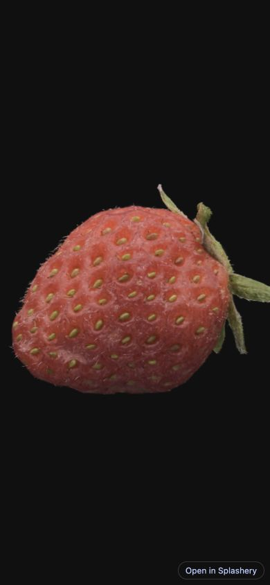   |    |
| 1440×900 | 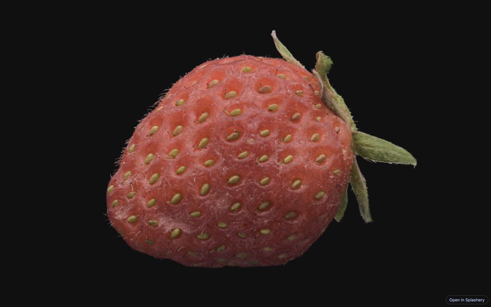 | 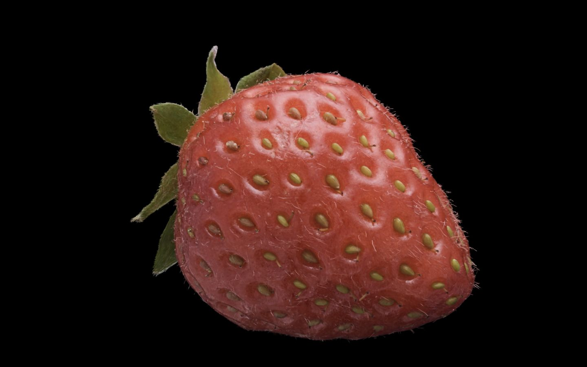 |

#### Bee

| Viewport | Splashery                                                                                      | SuperSplat source                                                                                |
| -------- | ---------------------------------------------------------------------------------------------- | ------------------------------------------------------------------------------------------------ |
| 390×844  | 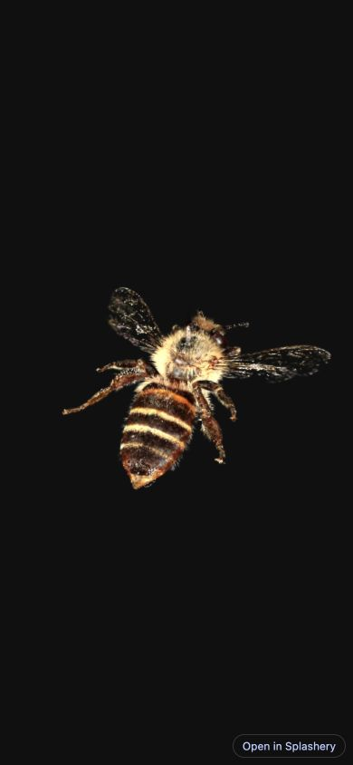   |    |
| 1440×900 | 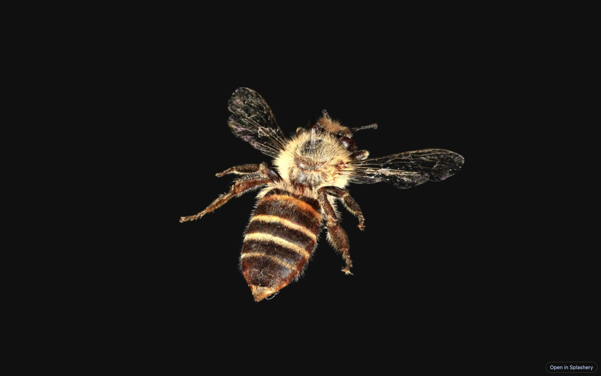 | 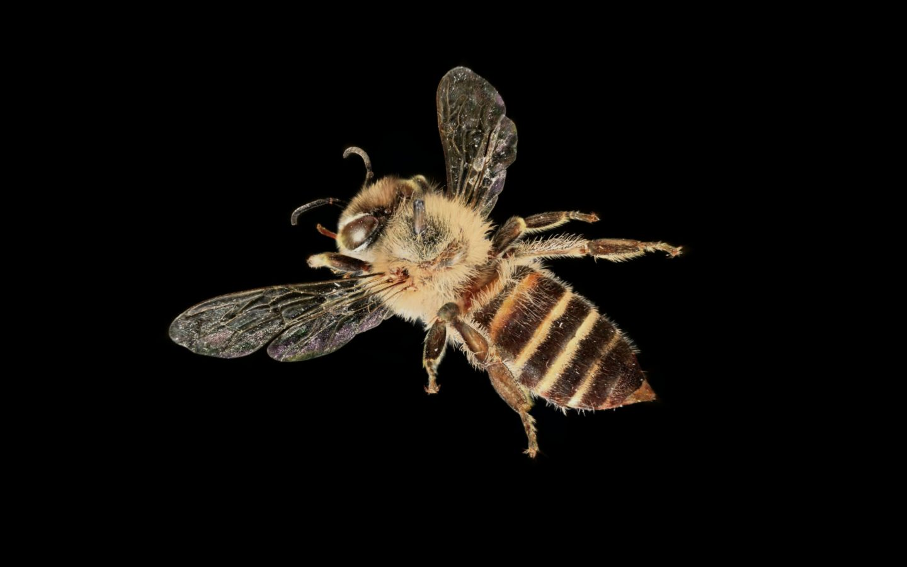 |

#### BMX bicycle

| Viewport | Splashery                                                                                                   | SuperSplat source                                                                                             |
| -------- | ----------------------------------------------------------------------------------------------------------- | ------------------------------------------------------------------------------------------------------------- |
| 390×844  | 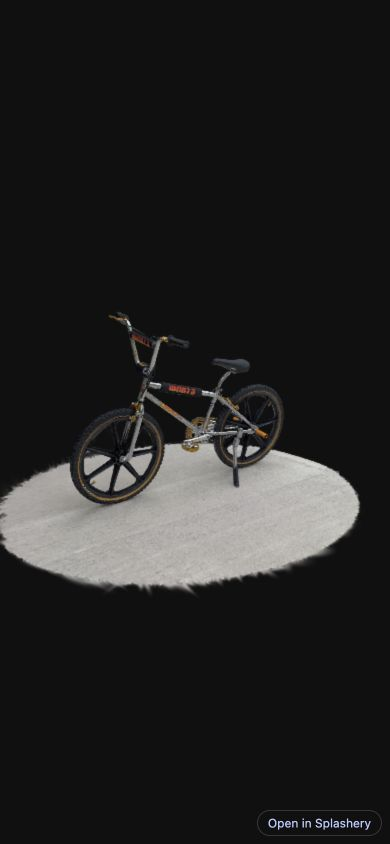   | 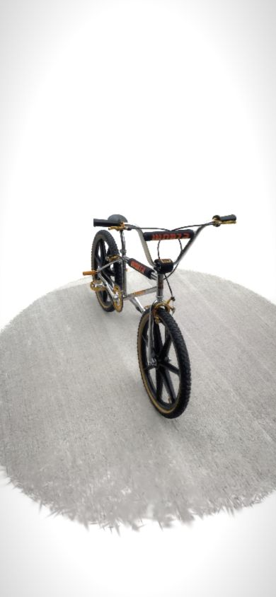   |
| 1440×900 | 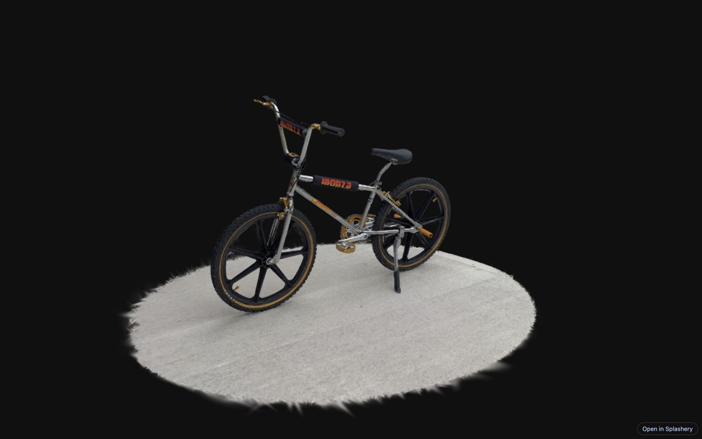 | 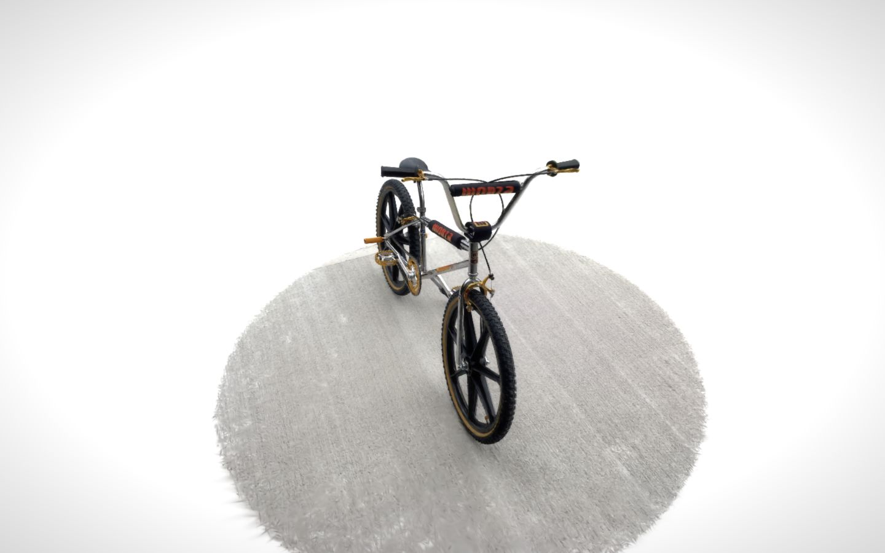 |

#### Cave lioness

| Viewport | Splashery                                                                                                        | SuperSplat source                                                                                                  |
| -------- | ---------------------------------------------------------------------------------------------------------------- | ------------------------------------------------------------------------------------------------------------------ |
| 390×844  | 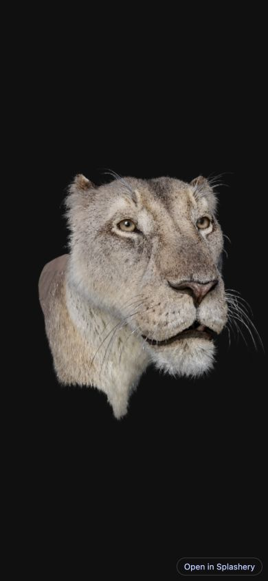   |    |
| 1440×900 |  |  |

#### Toy T. rex

| Viewport | Splashery                                                                                                  | SuperSplat source                                                                                            |
| -------- | ---------------------------------------------------------------------------------------------------------- | ------------------------------------------------------------------------------------------------------------ |
| 390×844  | 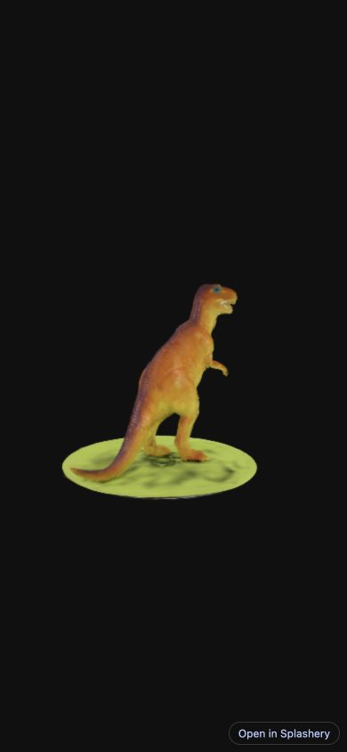   |    |
| 1440×900 | 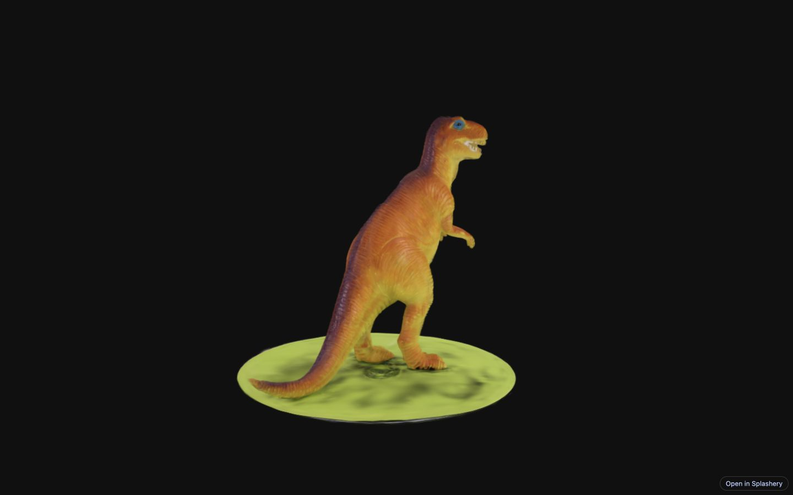 | 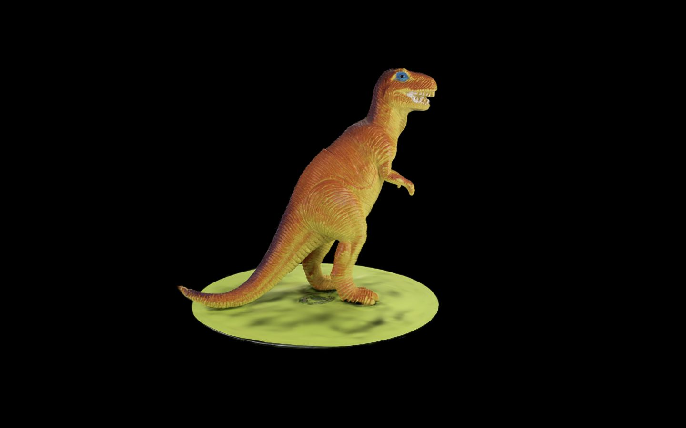 |

## Where each is better, and what remains unclear

**SuperSplat is the better evidenced choice for preparing and distributing captures:** it has
Gaussian cleanup/selection, baked color changes, more interchange formats, camera timelines, hosted
scene management, streamed LOD and documented XR/self-hosted exports. Those are concrete workflow
advantages, supported by
[cleanup](https://developer.playcanvas.com/user-manual/supersplat/editor/editing-splats/),
[color tools](https://developer.playcanvas.com/user-manual/supersplat/editor/color-and-appearance/),
[formats](https://developer.playcanvas.com/user-manual/supersplat/editor/import-export/),
[timeline](https://developer.playcanvas.com/user-manual/supersplat/editor/timeline/),
[Manage](https://developer.playcanvas.com/user-manual/supersplat/manage/),
[streaming](https://developer.playcanvas.com/user-manual/supersplat/streaming/) and
[self-hosting](https://developer.playcanvas.com/user-manual/supersplat/viewer/self-hosting/). This
audit checked the documentation and hosted viewing; it did not independently exercise editor export,
publishing, LOD creation or a headset.

**Splashery is the better evidenced fit for immediate toy play and heterogeneous media recipes:**
tap actions, eligible articulated parts, throwing/bouncing, sound, explicitly started live input,
PDF books, photo albums and generated math/science/chemistry are already source paths in the
capability table
([src/motion.js:155](https://github.com/ryanjosephkamp/splashery/blob/d2c43327019e83d6c5b94217ab6def2742c1d2c4/src/motion.js#L155),
[src/physics/hands-on.js:1](https://github.com/ryanjosephkamp/splashery/blob/d2c43327019e83d6c5b94217ab6def2742c1d2c4/src/physics/hands-on.js#L1),
[src/sound.js:1](https://github.com/ryanjosephkamp/splashery/blob/d2c43327019e83d6c5b94217ab6def2742c1d2c4/src/sound.js#L1),
[src/live/live.js:136](https://github.com/ryanjosephkamp/splashery/blob/d2c43327019e83d6c5b94217ab6def2742c1d2c4/src/live/live.js#L136),
[src/packs/pictures.js:774](https://github.com/ryanjosephkamp/splashery/blob/d2c43327019e83d6c5b94217ab6def2742c1d2c4/src/packs/pictures.js#L774),
`src/packs/maths.js:1`,
[src/packs/science.js:1](https://github.com/ryanjosephkamp/splashery/blob/d2c43327019e83d6c5b94217ab6def2742c1d2c4/src/packs/science.js#L1),
[src/packs/chemistry.js:1](https://github.com/ryanjosephkamp/splashery/blob/d2c43327019e83d6c5b94217ab6def2742c1d2c4/src/packs/chemistry.js#L1)).
The corresponding stock SuperSplat recipes were unconfirmed in the reviewed docs. This advantage
concerns the shipped product workflow;
[downloadable app starters](https://blog.playcanvas.com/new-in-supersplat-vibe-code-splat-apps/) can
support separately authored equivalents. The sampled Labs captures are whole-object hops, not
demonstrated anatomical/vehicle articulation
([src/packs/photoreal-r2.js:1](https://github.com/ryanjosephkamp/splashery/blob/d2c43327019e83d6c5b94217ab6def2742c1d2c4/src/packs/photoreal-r2.js#L1)).

**For this small-object viewer sample, Splashery trades capture detail for smaller assets.** Its low
SOG files are 1.59–3.86 decimal MB; high are 5.87–14.97 MB. Narrow source strawberry/lioness
frame-interval p95 values were 14.4/14.7 ms versus Splashery 10.3/10.3 ms; at desktop,
strawberry/lioness were 21.0/20.9 versus 10.0/10.2 ms. Bee, bicycle and T. rex results overlap more
closely. These observations follow the count/size and timing tables,
[file sizes](supersplat-compare-2026-10/asset-sizes.json) and
[cadence rows](supersplat-compare-2026-10/summary.csv); fewer splats and different rendering/camera
choices are material confounders. They do not establish that Splashery’s engine is faster at equal
quality, or that streamed SuperSplat environments would behave the same way.

**Privacy is shared by local workflows.** Splashery file reads/downloads stay in-browser
([src/loaders.js:1](https://github.com/ryanjosephkamp/splashery/blob/d2c43327019e83d6c5b94217ab6def2742c1d2c4/src/loaders.js#L1),
[src/exports.js:9](https://github.com/ryanjosephkamp/splashery/blob/d2c43327019e83d6c5b94217ab6def2742c1d2c4/src/exports.js#L9));
SuperSplat’s [Editor](https://developer.playcanvas.com/user-manual/supersplat/editor/) and
[media rendering](https://developer.playcanvas.com/user-manual/supersplat/editor/rendering/) also
describe local processing. Public sharing differs: Splashery serializes settings/references
([src/exports.js:280](https://github.com/ryanjosephkamp/splashery/blob/d2c43327019e83d6c5b94217ab6def2742c1d2c4/src/exports.js#L280)),
while [publishing](https://developer.playcanvas.com/user-manual/supersplat/editor/publishing/)
stores uploaded scene content. The phrase “the link holds the scene” must not imply that local file
bytes travel with a Splashery hash.

**Unclear:** exact first-frame ranking; physical-phone thermals, battery and memory; calibrated
visual quality; current offline behavior; edited-format round trips; live permission/capture
behavior on real hardware; XR; and large-room/streaming performance. None were confirmed by this
five-object run. The source lioness loaded/drew 1,855,777 splats even at a narrow Mac viewport
([runtime observation](supersplat-compare-2026-10/measurements.json)); desktop user agent and older
scene packaging mean that does not test the documented mobile streamed-scene budget
([streaming](https://developer.playcanvas.com/user-manual/supersplat/streaming/)).

## Owner evidence

The owner supplied no captures, recordings or observation notes for this task. No `owner/` files
were invented. None of the findings rests on owner-provided evidence; browser observations here were
collected by Codex, and feature paths were read from the baseline repository.

## Ideas for Splashery

These are proposals, not implemented changes or measured predictions.

1. **Coarse-first loading for large captures.** Prototype a self-hosted `lod-meta.json`/chunk path,
   expose the active Gaussian budget, and test time-to-visible-content plus memory on a large
   environment. The model is
   [streaming](https://developer.playcanvas.com/user-manual/supersplat/streaming/); current
   Splashery accumulates complete file bytes before parsing
   ([src/loaders.js:34](https://github.com/ryanjosephkamp/splashery/blob/d2c43327019e83d6c5b94217ab6def2742c1d2c4/src/loaders.js#L34)).
   Keep local-file handling and scene references explicit
   ([src/exports.js:280](https://github.com/ryanjosephkamp/splashery/blob/d2c43327019e83d6c5b94217ab6def2742c1d2c4/src/exports.js#L280)).
2. **Extend SH quality deliberately.** The new pack already keeps one band in selected full files;
   lite never does
   ([tools/pr2-prepare.mjs:5](https://github.com/ryanjosephkamp/splashery/blob/d2c43327019e83d6c5b94217ab6def2742c1d2c4/tools/pr2-prepare.mjs#L5),
   [src/packs/photoreal-r2.js:215](https://github.com/ryanjosephkamp/splashery/blob/d2c43327019e83d6c5b94217ab6def2742c1d2c4/src/packs/photoreal-r2.js#L215)).
   Strawberry/bee removed SH
   ([src/toys.js:78](https://github.com/ryanjosephkamp/splashery/blob/d2c43327019e83d6c5b94217ab6def2742c1d2c4/src/toys.js#L78),
   [src/toys.js:112](https://github.com/ryanjosephkamp/splashery/blob/d2c43327019e83d6c5b94217ab6def2742c1d2c4/src/toys.js#L112)).
   Compare zero/one/higher bands with fixed poses and payload budgets before adding a quality
   control; [formats](https://developer.playcanvas.com/user-manual/supersplat/editor/import-export/)
   exposes SH export choices. “Add SH” as if wholly absent would be wrong.
3. **Make capture cleanup reachable.** Start with a clear handoff to SuperSplat, or a bounded,
   undoable selection/crop workflow; cite
   [cleanup](https://developer.playcanvas.com/user-manual/supersplat/editor/editing-splats/).
   Splashery already directs stray cleanup there
   ([index.html:960](https://github.com/ryanjosephkamp/splashery/blob/d2c43327019e83d6c5b94217ab6def2742c1d2c4/index.html#L960))
   and limits clay to generated toys
   ([src/app.js:316](https://github.com/ryanjosephkamp/splashery/blob/d2c43327019e83d6c5b94217ab6def2742c1d2c4/src/app.js#L316)).
   A toy deformation effect is not a substitute for deleting unwanted Gaussians.
4. **Separate rendering cost from visible cadence.** Add optional diagnostic timing with explicit
   GPU/CPU/cadence labels, sample windows and active count/resolution.
   [Editor 3.0 release](https://blog.playcanvas.com/new-in-supersplat-editor-3-0-rebuilt-on-webgpu/)
   documents GPU frame min/median/p95; this audit’s injected event cadence cannot make that same
   GPU-duration claim. Splashery’s actual renderer selection and tier caps are in
   [src/stage.js:32](https://github.com/ryanjosephkamp/splashery/blob/d2c43327019e83d6c5b94217ab6def2742c1d2c4/src/stage.js#L32)
   and
   [src/player.js:50](https://github.com/ryanjosephkamp/splashery/blob/d2c43327019e83d6c5b94217ab6def2742c1d2c4/src/player.js#L50).
5. **Keep the toy/media advantage easy to discover.** Document the existing sound, hands-on, book
   and live-input recipes together, including their embed limits and Labs labels. Preserve explicit
   Start/Stop and local exports
   ([src/live/live.js:136](https://github.com/ryanjosephkamp/splashery/blob/d2c43327019e83d6c5b94217ab6def2742c1d2c4/src/live/live.js#L136),
   [src/sound.js:1](https://github.com/ryanjosephkamp/splashery/blob/d2c43327019e83d6c5b94217ab6def2742c1d2c4/src/sound.js#L1),
   [src/viewer.js:65](https://github.com/ryanjosephkamp/splashery/blob/d2c43327019e83d6c5b94217ab6def2742c1d2c4/src/viewer.js#L65)).
   For the inspected stock SuperSplat product, matching recipes remain unconfirmed; acknowledge
   custom PlayCanvas apps rather than claiming a platform limitation
   ([downloadable app starters](https://blog.playcanvas.com/new-in-supersplat-vibe-code-splat-apps/)).

## Audit data and verification

- [Pair/source attribution manifest](supersplat-compare-2026-10/pairs.json) and
  [opened scene-page receipts](supersplat-compare-2026-10/scene-pages.json).
- [21 attempts](supersplat-compare-2026-10/collection-attempts.json),
  [20 canonical rows](supersplat-compare-2026-10/measurements.json),
  [browser instrumentation](supersplat-compare-2026-10/instrumentation.js),
  [collection recipe](supersplat-compare-2026-10/collection-driver.js).
- [CSV](supersplat-compare-2026-10/summary.csv),
  [unrounded derived values](supersplat-compare-2026-10/summary.json),
  [derivation/coverage validation](supersplat-compare-2026-10/derive.py),
  [validation receipt](supersplat-compare-2026-10/validation.json).
- [baseline SOG bytes/checksums](supersplat-compare-2026-10/asset-sizes.json),
  [environment](supersplat-compare-2026-10/browser-environment.json),
  [deployed-module comparison](supersplat-compare-2026-10/live-baseline-check.json).
- [screenshot manifest](supersplat-compare-2026-10/screenshots.json),
  [pose overrides](supersplat-compare-2026-10/screenshot-poses.json),
  [20 image dimensions/checksums](supersplat-compare-2026-10/image-validation.json),
  [inspection montage](supersplat-compare-2026-10/contact-sheet.jpg).

The derivation check establishes a complete 5×2×2 matrix, 20 exact-size images, matching measurement
canvas dimensions, WebGPU/DPR 1, no recorded page errors, and 272–600 frame intervals per row. It
explicitly records 18 truncated network buffers and 12 post-readiness hooks. Screenshot framing was
visually inspected. Browser instrumentation/camera overrides were confined to the audit tab;
HTTP-cache and viewport overrides were restored and that tab closed.

Documentation-only verification: `python3 docs/audits/supersplat-compare-2026-10/derive.py`,
`npx prettier --check docs/audits/supersplat-compare-2026-10.md`, `npx prettier --check .`,
`node tools/us-english.mjs --diff`, and staged `git diff --check`. Check outcomes are recorded in
the draft PR. No source files changed and no Playwright regression suite was run; the observed
browser matrix is evidence collection, not a substitute claim that every product feature passed
regression tests.
