# QR codes made of splats: a parametric study

**October 5, 2026.** Lane QR lab r2 (Opus 5.5). The tools are `tools/qrs-study.mjs` (the study),
`tools/qrs-sheet.mjs` (the phone test sheet) and `tools/qrs-study/` (the rasterizer, readers,
variables, shapes, Micro QR, three-color and engine parts). The data, charts and pictures are in
[qr-splat-study-2026-10/](qr-splat-study-2026-10/). Every number below comes from a run of those
tools on this machine; nothing is estimated by hand. The captures are **simulated**: no real phone
took part (see "Limits").

## Summary

- **What we did.** We built QR codes out of 3D Gaussian splats with the labs' own builder
  (`src/qr-lab/splats.js`) and damage (`src/qr-lab/damage.js`), rendered them with a software
  Gaussian splat rasterizer that we checked against the real engine, photographed them with the QR
  scan lab's simulated phone captures and read every photo with three independent readers (jsQR,
  zxing-js and zxing-cpp). We swept 24 splat, motion and view variables and 53 damage-by-region
  cases finely, at four error correction levels and three code sizes: **43,240 captures in 58
  minutes** on 4 CPU cores, plus 1,888 for the shapes, Micro QR and three-color parts.
- **Splats are not ink.** The most sensitive splat variable is how far each splat spreads. Opaque
  splats that spread wider don't blur a code, they _swell_ it: every dark module grows into its
  light neighbors. With 3 splats per module edge, the code stops reading once a splat's spread
  passes about **0.75 of the spacing between splats** (0.25 of a module). "Blur" and "grow" damage
  of only about **10–20%** break a code; a printed code has no such failure.
- **Few splats is fine, and so are tiny ones.** A module needs about **3 splats per edge**; at 2 the
  code fails on phone-like captures. But the splats can shrink to a twentieth of their spacing (a
  sparse grid of dots) and zxing-cpp still reads 100%.
- **Contrast and opacity hold far below print rules.** zxing-cpp kept reading down to a contrast of
  **1.36:1** and dark splats at **10% opacity** on phone-like captures; jsQR needed about **2.2:1**
  and **29%**. Error correction level doesn't change these thresholds (L, M, Q and H all fail at the
  same contrast), because a faint code fails as a whole, not module by module.
- **Gaps and dots.** Gaps between modules stop the reads at about **30–36% of the module's edge**
  (zxing-cpp; jsQR 16–32%), whether the modules are squares, dots or rounded squares.
- **Angle.** Seen at an angle in 3D, a splat code reads to about **60° of yaw** with zxing-cpp but
  only **16–21°** with jsQR and zxing-js. Part of the reason is that the dark splats and the sheet
  behind them, only 0.03 modules apart, sort into each other as the view turns: lifting the dark
  layer 0.3 modules off the sheet took jsQR from 21° to 37° and zxing-js from 16° to 41° front-on.
- **Motion has a bug, not just a limit.** The Damage lab's "Move in time" sends modules behind the
  sheet in the trough of its wave, where they vanish: **no reader read a single frame** at any
  amount of 10% or more. With the sheet set back, codes read until the modules move about a third of
  a module.
- **The Alive color wave is safe.** No phase of the wave lowered any reader's scan rate below its
  rate on the plain code.
- **The block meter.** For codes seen straight on, "every block can fix what it lost" (what the
  Damage lab's meter shows) agrees with zxing-cpp **82%** of the time. When the blocks say no, the
  readers almost always fail too (zxing-cpp still read 17% of those); when the blocks say yes, the
  reader can still fail, mostly because it can't _find_ the code (gaps, dots, damaged finders).
- **Do codes have to be square?** No, but the reader decides. A QR code's modules can be rounded or
  dots and the code can be framed in a circle or surrounded by a circle of decoy modules, as long as
  the three finder patterns and a light margin around them survive. Cutting the finders or filling
  the quiet zone with a pattern stops every reader. **Micro QR** and **rMQR** (rectangular Micro QR,
  ISO/IEC 23941:2022) are real standard codes, written here by two independent writers; **only
  zxing-cpp** reads them (jsQR and zxing-js read neither), and zxing-cpp reads rMQR only when it is
  seen nearly straight on.
- **Three codes in one square (X2).** A red, green and blue code in one square holds three times the
  data in the same area. Splashery's splitting reader read all three **100%** of the time front-on
  and on phone-like captures at every level with clean color (zxing-cpp), but channel crosstalk of
  **20%** breaks it (in theory the contrast in a channel is 1 − 4k, so 25% erases it). An ordinary
  reader reads the green code, or nothing once crosstalk passes 10–15%. That color-multiplexed QR
  codes triple the capacity is **not new** (see "What looks new").

## Method

### The codes

Each code is built by `codeSplats` (`src/qr-lab/splats.js`): a light sheet of splats (the quiet zone
and light modules) 0.02 modules behind, and each dark module a patch of flat splats on two staggered
lattices, `per` splats per module edge (3 by default), each with a spread of `soft` (0.55) times the
spacing, opaque, 0.01 modules in front. Square modules close up with their dark neighbors (the
lane's change of October 5, 2026, which this run includes). The quiet zone is 4 modules.

Three texts, at levels L, M, Q and H (the version follows the text and the level):

| Text                                     | Characters | Version at L / M / Q / H |
| ---------------------------------------- | ---------- | ------------------------ |
| short ("Splats make a code!")            | 19         | 2 / 2 / 2 / 3            |
| link (https://ryanjosephkamp.github.io…) | 43         | 3 / 4 / 4 / 5            |
| long (a paragraph about Splashery)       | 175        | 8 / 9 / 11 / 13          |

(The long text says it makes "version 10 at level M"; it makes version 9. The text is only data.)

### The renderer

`tools/qrs-study/raster.mjs` renders splats the way a 3D Gaussian splatting renderer does (Kerbl et
al., [3D Gaussian Splatting](https://repo-sam.inria.fr/fungraph/3d-gaussian-splatting/), after
Zwicker et al.'s EWA splatting): each splat's 3D covariance R S Sᵀ Rᵀ is carried into the camera and
projected to 2D with the Jacobian of the pinhole projection, plus 0.3 px² on the diagonal (3DGS's
low-pass filter); splats are sorted by depth and alpha-composited front to back with alpha = opacity
· exp(−½ dᵀΣ⁻¹d), capped at 0.99, skipped below 1/255 and cut off at 3σ.

The "screen" picture shows the code, its quiet zone and a margin of the app's dark background (a
tenth of the code's width each side) at **8 pixels per module**, seen from 3 code-widths away. Each
trial moves the code by a random fraction of a pixel.

**Checked against the real engine.** `tools/qrs-study/engine.mjs` took the QR code toy's own splats
(`src/qr/build.js`, Classic style, level M) for each of the three texts, rendered them in the
running app (PlayCanvas 2.22.3 in Chromium with SwiftShader WebGL2, through the toy's test hook,
scan view and the camera turned 20°) and with our rasterizer using the toy's camera (38° field of
view). With no shift or scale fitted, the pictures matched to a correlation of **0.989–0.998** and a
mean gray difference of **2.9–7.6 out of 255**
([side-by-side pictures](qr-splat-study-2026-10/engine/),
[engine.csv](qr-splat-study-2026-10/engine.csv)). The three readers gave the same verdict on the
engine's picture and ours in 33 of 36 cases (each picture as it is and photographed as "phone"); the
3 differences are jsQR and zxing-js on the long code, which read the engine's slightly softer
picture and not ours. We did not compare GPUs other than SwiftShader.


### The captures

The QR scan lab's simulated phone captures (`tools/qr-scan-lab/sim.mjs`, unchanged; method in
[the scan lab's scorecard](../audits/qr-scan-lab-2026-10.md)): a pinhole camera photographs the
screen picture, then uneven light, blur, sensor noise and JPEG. We used three:

- **front**: straight on, 8 pixels per module, no noise (a clean screenshot);
- **phone**: 5 pixels per module, turned 20° (yaw), 6° (pitch), 3° (roll), blur 0.15 module, uneven
  light 30%, noise, JPEG quality 50 (the scan lab's "phone");
- **hard**: 4 pixels per module, 30°/10°/6°, blur 0.25 module, light 45%, more noise, JPEG 35.

### The readers

jsQR 1.4.0 and zxing-js 0.21.3 (as the scan lab used them: plain, no inversion; zxing with
TRY_HARDER) and **zxing-cpp** through zxing-wasm 3.1.4 (WebAssembly, its default options: try
harder, rotate, invert and downscale; QR Code, Micro QR and rMQR). zxing-cpp is the maintained C++
port of ZXing, the library behind many scanner apps, and the strongest of the three here; still, no
reader here is a phone's camera app. A read counts only when the text is **exactly** the one
encoded.

### Trials, seeds and statistics

Every sweep value is run at each level, each text and 3 trials (2 for the damage sweeps, which use
the link only). A trial changes the damage's seed, the capture's noise seed and the code's sub-pixel
position; all seeds are fixed, so a rerun gives the same rows. A scan rate is k reads out of n, with
a **Wilson 95% interval** ([Wilson score interval](https://arxiv.org/pdf/2109.12464)), in
`cells.csv.gz`. A **threshold** is where a sweep, walked from the easy end, first falls below 90%
(and 50%) of captures read, interpolated linearly between the two sweep values around it
(`thresholds.csv`). With 9 captures per point (3 texts × 3 trials), or 2 for damage, one capture
moves a rate by 11 or 50 points: thresholds are as fine as the sweep's steps, and the damage ones
are rough.

### Run time

| Part                                     | Captures | Time on 4 cores |
| ---------------------------------------- | -------- | --------------- |
| Sweeps and damage (`--grid=full`)        | 38,960   | 53.6 min        |
| Motion with the sheet set back           | 2,768    | 2.6 min         |
| Dots and rounded at 6 splats per edge    | 1,512    | 1.3 min         |
| Shapes                                   | 510      | 1.4 min         |
| Micro QR and rMQR                        | 370      | 0.6 min         |
| Three codes in one square (and controls) | 1,008    | 3.9 min         |
| Engine comparison                        | 6 pairs  | 1 min           |

Each capture is read by all three readers (each three-color capture 12 ways). About 330 ms per
capture per core; the rasterizer and the capture simulation take most of it.

## Results

### The plain code

The default splat code read 100% with zxing-cpp, front-on and on "phone" captures, at every level
and for every text; jsQR and zxing-js missed a few clean front-on captures (the short text at Q, the
link at H). The long, dense code (version 9 to 13) is where readers differ: zxing-cpp read every
capture, but jsQR and zxing-js read **none** of the "phone" captures at M, Q or H, and on "hard"
captures zxing-js read almost nothing at any size (3 trials each, level M):

| Text  | Front: jsQR / zxing-js / zxing-cpp | Phone | Hard  |
| ----- | ---------------------------------- | ----- | ----- |
| short | 3/3/3                              | 3/3/3 | 2/0/3 |
| link  | 3/3/3                              | 3/3/3 | 3/1/3 |
| long  | 2/2/3                              | 0/0/3 | 0/0/3 |

So the thresholds below are given for the **link** (version 4 at M), where every reader starts at
100% on "front" and "phone"; the pooled numbers are in `thresholds.csv` (text "all").

### Thresholds

Where the scan rate first falls below 90% (link, level M). "never": it stayed at 90% or more across
the whole sweep.

| Variable (sweep, easy end first)               | Front, zxing-cpp | Phone, jsQR | Phone, zxing-js | Phone, zxing-cpp | Phone, zxing-cpp 50% |
| ---------------------------------------------- | ---------------- | ----------- | --------------- | ---------------- | -------------------- |
| Splat spread ÷ spacing, wider (0.55 → 4)       | 0.78             | 0.57        | 0.57            | 0.78             | 0.88                 |
| Splat spread ÷ spacing, narrower (0.55 → 0.05) | never            | never       | 0.18            | never            | never                |
| Splats per module edge (8 → 1)                 | 1.90             | 2.90        | 2.70            | 2.85             | 2.25                 |
| Gap, share of the module's edge (0 → 0.9)      | 0.30             | 0.32        | 0.61            | 0.36             | 0.39                 |
| Gap, finders kept solid                        | 0.77             | 0.32        | 0.27            | 0.36             | 0.47                 |
| Dots, 3 splats per edge, gap (0 → 0.6)         | 0.31             | 0.33        | never           | 0.32             | 0.38                 |
| Dots, 6 splats per edge                        | 0.12             | 0.23        | 0.53            | 0.21             | 0.25                 |
| Rounded squares, 6 splats per edge             | 0.22             | 0.43        | 0.53            | 0.31             | 0.35                 |
| Opacity of the dark splats (1 → 0.05)          | never            | 0.29        | 0.44            | 0.10             | 0.07                 |
| Contrast, WCAG ratio (18.4:1 → 1.11:1)         | 1.36             | 2.17        | 1.95            | 1.36             | 1.30                 |
| Gradient to pale, ratio at the pale end        | never            | never       | never           | never            | never                |
| Alive wave, Classic colors (each phase)        | never            | never       | never           | never            | never                |
| Alive wave, gray code (each phase)             | never            | never       | never           | never            | never                |
| Yaw in the scene, degrees (0 → 80)             | 70.5             | 16.5        | 15.5            | 60.5             | 62.5                 |
| Yaw, dark layer lifted 0.3 modules             | 66.5             | 30.8        | 16.5            | 51.5             | 56.3                 |
| Pitch, degrees (0 → 80)                        | 66.5             | 31.5        | 15.5            | 51.5             | 56.3                 |
| Distance, screen pixels per module (8 → 1.6)   | 3.52             | 5.25        | 7.76            | 6.08             | 5.14                 |

Notes on the table:

- **Spread.** Between the default 0.55 and 0.75 the code goes from reading to not reading. At 0.75 a
  splat's spread is 0.25 of a module, so its 3σ reach is 0.75 of a module: past the module's edge.
  Because each splat is nearly opaque and many overlap, the dark region _grows_ instead of fading at
  its edge, and light modules between dark ones fill in. The damage sweeps "blur" (splats wider) and
  "grow" (dark splats bigger) show the same thing: 10–20% is enough.
- **Narrow splats are harmless.** At a spread of 0.05 the module is a sparse grid of tiny dots, yet
  zxing-cpp and jsQR read it on phone captures: the photo's blur averages the dots into gray, and a
  dark-enough gray is still dark.
- **Splats per edge.** 3 is the least that holds on phone captures (2.85 for zxing-cpp); with 2 the
  sheet shows between the splats.
- **Gaps, dots and rounded modules.** At 3 splats per edge a dot and a rounded square keep exactly
  the same splats (every lattice point is inside both shapes), so their rows were identical; at 6
  per edge they differ, and dots fail a little sooner. Keeping the finders solid let zxing-cpp read
  front-on codes with much larger gaps (0.77), but not phone captures.
- **Contrast and opacity** fail at the same point at every level (1.36, 1.36, 1.36 and 1.35 for L,
  M, Q, H), because a faint code is lost everywhere at once.
- **Distance.** On the "phone" capture the photo has 5/8 of the screen's pixels, so zxing-cpp's
  threshold of 6.08 screen pixels is **3.8 photo pixels per module** (jsQR 3.3, zxing-js 4.9), close
  to the scan lab's floor of 4.









More charts, one per variable: [charts/](qr-splat-study-2026-10/charts/) (`per`, `sparse`,
`opacity`, `gradient`, `dots`, `dots6`, `rounded6`, `gap-eyes`, `dots-eyes`, `alive-*`, `time*`,
`yaw-lifted`, `pitch`, `lift`, `dist`). Each shows the "phone" captures, one panel per reader and
one line per level, the three texts pooled.

### Motion

- **The Alive wave** (the QR code toy's color wave, modeled from `src/qr/field.js`: each dark
  module's color moves up to 85% toward the wave color at the same Rec. 709 gray) never lowered a
  reader's rate below the plain code's, at any of 12 phases, for the Classic colors or a mid-gray
  code. On the short text and the link together: front-on 276, 252 and 288 of 288 for jsQR, zxing-js
  and zxing-cpp (the plain code: 23, 21 and 24 of 24); phone 288, 276 and 288 of 288.
- **"Move in time"** (`damage.js`, kind `time`): **0 reads** in 2,592 captures at amounts 0.5 and 1,
  and 0 of 160 at amounts of 10% or more in the damage sweep. The motion moves each module out of
  the plane by up to ±0.6 × amount modules, and the dark splats sit only 0.03 modules in front of
  the sheet, so in the wave's trough half of the modules pass **behind** the opaque sheet and
  disappear. This is a flaw in how the motion is built, not a limit of splat codes; it shows in the
  Damage lab too. **Fixed the same day:** the wave now moves modules only toward the viewer (0 to
  0.6 × amount modules out of the plane), in `damage.js` and the Damage lab's GPU program alike. The
  rows here were measured before the fix; the "set back" rows below show how the fixed motion
  behaves.
- **With the sheet set back** 0.8 modules (so nothing passes behind it), the same motion reads until
  it moves modules about **0.3 modules** (amount 0.52 for zxing-cpp on "phone"; 0.61 front-on). At
  amount 0.5 (up to 0.3 modules) zxing-cpp read 93% of front-on frames and 81% of phone frames over
  the loop; at amount 1 (0.6 modules), 29% and 20%. Some moments of the loop are much worse than
  others, so a moving code needs a still moment to be scanned.

### Damage, by region

The amount at which zxing-cpp first falls below 90% on "phone" captures (the link; level M, with L
and H in parentheses). Each point is only 2 captures, so read these as ±0.1. The
[damage charts](qr-splat-study-2026-10/charts/) show every region and level.

| Damage                 | Everywhere       | Corner             | Center             | Finder           | Bottom edge      |
| ---------------------- | ---------------- | ------------------ | ------------------ | ---------------- | ---------------- |
| Scratch                | 0.42 (0.22 0.42) | 0.02 (0.62 0.12)   | never              | 0.22 (0.22 0.22) | 0.02 (0.02 0.02) |
| Sticker                | 0.41 (0.31 0.61) | 0.12 (0.32 0.02)   | 0.41 (0.31 0.71)   | 0.01 (0.01 0.01) | 0.61 (0.31 0.82) |
| Tear                   |                  | 0.62 (0.62 0.52)   |                    | 0.11 (0.12 0.11) |                  |
| Burn                   |                  | 0.42 (0.42 0.32)   |                    | 0.01 (0.01 0.01) |                  |
| Smudge                 | never            | never              | never              | 0.12 (0.11 0.11) | never            |
| Blur (splats wider)    | 0.11 (0.02 0.11) | 0.11 (0.11 0.22)   | 0.12 (0.11 0.42)   | 0.11 (0.11 0.11) | 0.11 (0.11 0.11) |
| Shrink                 | never            | never              | never              | never            | never            |
| Grow (dark splats)     | 0.11 (0.11 0.11) | 0.21 (0.11 0.32)   | 0.21 (0.11 0.52)   | 0.12 (0.11 0.12) | 0.12 (0.11 0.11) |
| Jitter                 | 0.21 (0.21 0.21) | 0.41 (0.31 0.32)   | 0.41 (0.32 never)  | 0.31 (0.31 0.22) | 0.31 (0.21 0.21) |
| Fade                   | 0.91 (0.91 0.91) | 0.91 (0.81 0.92)   | 0.91 (0.81 never)  | 0.82 (0.82 0.91) | 0.81 (0.81 0.82) |
| Color drift            | never            | never (0.92 never) | never (0.72 never) | 0.81 (0.82 0.81) | 0.72 (0.81 0.91) |
| Curve                  | 0.31 (0.21 0.31) |                    |                    |                  |                  |
| Tilt                   | 0.72 (0.62 0.71) |                    |                    |                  |                  |
| Move in time           | 0.01 (0.01 0.01) |                    |                    |                  |                  |
| Move in time, set back | 0.52 (0.42 0.61) |                    |                    |                  |                  |

What it shows:

- **Finders are the weak spot.** Any damage to the upper-left finder (a sticker, a burn, a smudge, a
  tear) breaks the code almost at once, at every level, as the standard predicts: error correction
  protects data, not the finder patterns a reader needs to find the code.
- **Error correction pays off where the data is.** A sticker in the middle stops the reads at amount
  0.31 at L, 0.41 at M, 0.61 at Q and 0.71 at H: a covered square of 19%, 25%, 37% and 43% of the
  code's width, or about 3.5%, 6%, 13% and 18% of its area (the standard's L, M, Q and H restore 7%,
  15%, 25% and 30% of the codewords; a sticker also covers whole codewords only in part).
- **Damage only splats have.** Wider or bigger splats (blur, grow) are the most destructive kind of
  all: 10–20% breaks the code at every level, because the swelling reaches every module at once.
  Shrinking the splats never broke it (at 15% of their size the modules are tiny dots, as with
  narrow splats). Jitter breaks it once splats move about 0.13 modules (amount 0.21). Fading the
  splats almost away (to 9–19% opacity) and drifting their color all the way to pale orange (a
  contrast of about 2:1 left) still read.

### Do the blocks predict the readers?

For every code seen straight on we know where each module is, so the study also read the modules
itself (the mean gray of a small disk at each module's center, cut by Otsu's threshold) and asked
`analyze()` (`src/qr-lab/read.js`) whether the format information and every block's Reed–Solomon
decoding come back right: the Damage lab meter's verdict. Against the readers (all front-on codes of
the splat, motion and damage sweeps; `blocks.csv`):

| Capture | Captures | Agrees with zxing-cpp | zxing-cpp read it when the blocks said yes | zxing-cpp read it when the blocks said no |
| ------- | -------- | --------------------- | ------------------------------------------ | ----------------------------------------- |
| front   | 11,116   | 82%                   | 82%                                        | 17%                                       |
| phone   | 11,116   | 81%                   | 81%                                        | 16%                                       |
| hard    | 6,804    | 90%                   | 92%                                        | 18%                                       |

The blocks are a good **upper bound**: when they say a code can't be fixed, the readers almost
always fail too. When they say it can, a reader may still fail, and the failures cluster in the
cases that break a reader's _search_ for the code rather than its error correction: gaps, dots and
rounded modules (1,022 of the 1,782 front-on misses), scratches, wide or grown splats, jitter,
stickers and tears near the finders. The other way round (the reader read a code the blocks gave up
on: 256 front-on) happens with gradients, smudges and color drift, where our simple threshold over
module centers misreads modules a reader's local thresholding gets right. So the Damage lab's meter
should say "error correction can fix this" (or can't), and the "still scans?" verdict should keep
coming from a real reader, as it does.

## Do codes have to be square?

### A square QR code, reshaped

Each shape is the link at levels M and H, 5 trials, read on all three captures
([shapes.csv](qr-splat-study-2026-10/shapes.csv), pictures in
[shapes/](qr-splat-study-2026-10/shapes/)). The counts are level M, "phone" captures, out of 5: jsQR
/ zxing-js / zxing-cpp.

| Shape                                         | Phone, M | Verdict                                      |
| --------------------------------------------- | -------- | -------------------------------------------- |
| Square modules (the baseline)                 | 5/5/5    | reads                                        |
| Rounded modules                               | 5/5/5    | reads                                        |
| Dots, finders too                             | 5/5/5    | reads                                        |
| Dots, solid square finders                    | 5/5/5    | reads                                        |
| Round finders (a ring and a disk)             | 5/3/5    | reads (weaker on "hard": 3/0/2)              |
| Framed in a circle, quiet zone kept           | 5/5/5    | reads                                        |
| Cut to a circle through the code's corners    | 5/5/5    | reads                                        |
| Cut to a circle inside the code (finders cut) | 0/0/0    | **never reads** (0 of 30 for every reader)   |
| Circle of decoy modules, 4-module quiet zone  | 5/5/5    | reads                                        |
| Circle of decoy modules, 1-module quiet zone  | 5/5/5    | reads                                        |
| Quiet zone of 2 modules                       | 5/5/5    | reads                                        |
| Quiet zone of 1 module                        | 5/5/5    | reads                                        |
| No quiet zone, on the dark app background     | 0/0/0    | **never reads** on phone captures            |
| No quiet zone, on a white background          | 5/5/5    | reads (white around it is a quiet zone)      |
| Quiet zone filled with a random pattern       | 0/0/0    | **never reads** (0 of 30)                    |
| Stretched 2:1 sideways                        | 5/0/5    | jsQR and zxing-cpp read it; zxing-js never   |
| Turned 45° (a diamond)                        | 1/0/5    | zxing-cpp reads it; jsQR and zxing-js rarely |

The rule the shapes follow: a reader first looks for the three finder patterns (the 1:1:3:1:1 runs
of dark and light across each "eye") with light around them, then samples a grid between them. So a
code can take almost any outline, and its modules almost any shape, as long as the finders keep
their ratios and their light margin. A ring with a disk inside still has those ratios along every
line through its center, which is why round finders work. Decoys around the code didn't confuse any
reader in this test, even with only one module of quiet zone. The stretched code is an affine view
of a square one, which every reader's perspective model covers in principle; zxing-js didn't find
it.

### Codes that are not square by design

The standard has two smaller relatives. **Micro QR** (ISO/IEC 18004) has one finder and 11 to 17
modules a side; **rMQR** (rectangular Micro QR,
[ISO/IEC 23941:2022](https://www.iso.org/standard/77404.html)) is a rectangle from 7×43 to 17×139
modules, made for narrow spaces. We wrote each with two independent writers, zxing-cpp (zxing-wasm)
and BWIPP (bwip-js); for three of the four symbols the two writers produced the very same modules
([micro.csv](qr-splat-study-2026-10/micro.csv), pictures in
[micro/](qr-splat-study-2026-10/micro/)).

| Symbol                   | jsQR | zxing-js | zxing-cpp, plain pixels (22 captures) | zxing-cpp, splats (front / phone / hard of 5) |
| ------------------------ | ---- | -------- | ------------------------------------- | --------------------------------------------- |
| Micro QR M3, "HELLO 123" | 0    | 0        | 20–21                                 | 5 / 2–4 / 1                                   |
| Micro QR M3, "Splats!"   | 0    | 0        | 21                                    | 5 / 4 / 0                                     |
| rMQR R15×59, the link    | 0    | 0        | 10                                    | 1 / 0 / 0                                     |
| rMQR R9×59, short text   | 0    | 0        | 15                                    | 1 / 0 / 0                                     |
| QR version 4, the link   | 41   | 40       | 22                                    | 5 / 5 / 5                                     |

So: **only zxing-cpp reads Micro QR and rMQR**; jsQR and zxing-js read QR Code alone. zxing-cpp
reads Micro QR almost as well as QR Code, but rMQR only nearly straight on: the link's rMQR failed
every capture turned 10° or more (the short one failed at 35°), both failed every blur of 0.2
modules or more and the "phone" capture, and zxing-cpp read our splat rMQR in only 1 of 5 front-on
trials (a small change of position was enough to lose it). Whether a phone's own camera app reads
Micro QR or rMQR is not something this study can say; codes S48 and S49 on the phone sheet ask the
phone.

So codes don't have to be square, and some standard codes aren't. But a square QR code is the shape
every reader reads; a round look is best made by rounding the modules or framing the square, not by
cutting it.

## Three codes in one square (X2)

`src/qr-lab/rgb.js` gives each module one of eight colors: the red channel carries one QR code,
green a second, blue a third. We built two sets (three short texts, version 1–2; three links,
version 3–6) at every level as splats, photographed them as above, then added what a camera does to
color: crosstalk between channels (`crosstalk(k)`: each channel picks up k of the other two) and
saving as JPEG, both as jpeg-js writes it (4:4:4, every pixel keeps its color) and with **4:2:0
chroma subsampling**, as phone cameras save photos (we convert to YCbCr, average Cb and Cr over each
2×2 block, and convert back before the JPEG). 3 trials, 1,008 captures; each read 12 ways
([rgb.csv](qr-splat-study-2026-10/rgb.csv)).


**Splitting reader, all three texts right** (zxing-cpp per channel; level M; 6 captures per cell):

| Crosstalk k | Front, 4:2:0 | Phone, 4:4:4 | Phone, 4:2:0 | Hard, 4:4:4 | Hard, 4:2:0 |
| ----------- | ------------ | ------------ | ------------ | ----------- | ----------- |
| 0           | 100%         | 100%         | 100%         | 83%         | 67%         |
| 0.05        | 100%         | 100%         | 100%         | 83%         | 67%         |
| 0.10        | 100%         | 100%         | 100%         | 83%         | 0%          |
| 0.15        | 100%         | 100%         | 100%         | 0%          | 0%          |
| 0.20        | 100%         | 50%          | 0%           | 0%          | 0%          |
| 0.30        | 0%           | 0%           | 0%           | 0%          | 0%          |

- **It works** with clean color: with no crosstalk zxing-cpp read all three texts 100% of the time
  at every level, front-on and on "phone" captures. jsQR and zxing-js are less steady: for example
  zxing-js read all three in 0 of 6 front-on captures at H, while it read the one-color control (the
  green text alone, same version) 6 of 6.
- **Crosstalk is the limit.** With crosstalk k, a channel's "on" and "off" differ by (1 − 4k) of the
  full range in the worst case (a module on in one channel and off in the other two against one off
  in it and on in the other two), so k = 0.25 erases it. In the runs, 0.15 still read on "phone";
  0.2 failed half or all; 0.3 never read. A real camera's crosstalk depends on its color filters and
  processing, and we did not measure one. A reader that knows the colors could undo crosstalk with
  the inverse 3×3 matrix; ours doesn't.
- **4:2:0 subsampling costs little on its own** but adds to everything else: on "hard" captures with
  k = 0.1, 4:4:4 read 83% and 4:2:0 read 0%.
- **An ordinary reader** on the color picture read the **green** code and nothing else, whenever it
  read anything: green carries 59–72% of the gray a reader computes, and gray is all it sees. Past a
  crosstalk of about 0.1 (zxing-cpp) or 0.15 (jsQR) it read nothing. No reader ever returned the red
  or blue text, and none returned a wrong text.
- **Capacity.** Three codes of one version hold three times the data of one; to hold the same three
  texts a one-color code would need a larger version (the three links, 141 bytes, need version 8 at
  M; each link alone is version 4). The cost is the crosstalk sensitivity above, and that the code
  reads only with a splitting reader.

## What looks new about codes made of splats

We searched for earlier work (October 5, 2026). What we found:

- **Color QR codes that multiplex three codes in the red, green and blue channels are not new.**
  Many papers and tools do it, report the same tripled capacity and name crosstalk as the main
  problem: for example
  [Improving Performance of the Multiplexed Colored QR Codes](https://saiconference.com/Downloads/Volume11No3/Paper_24-Improving_Performance_of_the_Multiplexed_Colored_QR_Codes.pdf),
  the [qrgb](https://pypi.org/project/qrgb/) and [ChromaQR](https://github.com/w-henderson/ChromaQR)
  projects, and high-capacity color barcodes such as Querini and Italiano's
  [HCC2D](https://www.academia.edu/15020599/High_Capacity_Colored_Two_Dimensional_codes). Our X2
  code is that idea; what we add is only that it is drawn with splats and measured under the scan
  lab's captures.
- **Fiducial markers in Gaussian splatting scenes exist:** Tabaa and Di Caro,
  [Fiducial Marker Splatting for High-Fidelity Robotics Simulations](https://arxiv.org/abs/2508.17012)
  (2025), generate AprilTags as Gaussians inside splat scenes so robots can localize in simulation.
  That is the closest prior work we found: a machine-readable square pattern made of splats. It is
  about AprilTags (no data payload, no error correction) and pose accuracy, not QR codes.
- **Hiding data in splats exists,** for example [GS-Hider](https://arxiv.org/abs/2405.15118)
  (NeurIPS 2024) hides messages in a splat scene's attributes for a decoder network. It is
  steganography, not a code a phone reads.
- **3D QR codes exist,** made by geometry and shadows, for example
  [Fabricable Unobtrusive 3D-QR-Codes with Directional Light](https://diglib.eg.org/handle/10.1111/cgf14065),
  and 3D-printed codes; so do studies of module shapes and aesthetic QR codes (for example
  [Improving readability by modifying graphic QR code microstructure](https://scholar.lib.ntnu.edu.tw/en/publications/improving-readability-by-modifying-graphic-qr-code-microstructure/)).

We found **no published study of QR codes built from Gaussian splats**, and nothing on the questions
specific to them: how a splat's spread, count and opacity set whether a code reads; that opaque
splats swell a code rather than blur it; that coplanar layers of splats sort into each other when
turned; or how a splat code's motion and color wave affect scanning. As far as we can tell, those
measurements are new. That is a search of the open web on one day, not a literature review: we may
have missed work, and a reader who knows of some should tell us.

## The phone test sheet

`node tools/qrs-sheet.mjs` makes [phone-sheet.html](qr-splat-study-2026-10/phone-sheet.html)
(self-contained, printable) and [phone-sheet.png](qr-splat-study-2026-10/phone-sheet.png): 50 codes,
S01 to S50, each rendered as the study renders it, with what it is and what the study predicts
([phone-sheet.json](qr-splat-study-2026-10/phone-sheet.json) lists them). For 17 variables it shows
the code just on the readable side of the threshold and the code just past it; then the 17 shapes, a
Micro QR, an rMQR and the three-color code. The owner's results go in the form in the lane's handoff
file. That is the study's only contact with real phones so far.

## Limits

- **Simulated captures, not phones.** The captures are the scan lab's models of a phone photo (a
  pinhole camera, Gaussian blur, noise, uneven light, JPEG). Real phones add autofocus, exposure
  control, glare, moiré from a screen's pixels, motion blur and their own image processing, and
  their camera apps (Apple's, Google's ML Kit) are not any of our readers. A pass here is evidence,
  not a guarantee; the phone sheet is there to check it.
- **A software rasterizer, not every GPU.** Ours matched the engine in SwiftShader closely, but GPUs
  differ in precision, and the engine's own culling of tiny splats (under about two pixels) is not
  modeled.
- **The labs' splat codes, not the toy's styles.** The sweeps use `codeSplats`, with the dark layer
  0.03 modules in front of the sheet; the QR code toy's styles (built by `src/qr/build.js`) are
  thicker and were measured by the scan lab.
- **Coarse steps and small samples.** 9 captures per point for the splat variables and 2 for the
  damage ones; thresholds are interpolated between sweep steps and are only as fine as the steps.
- **One screen size.** The screen picture is always 8 pixels per module (except the distance sweep).
- **Crosstalk is a model** (`crosstalk(k)`), with no measurement of a real camera's.
- **zxing-cpp's options.** We used its defaults (including trying inverted codes); jsQR and zxing-js
  ran plain, as in the scan lab.

## Rerunning

```sh
node tools/qrs-study.mjs --grid=full                  # sweeps, damage, shapes, Micro QR, three colors
node tools/qrs-study.mjs --grid=full --only=engine    # needs the app on port 4173 and SPLASHERY_CHROMIUM
node tools/qrs-study.mjs --grid=full --summarize      # tables and charts from the saved rows
node tools/qrs-sheet.mjs                              # the phone sheet
node tools/qrs-study.mjs --only=gap,opacity           # a few variables, small grid, in .cache/
```

`tests/qrs-study.spec.mjs` runs the study on a tiny grid and checks that a clean code reads with all
three readers and a code with its finder torn off reads with none.
